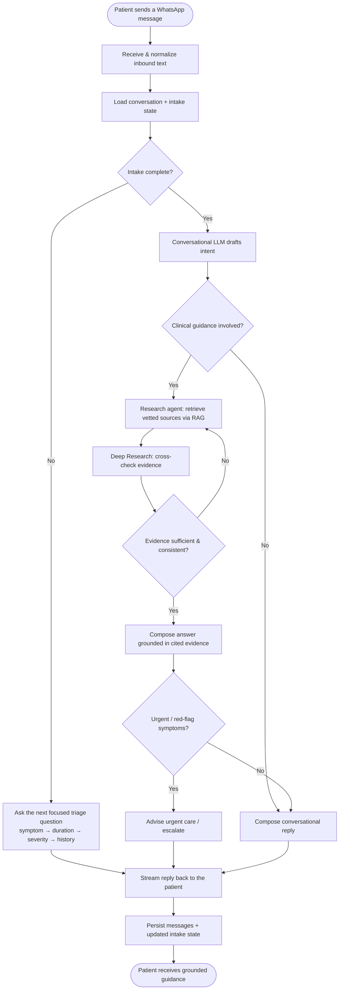

# DOC Project 2026

## Project Overview

### What I Built

I designed and built **Doctor On Call**, a **WhatsApp-based medical assistant** that guides users through a *simulated doctor visit* in low-resource rural settings. Instead of asking patients to install an app or navigate a clinical portal, the entire experience lives inside a chat thread on **WhatsApp** — the one interface tens of millions of users in rural India already know, trust, and can run on a low-bandwidth connection.

A patient sends a message describing how they feel. Behind the scenes, the system runs a **structured, multi-turn intake flow** — the kind of triage questioning a doctor walks through in person — collecting symptoms, duration, severity, and history one bite-sized question at a time. It then produces guidance grounded in vetted medical sources, never a raw, unverified model guess.

To keep that guidance safe, the assistant is built as a **multi-agent pipeline**. A conversational LLM handles the bedside manner and the structured intake, but it is *paired with a custom research agent* that uses **Retrieval-Augmented Generation (RAG)** and a **Deep Research** loop to retrieve and cross-check vetted medical information before any clinical statement is surfaced. The research agent acts as a grounding layer whose explicit job is to reduce hallucinations — the conversational model proposes, the research agent verifies against sources.

The system is intentionally engineered around the constraints of its users: **WhatsApp as a familiar, low-bandwidth front door**, structured prompt flows that work over plain text, and workflows adapted to settings with limited access to healthcare infrastructure.

### Why I Built It

- **Access goal:** Put a guided, safety-first triage experience in front of underserved rural users *without* requiring new apps, smartphones with spare storage, or reliable high-speed data — by meeting them where they already are, on WhatsApp.
- **Safety goal:** Make a medical assistant whose answers are *grounded in vetted sources*, not improvised. The research-agent layer exists specifically so the system can say "here is what trustworthy sources indicate" rather than confidently hallucinating clinical advice.
- **Engineering goal:** Build a real-time, extensible agentic backend that can stream responses, call tools, manage a structured task flow, and plug new message types and data sources in cleanly as the medical knowledge base grows.

## Technical Overview

### System Architecture

The architecture separates the **patient-facing channel** (WhatsApp) from the **agentic reasoning core** (a streaming, tool-calling chat engine) from the **grounding layer** (a RAG + Deep Research medical research agent). The same core also drives a web console used to observe and debug conversations.

- **WhatsApp channel**: Receives inbound patient messages via the **WhatsApp Cloud API** webhook, normalizes them, forwards them to the agentic core, and delivers streamed replies back to the patient's thread.
- **Agentic core**: An **ASP.NET 9.0** service built on the **LmDotnetTools** agent suite. It runs a unified agentic loop, persists conversations to SQLite, executes tools through a function-call middleware + **MCP** (Model Context Protocol), and streams partial responses over **SignalR** and **Server-Sent Events**.
- **Research agent (RAG + Deep Research)**: A grounding agent invoked as a tool inside the loop. It retrieves vetted medical passages, runs a multi-step Deep Research cycle to corroborate findings, and returns cited evidence the conversational model must base its answer on.
- **Web console**: A **SvelteKit 5 + TypeScript + Tailwind 4** app with an extensible message-rendering system for inspecting every message type (text, reasoning, tool calls, tool results, usage) in real time.
- **Shared contracts**: TypeScript interfaces shared across the boundary so the console and backend agree on the wire format.

### Key Components

**Agentic Core (`server/Services/ChatService.cs`):** Orchestrates a conversation turn end-to-end — builds the chat-specific function-call middleware, invokes the streaming LLM agent, executes any tool calls (including the research agent), and streams partial results to the patient and console. Implements a tool-result callback so results flow back the instant they're ready rather than at the end of the turn.

**Streaming LLM Agent (`server/Program.cs`):** An OpenAI-compatible `IStreamingAgent` (via LmDotnetTools `OpenClientAgent`) wired with an HTTP response cache. Provider, base URL, and key come from `LLM_API_KEY` / `LLM_BASE_API_URL`, so the same core runs against OpenAI, Azure, or OpenRouter unchanged.

**Medical Research Agent (RAG + Deep Research):** The grounding layer. Exposed to the loop as a callable tool, it performs retrieval over vetted medical sources and a Deep Research corroboration cycle, returning cited evidence. Its purpose is to constrain the conversational model to source-backed statements and measurably cut hallucinations.

**Structured Intake Flow (`server/Services/InstructionChainParser.cs`, `ImprovedTaskManagerService.cs`):** Drives the multi-turn "doctor visit" as a tracked task chain — one focused question per turn (symptoms → duration → severity → history) — so the conversation behaves like a guided triage rather than an open-ended chat.

**Tool & MCP Layer (`server/Services/McpClientManager.cs`, `server/Functions/`):** A function registry that combines built-in tools (e.g., the sample `WeatherFunction`) with external tools discovered over the **Model Context Protocol**, letting new clinical tools and data sources be added without touching the core loop.

**WhatsApp Bridge (`whatsapp_waha/src/`):** `WhatsAppWaha.MessageReceiver` ingests inbound messages, `WhatsAppWaha.Core` (`IWahaService`) validates numbers and sends replies, and `WhatsAppWaha.HelloWorld` is a minimal send-a-message reference app. Phone numbers are validated to E.164 before any send.

**Extensible Message Rendering (`client/src/lib/components/MessageRouter.svelte`):** A registry-driven router that maps each message type to a Svelte renderer (`TextRenderer`, `ReasoningRenderer`, `ToolCallRenderer`, `ToolResultRenderer`, …). Streaming fragments are accumulated into complete messages before display, so partial tool arguments and reasoning render cleanly as they arrive.

### Grounding-First Response Generation

The conversational model never speaks clinically on its own. Every turn that could produce medical guidance routes through the research agent first: the model drafts intent, the research agent retrieves and corroborates vetted evidence, and only then is a patient-facing answer composed *on top of* that evidence. This grounding-before-answering split is the core safety mechanism of the system.

## Code in Action: A Patient Conversation

### 1. Inbound message (WhatsApp Cloud API → bridge)

A patient texts the WhatsApp number. The bridge receives the webhook and forwards normalized text into the agentic core via the streaming endpoint:

```csharp
// IWahaService — validate then send, used on the reply path
public interface IWahaService
{
    bool ValidatePhoneNumber(string phoneNumber);   // E.164 check before any send
    Task<WahaMessageResult> SendTextMessageAsync(
        string phoneNumber, string message,
        SendTextOptions? options = null, CancellationToken cancellationToken = default);
}
```

### 2. Agentic core receives the turn (REST + SSE)

```
POST /api/chat/stream-sse        # streams the assistant turn back token-by-token
GET  /api/chat/{id}              # full conversation
GET  /api/chat/{chatId}/tasks    # structured intake task state
POST /api/chat                   # create a conversation
```

### 3. The structured intake flow asks one focused question

Rather than dumping a form, the task manager advances the visit one step at a time — symptom, then duration, then severity — tracking state per conversation so the patient is never overwhelmed.

### 4. The research agent grounds the answer

Before composing guidance, the core calls the RAG + Deep Research agent as a tool, receives cited evidence, and constrains the conversational model to it — then streams the grounded reply back through SSE/SignalR and out via the WhatsApp bridge.

## How the Workflow Runs

The diagram below traces the **logic** of a single patient turn — from an inbound symptom message to a grounded reply — including the decision to ground clinical content and the Deep Research corroboration loop:



**1. Wire the streaming agent (provider-agnostic)**

```csharp
var apiKey  = Environment.GetEnvironmentVariable("LLM_API_KEY") ?? configuration["OpenAI:ApiKey"];
var baseUrl = Environment.GetEnvironmentVariable("LLM_BASE_API_URL") ?? "https://api.openai.com/v1";
var openClient = new OpenClient(httpClient, baseUrl, null, logger);
return new OpenClientAgent("OpenAi", openClient);
```

**2. Run the turn through the core**

```csharp
// ChatService builds chat-specific tool middleware, invokes the agent,
// executes tool calls (incl. the research agent), and streams partial results.
await foreach (var update in _chatService.StreamCompletionAsync(chatId, userMessage, ct))
    await sse.SendEventAsync(update);   // partial tokens to the client + WhatsApp bridge
```

**3. Ground before answering**

The loop calls the research agent as a tool, gets cited evidence back, and composes the patient-facing reply on top of it.

**4. Deliver to WhatsApp**

```csharp
await wahaService.SendTextMessageAsync(patientNumber, groundedReply);
```

## Project Structure & File Guide

### Directory Overview

```text
DOC_Project_2025/
│
├── client/                     # SvelteKit 5 web console (TypeScript, Tailwind 4)
│   └── src/lib/
│       ├── components/         # MessageRouter + per-type renderers (text, reasoning, tool…)
│       ├── chat/               # handler-based orchestrator, SSE parser, event types
│       ├── api/                # REST client + SSE client
│       └── stores/             # chat / message / task state
│
├── server/                     # ASP.NET 9.0 agentic core
│   ├── Program.cs              # DI, streaming agent, SignalR, SSE, SQLite schema init
│   ├── Controllers/            # ChatController (REST + SSE), LogsController
│   ├── Services/               # ChatService, task manager, MCP manager, SSE, intake parser
│   ├── Hubs/                   # ChatHub (SignalR real-time)
│   ├── Functions/              # Built-in tools (WeatherFunction reference)
│   ├── Models/                 # Chat, Message, AiOptions, MCP config, SSE envelope
│   └── Storage/Sqlite/         # Chat + task persistence (no EF; custom SQLite layer)
│
├── server.Tests/               # xUnit — agentic loop, SSE, storage tests
│
├── whatsapp_waha/              # WhatsApp channel
│   └── src/
│       ├── WhatsAppWaha.Core/             # IWahaService, models, config, DI extensions
│       ├── WhatsAppWaha.MessageReceiver/  # inbound webhook receiver
│       └── WhatsAppWaha.HelloWorld/       # minimal send-message reference app
│
├── shared/types/               # Shared TS contracts (chat, api, tasks, user)
├── submodules/LmDotnetTools/   # LLM agent suite (agents, middleware, MCP, OpenAI provider)
├── docs/                       # Architecture, tool-call design, LmDotNet guide
└── .repo-instructions/         # Coding standards and development guides
```

### File & Format Details

| Component | Location | Notes |
|---|---|---|
| Agentic orchestration | `server/Services/ChatService.cs` | One turn end-to-end: agent + tools + streaming |
| Streaming agent setup | `server/Program.cs` | Provider-agnostic `OpenClientAgent` with HTTP cache |
| Structured intake | `server/Services/ImprovedTaskManagerService.cs`, `InstructionChainParser.cs` | Multi-turn doctor-visit task chain |
| Tool / MCP layer | `server/Services/McpClientManager.cs`, `server/Functions/` | Built-in + MCP-discovered tools |
| REST + SSE endpoints | `server/Controllers/ChatController.cs` | `/api/chat`, `/api/chat/stream-sse`, `/api/chat/{id}/tasks` |
| Real-time hub | `server/Hubs/ChatHub.cs` | SignalR partial-token streaming |
| Persistence | `server/Storage/Sqlite/` | Custom SQLite chat + task storage |
| WhatsApp send/receive | `whatsapp_waha/src/WhatsAppWaha.Core/Services/WahaService.cs` | E.164 validation, send, session check |
| WhatsApp inbound | `whatsapp_waha/src/WhatsAppWaha.MessageReceiver/` | Cloud API webhook receiver |
| Message rendering | `client/src/lib/components/MessageRouter.svelte` | Registry-driven renderer dispatch |
| Client orchestration | `client/src/lib/chat/handlerBasedOrchestrator.ts` | Accumulates streaming fragments |

## Current Status

The agentic core and channel are working end-to-end, with the grounding layer and clinical content actively expanding:

- **Agentic core** — streaming chat turns, function/tool calling, MCP integration, and SQLite persistence are working; covered by xUnit agentic-loop and SSE tests.
- **Web console** — extensible message rendering (text, reasoning, tool call, tool result, aggregate, usage) with real-time SSE/SignalR streaming; covered by Vitest + Playwright.
- **WhatsApp channel** — `WhatsAppWaha.Core` send/receive with E.164 validation and a HelloWorld reference app, plus an inbound message receiver (185+ tests in the core).
- **Structured intake flow** — task-tracked multi-turn questioning per conversation.
- **Grounding layer (RAG + Deep Research)** — research-agent integration is being expanded against a growing vetted-source corpus; deeper corroboration cycles and citation surfacing are in active development.
- **Cloud API migration** — the WhatsApp channel is being consolidated onto the official **WhatsApp Cloud API** path for production.

## Challenges and How I Solved Them

- **Reducing hallucination in medical answers:** Split the system into a conversational model + a dedicated RAG/Deep Research agent, and made grounding a *precondition* for any clinical statement — the model composes on top of retrieved evidence rather than from memory.
- **Low-bandwidth, app-free reach:** Chose WhatsApp as the front door so users need no new app and minimal data, and kept the protocol plain-text-first so it degrades gracefully on poor connections.
- **Overwhelming intake:** Modeled the doctor visit as a tracked task chain that asks one focused question per turn, instead of a single large form — matching how triage actually flows.
- **Real-time streaming over a chat channel:** Streamed partial tokens through SSE/SignalR on the core and relayed them out via the WhatsApp bridge, with a tool-result callback so evidence and answers surface the moment they're ready.
- **Provider flexibility + cost:** Wrapped the LLM in an OpenAI-compatible agent with an HTTP response cache and env-driven configuration, so the same core runs against OpenAI, Azure, or OpenRouter and replays cached responses during development and tests.
- **Extensibility as the knowledge base grows:** Used a registry-based message-rendering system on the client and an MCP-backed tool layer on the server, so new message types and clinical tools/data sources drop in without rewrites.

## Future Possibilities

- Expanded vetted-source corpus and stronger Deep Research corroboration with surfaced citations
- Multilingual intake and replies for regional Indian languages
- Voice-note intake (WhatsApp audio → transcription → triage)
- Image intake (e.g., photos of a rash or prescription) routed to the tool layer
- Escalation hand-off to human clinicians/telemedicine when triage indicates urgency
- Offline-tolerant queuing for intermittent connectivity

## TL;DR

A WhatsApp medical assistant that guides underserved rural users through a simulated doctor visit. A conversational LLM runs structured triage while a paired RAG + Deep Research agent grounds every clinical claim in vetted sources to cut hallucinations—backed by a real-time, tool-calling ASP.NET agentic core and a SvelteKit observability console.

---

**Project Duration:** Winter 2025 – Spring 2026  
**Technologies:** C# / ASP.NET 9.0, SvelteKit 5 + TypeScript, SignalR & SSE, SQLite, LmDotnetTools + MCP, RAG / Deep Research, WhatsApp Cloud API
