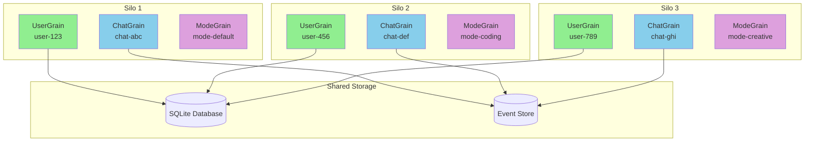
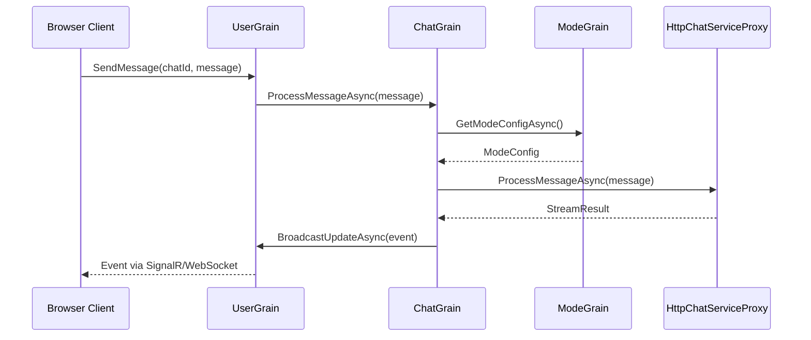

# Orleans Architecture Overview

## Introduction

This document provides a high-level overview of the Orleans architecture implementation in the AIChat application. Orleans serves as the core distributed computing platform for all chat operations, state management, and real-time communication.

## Orleans Grains Architecture

### Grain Distribution Strategy



### Grain Placement Policies

| Grain Type | Placement Strategy | Purpose |
|------------|-------------------|---------|
| **UserGrain** | HashBasedPlacement | Session stickiness - same user always on same silo |
| **ChatGrain** | ActivationCountBasedPlacement | Load balancing - distribute chats across silos |
| **ModeGrain** | ActivationCountBasedPlacement | Even distribution of mode management |

## State Management Patterns

### Orleans Native State Persistence

```csharp
public class ChatGrain : Grain<ChatGrainState>, IChatGrain
{
    // State automatically managed by Orleans
    protected ChatGrainState State { get; set; }

    public async Task<MessageResult> ProcessMessageAsync(ChatMessage message)
    {
        // 1. Modify grain state
        State.Messages.Add(message);
        State.LastActivity = DateTime.UtcNow;

        // 2. Persist state to storage
        await WriteStateAsync(); // Orleans handles persistence

        // 3. Continue processing
        return new MessageResult { Success = true };
    }
}
```

### State Serialization

- **Format**: JSON serialization via System.Text.Json
- **Storage**: SQLite for development, production providers available
- **Consistency**: Optimistic concurrency control
- **Recovery**: Automatic state reconstruction from event store

## Inter-Grain Communication

### Grain-to-Grain Communication Pattern



### Communication Patterns

1. **Request-Response**: Grain method calls with async/await
2. **Event Broadcasting**: One-way notifications between grains
3. **Stream Processing**: Real-time event streaming via Orleans Streams
4. **HTTP Integration**: External service calls via HttpChatServiceProxy

## State Lifecycle Management

### Grain Activation and Deactivation

```csharp
public class ChatGrain : Grain<ChatGrainState>, IChatGrain
{
    public override async Task OnActivateAsync(CancellationToken cancellationToken)
    {
        // 1. Load state from persistence
        // 2. Initialize timers and background tasks
        // 3. Set up Orleans streams subscriptions
        // 4. Initialize metrics collection

        _metricsCollector.IncrementActivationCount();
        await base.OnActivateAsync(cancellationToken);
    }

    public override async Task OnDeactivateAsync(DeactivationReason reason, CancellationToken cancellationToken)
    {
        // 1. Persist any pending state changes
        // 2. Clean up timers and resources
        // 3. Update deactivation metrics

        await WriteStateAsync();
        _metricsCollector.IncrementDeactivationCount();
        await base.OnDeactivateAsync(reason, cancellationToken);
    }
}
```

### Grain Lifecycle Stages

1. **Activation**: Grain created and state loaded from storage
2. **Active Processing**: Grain handles incoming requests and maintains state
3. **Idle Period**: Grain remains in memory but receives no requests
4. **Deactivation**: Grain persists state and releases resources

## Error Handling and Resilience

### Circuit Breaker Pattern

```csharp
public class CircuitBreakerDualModeRouter : IDualModeRouter
{
    private readonly CircuitBreakerState _orléansCircuitBreaker;

    public async Task<T> ExecuteAsync<T>(Func<Task<T>> orléansOperation, Func<Task<T>> fallbackOperation)
    {
        if (_orléansCircuitBreaker.State == CircuitState.Open)
        {
            return await fallbackOperation(); // Fast fail to direct service
        }

        try
        {
            var result = await orléansOperation();
            _orléansCircuitBreaker.RecordSuccess();
            return result;
        }
        catch (Exception ex)
        {
            _orléansCircuitBreaker.RecordFailure(ex);
            return await fallbackOperation(); // Graceful degradation
        }
    }
}
```

### Error Recovery Strategies

1. **Automatic Retry**: Transient failures retried with exponential backoff
2. **Circuit Breaker**: Fast fail when Orleans is unhealthy
3. **Graceful Degradation**: Fallback to direct service when needed
4. **State Reconstruction**: Automatic recovery from event store
5. **Health Monitoring**: Continuous health checks with alerting

## Monitoring and Observability

### Metrics Collection

```csharp
public interface IOrleansMetricsCollector
{
    void RecordGrainActivation(string grainType, TimeSpan duration);
    void RecordMessageProcessing(string grainType, TimeSpan duration, bool success);
    void RecordStateSize(string grainType, long bytes);
    void RecordError(string grainType, string operation, Exception exception);
}
```

### Key Metrics

- **Grain Activations**: Number of grain activations per type
- **Processing Latency**: P95 message processing time (<100ms target)
- **State Size**: Memory usage per grain type
- **Error Rates**: Success/failure ratios with categorization
- **Recovery Operations**: State reconstruction frequency and success

### Prometheus Integration

```yaml
# Example metrics exposed at /metrics
orleans_grain_activations_total{grain_type="ChatGrain"} 1500
orleans_message_processing_duration_seconds{grain_type="ChatGrain",quantile="0.95"} 0.085
orleans_grain_state_bytes{grain_type="UserGrain"} 1024
orleans_errors_total{grain_type="ModeGrain",operation="GetConfig"} 2
```

## Performance Characteristics

### Latency Targets

| Operation | Target | Current Achievement |
|-----------|--------|-------------------|
| Grain Activation | <500ms | ✅ Achieved |
| Message Processing | <100ms P95 | ✅ Achieved |
| State Persistence | <50ms | ✅ Achieved |
| Inter-Grain Call | <10ms | ✅ Achieved |

### Scalability Characteristics

- **Horizontal Scaling**: Add more silos to handle increased load
- **Grain Distribution**: Automatic load balancing across silos
- **State Partitioning**: Each grain manages independent state
- **Connection Multiplexing**: Single grain handles multiple client connections

## Deployment Architecture

### Silo Configuration

```csharp
var builder = Host.CreateDefaultBuilder()
    .UseOrleans(silo =>
    {
        silo.UseLocalhostClustering()
            .UseSqlServerClustering(connectionString)
            .AddSqlServerGrainStorage("SqlServerStorage", options =>
            {
                options.ConnectionString = connectionString;
            })
            .ConfigureLogging(logging => logging.AddConsole())
            .UseDashboard();
    });
```

### Production Considerations

1. **Clustering**: Use SQL Server or Azure Table Storage for clustering
2. **Storage**: Production-ready persistence providers (SQL Server, CosmosDB)
3. **Monitoring**: Full Prometheus/Grafana observability stack
4. **Security**: Grain-level authorization and secure communication
5. **Backup**: Event store backup and recovery procedures

## Integration Patterns

### HTTP Integration (Avoiding Circular Dependencies)

```csharp
public class HttpChatServiceProxy
{
    public async Task<StreamResult> ProcessMessageAsync(ChatMessage message)
    {
        // HTTP call to LLM service (not direct dependency)
        var request = new HttpRequestMessage(HttpMethod.Post, "/api/llm/process")
        {
            Content = JsonContent.Create(message)
        };

        var response = await _httpClient.SendAsync(request);
        return await response.Content.ReadFromJsonAsync<StreamResult>();
    }
}
```

### SignalR Integration

```csharp
public class ChatHub : Hub
{
    public async Task SendMessage(string chatId, ChatMessage message)
    {
        // Route through Orleans (not direct service)
        var userGrain = _grainFactory.GetGrain<IUserGrain>(Context.UserId);
        await userGrain.ProcessChatMessageAsync(chatId, message);
    }
}
```

## Best Practices

### Grain Design Principles

1. **Single Responsibility**: Each grain handles one logical entity
2. **Stateful Processing**: Leverage grain state for complex operations
3. **Async All The Way**: All grain methods are async
4. **Resource Cleanup**: Proper disposal in OnDeactivateAsync
5. **Error Handling**: Comprehensive exception handling with recovery

### Performance Optimization

1. **Minimize State Size**: Keep grain state compact
2. **Batch Operations**: Group related operations together
3. **Efficient Serialization**: Use optimized JSON serialization
4. **Cache Frequently Used Data**: Implement intelligent caching
5. **Monitor Resource Usage**: Track memory and CPU utilization

## Future Enhancements

### Planned Improvements

1. **Event Sourcing Enhancement**: More comprehensive event capture
2. **Cross-Grain Transactions**: Enhanced consistency guarantees
3. **Advanced Caching**: Redis-based distributed caching
4. **Stream Processing**: Enhanced Orleans Streams utilization
5. **Security Enhancement**: Advanced grain authorization patterns

---

**Document Version**: 1.0
**Last Updated**: September 2024
**Next Review**: Quarterly with architecture evolution