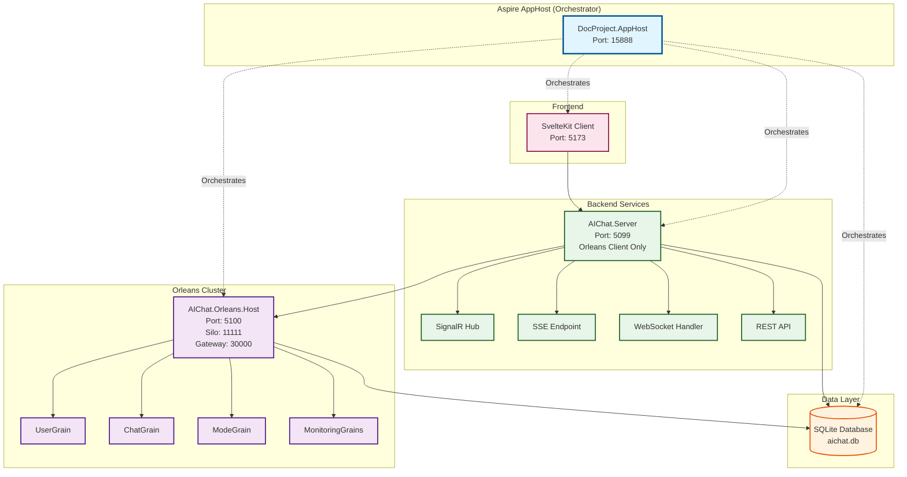
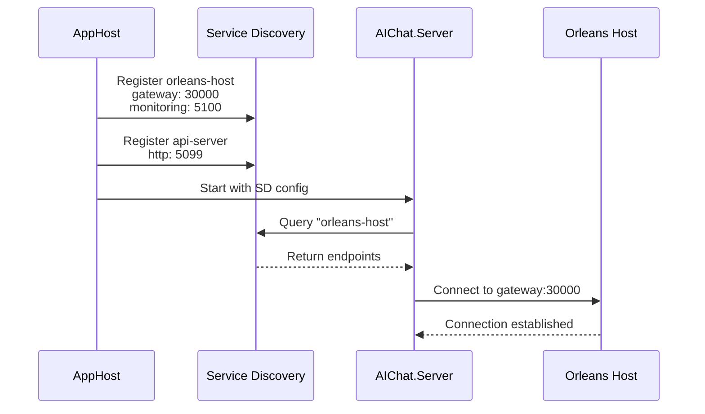
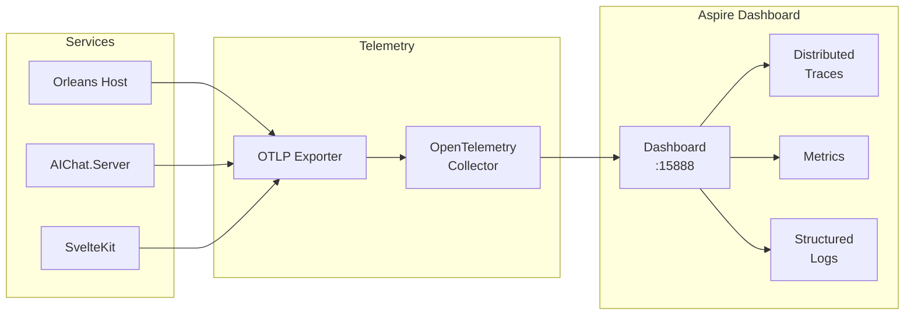

# Microsoft Aspire Orchestration - Technical Design Document

**Feature**: Adopt Microsoft Aspire for Service Orchestration
**Status**: Design Phase
**Date**: 2025-10-13
**Author**: Claude (spec-architect agent)

## Table of Contents

1. [Executive Summary](#executive-summary)
2. [Architecture Design](#1-architecture-design)
3. [Project Structure](#2-project-structure)
4. [AppHost Implementation Design](#3-apphost-implementation-design)
5. [ServiceDefaults Implementation Design](#4-servicedefaults-implementation-design)
6. [Service Integration Design](#5-service-integration-design)
7. [Configuration Management](#6-configuration-management)
8. [Service Discovery Design](#7-service-discovery-design)
9. [Observability Design](#8-observability-design)
10. [Database Management Design](#9-database-management-design)
11. [Development Workflow](#10-development-workflow)
12. [Migration Strategy](#11-migration-strategy)
13. [Technical Risks and Mitigations](#12-technical-risks-and-mitigations)

---

## Executive Summary

This document provides the complete technical design for adopting Microsoft Aspire to orchestrate the DOC_Project_2025 application stack. The primary architectural change involves **removing the Orleans Host background task from AIChat.Server** and running it as a separate service orchestrated by Aspire. This creates a cleaner separation of concerns and enables single-command application startup through the Aspire AppHost.

### Key Changes

1. **Orleans Host Separation**: Remove lines 273-309 from `AIChat.Server/Program.cs` where Orleans Host is started as background task
2. **New Projects**: Add `DocProject.AppHost` and `DocProject.ServiceDefaults` to the solution
3. **Service Orchestration**: SQLite → Orleans Host → AIChat.Server → SvelteKit Client
4. **Configuration Injection**: Replace hardcoded URLs with Aspire service discovery

---

## 1. Architecture Design

### 1.1 High-Level System Architecture



### 1.2 Service Dependency Graph

```
DocProject.AppHost
├── SQLite Database (aichat.db)
│   └── Data Volume Binding: ./data
├── AIChat.Orleans.Host (Separate Service)
│   ├── Depends On: SQLite
│   ├── Silo Port: 11111
│   ├── Gateway Port: 30000
│   └── Monitoring API: 5100
├── AIChat.Server (Orleans Client)
│   ├── Depends On: Orleans Host
│   ├── Depends On: SQLite
│   └── API Port: 5099
└── SvelteKit Client
    ├── Depends On: AIChat.Server
    └── Dev Server Port: 5173
```

### 1.3 Data Flow

1. **Startup Sequence**:
   ```
   AppHost Start → SQLite Ready → Orleans Silo Start → Orleans Gateway Ready
   → AIChat.Server Connect → API Ready → SvelteKit Start → Application Ready
   ```

2. **Runtime Communication**:
   ```
   User → SvelteKit → HTTP/SignalR/SSE → AIChat.Server → Orleans Client
   → Orleans Gateway → Orleans Silo → Grains → Database
   ```

### 1.4 Component Relationships

| Component | Type | Responsibility | Dependencies |
|-----------|------|---------------|--------------|
| DocProject.AppHost | Orchestrator | Service lifecycle, configuration injection | All services |
| DocProject.ServiceDefaults | Library | OpenTelemetry, health checks, service discovery | None |
| SQLite Database | Resource | Data persistence | None |
| AIChat.Orleans.Host | Service | Orleans silo hosting, grain execution | SQLite |
| AIChat.Server | Service | API, SignalR, SSE, Orleans client | Orleans Host, SQLite |
| SvelteKit Client | npm app | User interface | AIChat.Server |

---

## 2. Project Structure

### 2.1 New Projects to Create

#### DocProject.AppHost
```
server/DocProject.AppHost/
├── DocProject.AppHost.csproj
├── Program.cs
├── appsettings.json
├── appsettings.Development.json
├── Properties/
│   └── launchSettings.json
└── Extensions/
    └── ResourceExtensions.cs
```

#### DocProject.ServiceDefaults
```
server/DocProject.ServiceDefaults/
├── DocProject.ServiceDefaults.csproj
├── Extensions.cs
├── OpenTelemetryExtensions.cs
├── HealthCheckExtensions.cs
└── ServiceDiscoveryExtensions.cs
```

### 2.2 Solution File Changes

```xml
<!-- Add to DOC_Project_2025.sln -->
Project("{2150E333-8FDC-42A3-9474-1A3956D46DE8}") = "aspire", "aspire", "{NEW-GUID-1}"
EndProject
Project("{FAE04EC0-301F-11D3-BF4B-00C04F79EFBC}") = "DocProject.AppHost",
    "server\DocProject.AppHost\DocProject.AppHost.csproj", "{NEW-GUID-2}"
EndProject
Project("{FAE04EC0-301F-11D3-BF4B-00C04F79EFBC}") = "DocProject.ServiceDefaults",
    "server\DocProject.ServiceDefaults\DocProject.ServiceDefaults.csproj", "{NEW-GUID-3}"
EndProject

<!-- In NestedProjects section -->
{NEW-GUID-2} = {NEW-GUID-1}
{NEW-GUID-3} = {NEW-GUID-1}
```

### 2.3 File Organization

```
DOC_Project_2025/
├── server/
│   ├── DocProject.AppHost/          # NEW: Aspire orchestrator
│   ├── DocProject.ServiceDefaults/  # NEW: Shared service configuration
│   ├── AIChat.Server/               # MODIFIED: Remove Orleans Host code
│   ├── AIChat.Orleans.Host/         # MODIFIED: Add ServiceDefaults
│   └── AIChat.Orleans.*/            # UNCHANGED: Orleans libraries
├── client/                          # MODIFIED: Environment variable consumption
├── docs/
│   └── features/
│       └── aspire-orchestration/
│           ├── requirements.md
│           ├── design.md            # THIS DOCUMENT
│           └── tasks.md             # TO BE CREATED
└── DOC_Project_2025.sln            # MODIFIED: Add new projects
```

---

## 3. AppHost Implementation Design

### 3.1 Program.cs Structure

```csharp
// server/DocProject.AppHost/Program.cs
using CommunityToolkit.Aspire.Hosting.SQLite;

var builder = DistributedApplication.CreateBuilder(args);

// ========================================================================
// INFRASTRUCTURE RESOURCES
// ========================================================================

// SQLite database with persistent data binding
var database = builder.AddSQLite("sqlite-server", "./data")
    .AddDatabase("aichat", "aichat.db");

// Optional: SQLite Web UI for development inspection
if (builder.Environment.IsDevelopment())
{
    database.WithSqliteWeb();
}

// ========================================================================
// ORLEANS SILO (SEPARATE SERVICE)
// ========================================================================

// Orleans Host as separate service (no longer embedded in AIChat.Server)
var orleansHost = builder.AddProject<Projects.AIChat_Orleans_Host>("orleans-host")
    .WithReference(database)
    .WithEndpoint("silo", 11111)        // Silo port
    .WithEndpoint("gateway", 30000)     // Gateway port
    .WithEndpoint("monitoring", 5100)   // Monitoring API
    .WaitFor(database);                  // Ensure DB ready first

// ========================================================================
// BACKEND API SERVER (ORLEANS CLIENT)
// ========================================================================

// AIChat.Server - Now Orleans CLIENT only (silo code removed)
var apiServer = builder.AddProject<Projects.AIChat_Server>("api-server")
    .WithReference(database)
    .WithReference(orleansHost)
    .WithEnvironment("Orleans:GatewayPort", orleansHost.GetEndpoint("gateway"))
    .WithEnvironment("ASPNETCORE_URLS", "http://+:5099")
    .WaitFor(orleansHost)               // Orleans must be ready
    .WaitFor(database);                 // Database must be ready

// ========================================================================
// FRONTEND APPLICATION
// ========================================================================

// SvelteKit client with automatic API URL configuration
var client = builder.AddNpmApp("client", "../client", "dev")
    .WithReference(apiServer)
    .WithHttpEndpoint(env: "PORT", port: 5173)
    .WithEnvironment("VITE_API_URL", apiServer.GetEndpoint("http"))
    .WaitFor(apiServer);                // API must be ready

// ========================================================================
// LAUNCH PROFILES
// ========================================================================

// Configure different launch profiles based on environment
if (builder.Configuration["ASPIRE_PROFILE"] == "backend-only")
{
    // Backend development profile - no client
    builder.RemoveResource(client);
}
else if (builder.Configuration["ASPIRE_PROFILE"] == "orleans-debug")
{
    // Orleans debugging profile - extra logging
    orleansHost.WithEnvironment("Logging__LogLevel__Orleans", "Debug");
}

builder.Build().Run();
```

### 3.2 Project File (DocProject.AppHost.csproj)

```xml
<Project Sdk="Microsoft.NET.Sdk">
  <PropertyGroup>
    <OutputType>Exe</OutputType>
    <TargetFramework>net9.0</TargetFramework>
    <IsAspireHost>true</IsAspireHost>
    <ImplicitUsings>enable</ImplicitUsings>
    <Nullable>enable</Nullable>
  </PropertyGroup>

  <ItemGroup>
    <!-- Core Aspire packages -->
    <PackageReference Include="Aspire.Hosting.AppHost" Version="9.5.0" />
    <PackageReference Include="Aspire.Hosting.Orleans" Version="9.5.0" />
    <PackageReference Include="Aspire.Hosting.NodeJS" Version="9.5.0" />

    <!-- Community packages for SQLite -->
    <PackageReference Include="CommunityToolkit.Aspire.Hosting.SQLite" Version="9.5.0" />
  </ItemGroup>

  <ItemGroup>
    <!-- Project references for orchestration -->
    <ProjectReference Include="..\AIChat.Server\AIChat.Server.csproj" />
    <ProjectReference Include="..\AIChat.Orleans.Host\AIChat.Orleans.Host.csproj" />
  </ItemGroup>
</Project>
```

### 3.3 Configuration (appsettings.json)

```json
{
  "Logging": {
    "LogLevel": {
      "Default": "Information",
      "Microsoft.AspNetCore": "Warning",
      "Aspire": "Debug"
    }
  },
  "Aspire": {
    "Dashboard": {
      "Enabled": true,
      "OtlpEndpointUrl": "http://localhost:18889",
      "FrontendUrl": "http://localhost:15888"
    }
  }
}
```

### 3.4 Launch Settings

```json
{
  "$schema": "https://json.schemastore.org/launchsettings.json",
  "profiles": {
    "Default": {
      "commandName": "Project",
      "dotnetRunMessages": true,
      "launchBrowser": true,
      "launchUrl": "http://localhost:15888",
      "environmentVariables": {
        "ASPNETCORE_ENVIRONMENT": "Development",
        "DOTNET_ENVIRONMENT": "Development",
        "DOTNET_DASHBOARD_OTLP_ENDPOINT_URL": "http://localhost:18889",
        "DOTNET_RESOURCE_SERVICE_ENDPOINT_URL": "http://localhost:17031",
        "LLM_API_KEY": "$(LLM_API_KEY)",
        "SERPER_API_KEY": "$(SERPER_API_KEY)"
      },
      "applicationUrl": "http://localhost:15888"
    },
    "Backend Only": {
      "commandName": "Project",
      "environmentVariables": {
        "ASPIRE_PROFILE": "backend-only",
        "ASPNETCORE_ENVIRONMENT": "Development"
      }
    },
    "Orleans Debug": {
      "commandName": "Project",
      "environmentVariables": {
        "ASPIRE_PROFILE": "orleans-debug",
        "ASPNETCORE_ENVIRONMENT": "Development"
      }
    }
  }
}
```

---

## 4. ServiceDefaults Implementation Design

### 4.1 Extensions.cs - Main Entry Point

```csharp
// server/DocProject.ServiceDefaults/Extensions.cs
using Microsoft.AspNetCore.Builder;
using Microsoft.AspNetCore.Diagnostics.HealthChecks;
using Microsoft.Extensions.DependencyInjection;
using Microsoft.Extensions.Diagnostics.HealthChecks;
using Microsoft.Extensions.Hosting;
using Microsoft.Extensions.Logging;
using OpenTelemetry;

namespace Microsoft.Extensions.Hosting;

public static class Extensions
{
    /// <summary>
    /// Adds default service configuration for Aspire services.
    /// </summary>
    public static IHostApplicationBuilder AddServiceDefaults(
        this IHostApplicationBuilder builder)
    {
        // Configure OpenTelemetry
        builder.ConfigureOpenTelemetry();

        // Add default health checks
        builder.AddDefaultHealthChecks();

        // Configure service discovery
        builder.Services.AddServiceDiscovery();

        // Configure HTTP client defaults with resilience
        builder.Services.ConfigureHttpClientDefaults(http =>
        {
            // Add standard resilience handler
            http.AddStandardResilienceHandler();

            // Add service discovery
            http.AddServiceDiscovery();
        });

        return builder;
    }

    /// <summary>
    /// Maps default endpoints including health checks.
    /// </summary>
    public static WebApplication MapDefaultEndpoints(this WebApplication app)
    {
        // Health check endpoints (development only by default)
        if (app.Environment.IsDevelopment())
        {
            // All health checks
            app.MapHealthChecks("/health");

            // Liveness probe
            app.MapHealthChecks("/alive", new HealthCheckOptions
            {
                Predicate = r => r.Tags.Contains("live")
            });

            // Readiness probe
            app.MapHealthChecks("/ready", new HealthCheckOptions
            {
                Predicate = r => r.Tags.Contains("ready")
            });
        }

        return app;
    }
}
```

### 4.2 OpenTelemetry Configuration

```csharp
// server/DocProject.ServiceDefaults/OpenTelemetryExtensions.cs
using Microsoft.Extensions.DependencyInjection;
using Microsoft.Extensions.Hosting;
using Microsoft.Extensions.Logging;
using OpenTelemetry;
using OpenTelemetry.Metrics;
using OpenTelemetry.Resources;
using OpenTelemetry.Trace;

namespace Microsoft.Extensions.Hosting;

internal static class OpenTelemetryExtensions
{
    public static IHostApplicationBuilder ConfigureOpenTelemetry(
        this IHostApplicationBuilder builder)
    {
        // Configure logging with OpenTelemetry
        builder.Logging.AddOpenTelemetry(logging =>
        {
            logging.IncludeFormattedMessage = true;
            logging.IncludeScopes = true;
        });

        // Configure OpenTelemetry services
        builder.Services.AddOpenTelemetry()
            .ConfigureResource(resource => resource
                .AddService(
                    serviceName: builder.Environment.ApplicationName,
                    serviceVersion: "1.0.0",
                    serviceInstanceId: Environment.MachineName)
                .AddAttributes([
                    new KeyValuePair<string, object>("deployment.environment",
                        builder.Environment.EnvironmentName)
                ]))
            .WithMetrics(metrics => metrics
                .AddRuntimeInstrumentation()
                .AddAspNetCoreInstrumentation()
                .AddHttpClientInstrumentation()
                .AddProcessInstrumentation()
                .AddOtlpExporter())
            .WithTracing(tracing =>
            {
                if (builder.Environment.IsDevelopment())
                {
                    // Enable more detailed tracing in development
                    tracing.SetSampler(new AlwaysOnSampler());
                }

                tracing.AddAspNetCoreInstrumentation(options =>
                    {
                        options.RecordException = true;
                    })
                    .AddHttpClientInstrumentation(options =>
                    {
                        options.RecordException = true;
                    })
                    .AddSource("Orleans")
                    .AddSource("AIChat.*")
                    .AddOtlpExporter();
            });

        // Add OpenTelemetry exporters
        builder.AddOpenTelemetryExporters();

        return builder;
    }

    private static IHostApplicationBuilder AddOpenTelemetryExporters(
        this IHostApplicationBuilder builder)
    {
        // OTLP exporter is added automatically by Aspire
        // The endpoint is configured through environment variables

        // Add console exporter in development
        if (builder.Environment.IsDevelopment())
        {
            builder.Services.Configure<OpenTelemetryLoggerOptions>(logging =>
                logging.AddConsoleExporter());
        }

        return builder;
    }
}
```

### 4.3 Health Check Configuration

```csharp
// server/DocProject.ServiceDefaults/HealthCheckExtensions.cs
using Microsoft.Extensions.DependencyInjection;
using Microsoft.Extensions.Diagnostics.HealthChecks;
using Microsoft.Extensions.Hosting;

namespace Microsoft.Extensions.Hosting;

internal static class HealthCheckExtensions
{
    public static IHostApplicationBuilder AddDefaultHealthChecks(
        this IHostApplicationBuilder builder)
    {
        builder.Services.AddHealthChecks()
            // Basic self health check
            .AddCheck("self", () => HealthCheckResult.Healthy(), ["live"])

            // Add memory health check
            .AddProcessAllocatedMemoryHealthCheck(
                maximumMegabytesAllocated: 1024,
                name: "memory",
                tags: ["ready"])

            // Add process health check
            .AddProcessHealthCheck(
                name: "process",
                tags: ["ready"]);

        return builder;
    }
}
```

### 4.4 Service Discovery Helpers

```csharp
// server/DocProject.ServiceDefaults/ServiceDiscoveryExtensions.cs
using Microsoft.Extensions.DependencyInjection;
using Microsoft.Extensions.ServiceDiscovery;
using Orleans;
using Orleans.Configuration;

namespace Microsoft.Extensions.Hosting;

public static class ServiceDiscoveryExtensions
{
    /// <summary>
    /// Configures Orleans client with Aspire service discovery.
    /// </summary>
    public static IHostBuilder UseOrleansClientWithServiceDiscovery(
        this IHostBuilder hostBuilder,
        string serviceName = "orleans-host")
    {
        return hostBuilder.UseOrleansClient(clientBuilder =>
        {
            clientBuilder.Configure<ClusterOptions>(options =>
            {
                options.ClusterId = "doc-chat-cluster";
                options.ServiceId = "doc-chat-service";
            });

            // Use service discovery for gateway
            var gatewayUri = new Uri($"http://{serviceName}");
            clientBuilder.UseStaticClustering(new[]
            {
                new System.Net.IPEndPoint(
                    System.Net.Dns.GetHostAddresses(gatewayUri.Host)[0],
                    30000)
            });
        });
    }
}
```

### 4.5 Project File (DocProject.ServiceDefaults.csproj)

```xml
<Project Sdk="Microsoft.NET.Sdk">
  <PropertyGroup>
    <TargetFramework>net9.0</TargetFramework>
    <ImplicitUsings>enable</ImplicitUsings>
    <Nullable>enable</Nullable>
    <IsAspireSharedProject>true</IsAspireSharedProject>
  </PropertyGroup>

  <ItemGroup>
    <FrameworkReference Include="Microsoft.AspNetCore.App" />
  </ItemGroup>

  <ItemGroup>
    <PackageReference Include="Microsoft.Extensions.Http.Resilience" Version="9.5.0" />
    <PackageReference Include="Microsoft.Extensions.ServiceDiscovery" Version="9.5.0" />
    <PackageReference Include="OpenTelemetry.Exporter.OpenTelemetryProtocol" Version="1.10.0" />
    <PackageReference Include="OpenTelemetry.Extensions.Hosting" Version="1.10.0" />
    <PackageReference Include="OpenTelemetry.Instrumentation.AspNetCore" Version="1.10.1" />
    <PackageReference Include="OpenTelemetry.Instrumentation.Http" Version="1.10.0" />
    <PackageReference Include="OpenTelemetry.Instrumentation.Runtime" Version="1.10.0" />
    <PackageReference Include="OpenTelemetry.Instrumentation.Process" Version="0.5.0-rc.1" />

    <!-- Orleans client packages for service discovery helper -->
    <PackageReference Include="Microsoft.Orleans.Client" Version="9.0.0" />
  </ItemGroup>
</Project>
```

---

## 5. Service Integration Design

### 5.1 AIChat.Server Changes (CRITICAL)

#### What to Remove

**Lines 273-309 from Program.cs** - Complete Orleans Host background task:

```csharp
// REMOVE THIS ENTIRE BLOCK:
if (isDevelopmentEnvironment || isTestEnvironment)
{
    Log.Information(
        "Starting Orleans Host as separate process for {Environment} environment",
        builder.Environment.EnvironmentName
    );

    orleansHostCts = new CancellationTokenSource();

    // Start Orleans Host in background task with separate DI container
    _ = Task.Run(async () =>
    {
        try
        {
            Log.Information("Orleans Host starting in background...");
            // Pass empty args to Orleans Host to avoid URL conflicts
            await AIChat.Orleans.Host.Program.Main([]);
        }
        catch (OperationCanceledException)
        {
            Log.Information("Orleans Host shutdown requested");
        }
        catch (Exception ex)
        {
            Log.Error(ex, "Orleans Host failed unexpectedly");
        }
    }, orleansHostCts.Token);

    // Wait for Orleans to initialize before proceeding
    Log.Information("Waiting for Orleans Host to initialize...");
    Task.Delay(TimeSpan.FromSeconds(5)).Wait();
    Log.Information("Orleans Host initialization delay completed");
}
```

**Also remove shutdown handling (lines 826-840)**:

```csharp
// REMOVE:
// Setup graceful shutdown for Orleans Host
Console.CancelKeyPress += (sender, e) =>
{
    if (orleansHostCts != null)
    {
        Log.Information("Shutting down Orleans Host...");
        orleansHostCts.Cancel();
    }
};

// ... at the end of file ...
// Cleanup Orleans Host on shutdown
orleansHostCts?.Cancel();
orleansHostCts?.Dispose();
```

**Remove variable declaration (line 36)**:

```csharp
// REMOVE:
CancellationTokenSource? orleansHostCts = null;
```

#### What to Keep

- Orleans CLIENT configuration (line 313)
- Orleans metrics collection (lines 316-334)
- Orleans event relay (lines 339-354)
- All API endpoints, SignalR hub, SSE endpoints
- All existing service registrations

#### What to Add

**At the beginning of Program.cs, after builder creation**:

```csharp
// Add Aspire service defaults
builder.AddServiceDefaults();
```

**Update Orleans client configuration for service discovery**:

```csharp
// Line 313 - Update the AddOrleansClient call
builder.Services.AddOrleansClient(clientBuilder =>
{
    clientBuilder.Configure<ClusterOptions>(options =>
    {
        options.ClusterId = builder.Configuration["Orleans:ClusterId"] ?? "doc-chat-cluster";
        options.ServiceId = builder.Configuration["Orleans:ServiceId"] ?? "doc-chat-service";
    });

    // Use Aspire-injected connection string or fallback to config
    var orleansConnection = builder.Configuration.GetConnectionString("orleans-host");
    if (!string.IsNullOrEmpty(orleansConnection))
    {
        // Parse Aspire-provided connection
        var uri = new Uri(orleansConnection);
        clientBuilder.UseStaticClustering(new[]
        {
            new System.Net.IPEndPoint(
                System.Net.Dns.GetHostAddresses(uri.Host)[0],
                30000)
        });
    }
    else
    {
        // Fallback to localhost for non-Aspire runs
        clientBuilder.UseLocalhostClustering(30000);
    }
});
```

**Add Orleans dependency health check**:

```csharp
// Update health checks registration
builder.Services.AddHealthChecks()
    .AddCheck<OrleansClientHealthCheck>("orleans-client", tags: ["ready"])
    .AddCheck<OrleansHealthCheck>("orleans", tags: ["ready"])
    .AddCheck("self", () => HealthCheckResult.Healthy(), ["live"]);
```

**Map default Aspire endpoints**:

```csharp
// After app.Build(), add:
app.MapDefaultEndpoints();
```

**Update project file to reference ServiceDefaults**:

```xml
<ItemGroup>
  <ProjectReference Include="..\DocProject.ServiceDefaults\DocProject.ServiceDefaults.csproj" />
</ItemGroup>
```

### 5.2 AIChat.Orleans.Host Changes

#### What to Add

**Update Program.cs to use ServiceDefaults**:

```csharp
// After builder creation, add:
builder.AddServiceDefaults();
```

**Map default endpoints**:

```csharp
// In Configure method for web host:
app.MapDefaultEndpoints();
```

**Update project file**:

```xml
<ItemGroup>
  <ProjectReference Include="..\DocProject.ServiceDefaults\DocProject.ServiceDefaults.csproj" />
</ItemGroup>
```

#### What to Verify

- Silo starts independently (no dependency on AIChat.Server)
- Monitoring endpoints accessible at `/api/orleans/*`
- Health checks report correctly at `/health`
- Orleans gateway accepts client connections on port 30000

### 5.3 SvelteKit Client Changes

#### Environment Variable Consumption

**Update vite.config.ts**:

```typescript
import { defineConfig } from 'vite';
import { sveltekit } from '@sveltejs/kit/vite';

export default defineConfig({
  plugins: [sveltekit()],
  server: {
    port: parseInt(process.env.PORT || '5173'),
    proxy: {
      '/api': {
        // Use Aspire-injected URL or fallback
        target: process.env.VITE_API_URL || 'http://localhost:5099',
        changeOrigin: true
      }
    }
  }
});
```

**Update app configuration to use environment variables**:

```typescript
// src/lib/config.ts
export const config = {
  apiUrl: import.meta.env.VITE_API_URL || 'http://localhost:5099',
  wsUrl: (import.meta.env.VITE_API_URL || 'http://localhost:5099')
    .replace('http://', 'ws://')
    .replace('https://', 'wss://'),
};
```

---

## 6. Configuration Management

### 6.1 AppHost Configuration Structure

```json
// server/DocProject.AppHost/appsettings.json
{
  "Logging": {
    "LogLevel": {
      "Default": "Information",
      "Microsoft.AspNetCore": "Warning",
      "Aspire": "Information"
    }
  },
  "Aspire": {
    "Dashboard": {
      "Enabled": true,
      "OtlpEndpointUrl": "http://localhost:18889",
      "FrontendUrl": "http://localhost:15888"
    },
    "SQLite": {
      "DataDirectory": "./data",
      "EnableSqliteWeb": true,
      "SqliteWebPort": 8080
    }
  },
  "EnvironmentVariables": {
    "LLM_API_KEY": "$(LLM_API_KEY)",
    "LLM_BASE_API_URL": "$(LLM_BASE_API_URL)",
    "SERPER_API_KEY": "$(SERPER_API_KEY)"
  }
}
```

### 6.2 Service Configuration Injection Patterns

#### Pattern 1: Connection Strings

```csharp
// In AppHost:
var database = builder.AddSQLite("sqlite-server", "./data")
    .AddDatabase("aichat", "aichat.db");

var service = builder.AddProject<Projects.AIChat_Server>("api")
    .WithReference(database); // Automatically injects connection string

// In Service:
var connectionString = builder.Configuration.GetConnectionString("aichat");
// Receives: "Data Source=./data/aichat.db"
```

#### Pattern 2: Service URLs

```csharp
// In AppHost:
var orleans = builder.AddProject<Projects.AIChat_Orleans_Host>("orleans")
    .WithEndpoint("gateway", 30000);

var api = builder.AddProject<Projects.AIChat_Server>("api")
    .WithReference(orleans); // Injects service discovery config

// In Service:
// Automatically resolved through service discovery
var orleansEndpoint = configuration.GetConnectionString("orleans");
```

#### Pattern 3: Environment Variables

```csharp
// In AppHost:
var client = builder.AddNpmApp("client", "../client", "dev")
    .WithEnvironment("VITE_API_URL", api.GetEndpoint("http"));

// In Client:
// Access via process.env.VITE_API_URL
```

### 6.3 Configuration Override Patterns

```csharp
// Development overrides
if (builder.Environment.IsDevelopment())
{
    orleansHost.WithEnvironment("Orleans__Dashboard__Enabled", "true");
    apiServer.WithEnvironment("Logging__LogLevel__Orleans", "Debug");
}

// User secrets integration
builder.Configuration.AddUserSecrets<Program>();
var apiKey = builder.Configuration["LLM_API_KEY"];
apiServer.WithEnvironment("LLM_API_KEY", apiKey);
```

---

## 7. Service Discovery Design

### 7.1 Discovery Mechanism



### 7.2 URL Injection Mechanism

| Service | Injected As | Resolved To | Used For |
|---------|------------|-------------|-----------|
| orleans-host | ConnectionString | `http://orleans-host:30000` | Orleans gateway |
| orleans-host/monitoring | Endpoint | `http://orleans-host:5100` | Monitoring API |
| sqlite-server/aichat | ConnectionString | `Data Source=./data/aichat.db` | Database |
| api-server | Environment (VITE_API_URL) | `http://localhost:5099` | Client API calls |

### 7.3 Service Discovery Implementation

```csharp
// Automatic resolution in HttpClient
services.AddHttpClient<MyService>(client =>
{
    // "orleans-host" automatically resolved by service discovery
    client.BaseAddress = new Uri("http://orleans-host/");
});

// Manual resolution
var serviceResolver = serviceProvider.GetRequiredService<IServiceEndpointResolver>();
var endpoints = await serviceResolver.GetEndpointsAsync("orleans-host", default);
var endpoint = endpoints.Endpoints.First();
var address = $"http://{endpoint.Host}:{endpoint.Port}";
```

### 7.4 Fallback Configuration

```csharp
// Service can run without Aspire using fallback configuration
var orleansEndpoint = configuration.GetConnectionString("orleans-host")
    ?? "http://localhost:30000";

var databaseConnection = configuration.GetConnectionString("aichat")
    ?? "Data Source=aichat.db";
```

---

## 8. Observability Design

### 8.1 OpenTelemetry Integration



### 8.2 Distributed Tracing Setup

```csharp
// Trace sources registered in ServiceDefaults
.WithTracing(tracing => tracing
    .AddSource("Orleans")
    .AddSource("Orleans.*")
    .AddSource("AIChat.*")
    .AddSource("Microsoft.AspNetCore")
    .AddSource("System.Net.Http"));

// Custom activity creation
using var activity = Activity.StartActivity("ChatService.SendMessage");
activity?.SetTag("user.id", userId);
activity?.SetTag("chat.id", chatId);
activity?.SetTag("message.length", message.Length);
```

### 8.3 Metrics Collection

```csharp
// Automatic metrics from ServiceDefaults
- aspnetcore.request.duration
- http.client.request.duration
- orleans.grain.activation.count
- process.runtime.dotnet.gc.collections.count
- process.runtime.dotnet.alloc.rate

// Custom metrics
var meter = meterFactory.Create("AIChat.Server");
var messageCounter = meter.CreateCounter<long>("chat.messages.sent");
var activeUsers = meter.CreateUpDownCounter<int>("chat.users.active");
```

### 8.4 Log Correlation Strategy

```csharp
// Correlation ID propagation
public class CorrelationMiddleware
{
    public async Task InvokeAsync(HttpContext context, RequestDelegate next)
    {
        var correlationId = Activity.Current?.TraceId.ToString()
            ?? Guid.NewGuid().ToString();

        context.Items["CorrelationId"] = correlationId;
        context.Response.Headers["X-Correlation-ID"] = correlationId;

        using (logger.BeginScope("CorrelationId", correlationId))
        {
            await next(context);
        }
    }
}
```

### 8.5 Aspire Dashboard Utilization

- **Access URL**: http://localhost:15888
- **Features**:
  - Resources view with health status
  - Structured logs with filtering
  - Distributed trace timeline
  - Metrics graphs
  - Console output per service

---

## 9. Database Management Design

### 9.1 SQLite Data Binding

```csharp
// AppHost configuration
var database = builder.AddSQLite("sqlite-server", "./data")
    .AddDatabase("aichat", "aichat.db");

// Results in:
// - Database file: ./data/aichat.db
// - Connection string: "Data Source=./data/aichat.db"
// - Persistent across restarts
// - Shared between services
```

### 9.2 Schema Initialization Coordination

```csharp
// AIChat.Server startup
using (var scope = app.Services.CreateScope())
{
    var factory = scope.ServiceProvider.GetRequiredService<SqliteConnectionFactory>();

    if (env.IsEnvironment("Test"))
    {
        // Test environment: in-memory database
        await TestDatabaseInitializer.InitializeAsync(factory);
    }
    else
    {
        // Development/Production: persistent database
        await using var conn = await factory.CreateOpenConnectionAsync();
        await SchemaHelper.EnsureSchemaAsync(conn);
        await SchemaHelper.SeedUsersAsync(conn);
    }
}
```

### 9.3 Test vs Development Database

| Environment | Database Type | Connection String | Persistence |
|------------|--------------|-------------------|-------------|
| Test | In-Memory SQLite | `Data Source=File:aichat_test?mode=memory&cache=shared` | Session only |
| Development | File SQLite | `Data Source=./data/aichat.db` | Persistent |
| Production | File SQLite | `Data Source=./data/aichat.db` | Persistent |

### 9.4 SQLite Web UI Integration

```csharp
// Optional development tool
if (builder.Environment.IsDevelopment())
{
    database.WithSqliteWeb(port: 8080);
    // Access at http://localhost:8080
}
```

---

## 10. Development Workflow

### 10.1 Starting the Application

#### Method 1: Visual Studio
1. Set `DocProject.AppHost` as startup project
2. Press F5
3. Aspire dashboard opens automatically
4. All services start in dependency order

#### Method 2: Command Line
```bash
cd server/DocProject.AppHost
dotnet run

# Or with specific profile
dotnet run --launch-profile "Orleans Debug"
```

#### Method 3: PowerShell (Temporary/Deprecated)
```powershell
# Legacy scripts with deprecation warning
./build-and-start-server.ps1
# Outputs: "WARNING: This script is deprecated. Please use 'dotnet run --project server/DocProject.AppHost'"
```

### 10.2 Service Access Points

| Service | URL | Purpose |
|---------|-----|---------|
| Aspire Dashboard | http://localhost:15888 | Monitoring and logs |
| AIChat.Server | http://localhost:5099 | API endpoints |
| Orleans Monitoring | http://localhost:5100/api/orleans/* | Orleans metrics/health |
| SvelteKit Client | http://localhost:5173 | User interface |
| SQLite Web | http://localhost:8080 | Database inspection |
| SignalR Hub | http://localhost:5099/api/chat-hub | Real-time communication |
| SSE Endpoint | http://localhost:5099/api/chat-sse | Server-sent events |

### 10.3 Debugging Workflow

```csharp
// 1. Set breakpoints in any service
// 2. F5 to start debugging
// 3. All services debuggable simultaneously

// View correlated logs in Aspire dashboard
// Trace ID links requests across services
// Example trace:
// Client (5173) -> API (5099) -> Orleans (30000) -> Grain -> DB
```

### 10.4 Hot Reload Support

- **.NET Services**: Automatic with `dotnet watch`
- **SvelteKit**: HMR enabled by default
- **Configuration**: Restart required for AppHost changes

---

## 11. Migration Strategy

### 11.1 Step-by-Step Migration

#### Phase 1: Project Setup (30 minutes)
```bash
# 1. Install Aspire workload
dotnet workload install aspire

# 2. Create new projects
dotnet new aspire-apphost -n DocProject.AppHost -o server/DocProject.AppHost
dotnet new aspire-servicedefaults -n DocProject.ServiceDefaults -o server/DocProject.ServiceDefaults

# 3. Add to solution
dotnet sln add server/DocProject.AppHost/DocProject.AppHost.csproj
dotnet sln add server/DocProject.ServiceDefaults/DocProject.ServiceDefaults.csproj

# 4. Add project references
cd server/DocProject.AppHost
dotnet add reference ../AIChat.Server/AIChat.Server.csproj
dotnet add reference ../AIChat.Orleans.Host/AIChat.Orleans.Host.csproj

# 5. Add ServiceDefaults references
cd ../AIChat.Server
dotnet add reference ../DocProject.ServiceDefaults/DocProject.ServiceDefaults.csproj
cd ../AIChat.Orleans.Host
dotnet add reference ../DocProject.ServiceDefaults/DocProject.ServiceDefaults.csproj
```

#### Phase 2: AppHost Implementation (1 hour)
1. Copy Program.cs template from this document
2. Configure launch settings
3. Add appsettings.json
4. Test basic startup

#### Phase 3: ServiceDefaults Implementation (30 minutes)
1. Copy Extensions.cs from this document
2. Add OpenTelemetry configuration
3. Add health check setup
4. Test service defaults integration

#### Phase 4: AIChat.Server Refactoring (1 hour)
1. **Critical**: Remove Orleans Host background task (lines 273-309)
2. Remove shutdown handlers
3. Add ServiceDefaults
4. Update Orleans client configuration
5. Test Orleans client connectivity

#### Phase 5: Service Integration (1 hour)
1. Update AIChat.Orleans.Host with ServiceDefaults
2. Configure client environment variables
3. Test end-to-end flow
4. Verify health checks

#### Phase 6: Testing & Validation (1 hour)
1. Run all unit tests
2. Test manual flows
3. Verify dashboard functionality
4. Document any issues

### 11.2 Service Startup Order Changes

**Before Migration**:
```
AIChat.Server starts
  -> Orleans Host background task starts
    -> Wait 5 seconds
      -> Orleans client connects
        -> API ready
```

**After Migration**:
```
AppHost starts
  -> SQLite ready
    -> Orleans Host starts independently
      -> Orleans gateway ready
        -> AIChat.Server starts
          -> Orleans client connects
            -> API ready
              -> Client starts
```

### 11.3 Configuration Migration

| Configuration | Old Location | New Location |
|--------------|--------------|--------------|
| Orleans cluster settings | AIChat.Server appsettings | Orleans.Host appsettings + AppHost |
| Database connection | AIChat.Server appsettings | AppHost injection |
| Service URLs | Hardcoded/appsettings | Service discovery |
| API keys | Environment variables | AppHost environment injection |

### 11.4 Testing at Each Step

```bash
# After each phase, run:
dotnet test

# Verify services start:
dotnet run --project server/DocProject.AppHost

# Check health endpoints:
curl http://localhost:5099/health
curl http://localhost:5100/health

# Verify Orleans connectivity:
curl http://localhost:5100/api/orleans/health/status
```

---

## 12. Technical Risks and Mitigations

### 12.1 Risk: Orleans Separation Complexity

**Risk**: Hidden dependencies between Orleans Host and AIChat.Server
**Probability**: Medium
**Impact**: High

**Mitigation**:
- Thorough code review of shared dependencies
- Test Orleans grain calls extensively
- Monitor logs for connection failures
- Keep connection retry logic

**Verification**:
```csharp
// Test Orleans connectivity
var grainFactory = serviceProvider.GetRequiredService<IGrainFactory>();
var testGrain = grainFactory.GetGrain<IHealthCheckGrain>(0);
var result = await testGrain.CheckHealth();
Assert.Equal(HealthStatus.Healthy, result);
```

### 12.2 Risk: Service Discovery Failures

**Risk**: Services can't find each other through Aspire service discovery
**Probability**: Low
**Impact**: High

**Mitigation**:
```csharp
// Fallback configuration in each service
var orleansEndpoint = configuration.GetConnectionString("orleans-host");
if (string.IsNullOrEmpty(orleansEndpoint))
{
    // Fallback to known defaults
    orleansEndpoint = "http://localhost:30000";
    logger.LogWarning("Using fallback Orleans endpoint: {Endpoint}", orleansEndpoint);
}
```

### 12.3 Risk: Configuration Injection Gaps

**Risk**: Missing configuration not covered by Aspire injection
**Probability**: Medium
**Impact**: Medium

**Mitigation**:
- Maintain backward compatibility with appsettings
- Log all configuration sources at startup
- Document manual configuration requirements

### 12.4 Risk: Startup Time Regression

**Risk**: Aspire orchestration slower than direct startup
**Probability**: Low
**Impact**: Low

**Mitigation**:
- Measure baseline: ~10 seconds current
- Target: ≤15 seconds with Aspire
- Optimize with parallel starts where possible
- Accept minor overhead for benefits

### 12.5 Risk: Database Path Issues

**Risk**: SQLite file path conflicts or permissions
**Probability**: Low
**Impact**: Medium

**Mitigation**:
```csharp
// Ensure data directory exists
var dataPath = Path.Combine(builder.Environment.ContentRootPath, "data");
Directory.CreateDirectory(dataPath);

// Use absolute paths
var dbPath = Path.GetFullPath(Path.Combine(dataPath, "aichat.db"));
```

---

## Appendix A: Code Samples

### Complete AppHost Program.cs
[See Section 3.1 for full implementation]

### Complete ServiceDefaults Extensions.cs
[See Section 4.1 for full implementation]

### Orleans Client Configuration Update
[See Section 5.1 for implementation details]

---

## Appendix B: Validation Checklist

- [ ] Orleans Host runs as separate process
- [ ] AIChat.Server connects as Orleans client only
- [ ] Database persists across restarts
- [ ] All health checks pass
- [ ] Aspire dashboard shows all services
- [ ] Distributed traces work end-to-end
- [ ] Client receives correct API URL
- [ ] SignalR connections establish
- [ ] Orleans grains activate correctly
- [ ] No regression in functionality
- [ ] All tests pass
- [ ] Zero build warnings

---

## Document Version

- **Version**: 1.0
- **Status**: Design Complete
- **Next Steps**: Review → Task Breakdown → Implementation
