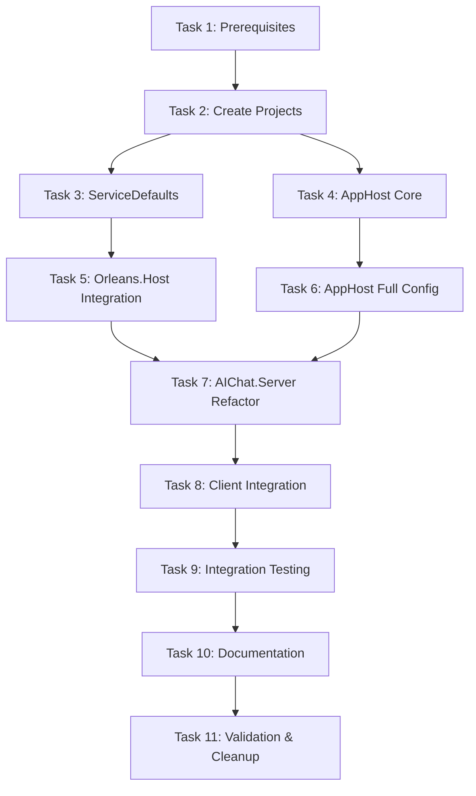

# Microsoft Aspire Orchestration - Implementation Tasks

**Feature**: Adopt Microsoft Aspire for Service Orchestration
**Status**: Task Breakdown Complete
**Date**: 2025-10-13
**Author**: Claude (spec-planner agent)

## Executive Summary

This document provides a sequential, actionable task breakdown for implementing Microsoft Aspire orchestration in the DOC_Project_2025 application. The most critical change involves removing the Orleans Host background task from `AIChat.Server/Program.cs` (lines 273-309) and running it as a separate service orchestrated by Aspire.

**Total Estimated Time**: 10 hours (1.25 days)

## Reference Documents

- [Requirements Document](./requirements.md)
- [Technical Design Document](./design.md)

## Task Dependency Graph



---

## Phase 1: Prerequisites and Setup

### ✅ Task 1: Install Aspire Workload and Verify Prerequisites - COMPLETED (2025-10-13)

**Priority**: Critical
**Estimated Time**: 15 minutes
**Dependencies**: None

**Description**:
Install the .NET Aspire workload and verify that all prerequisites are met for the migration. This task ensures the development environment is ready for Aspire development.

**IMPORTANT NOTE**: With .NET 10 RC, Aspire workload is deprecated. Aspire is now available as NuGet packages. We will use the package-based approach instead.

**Specific Actions**:
1. Open PowerShell/Terminal in project root directory
2. Run `dotnet workload list` to check current workloads
3. ~~Run `dotnet workload install aspire` to install Aspire workload~~ (NOT NEEDED in .NET 10)
4. Run `dotnet --version` to verify .NET SDK is installed
5. Verify Visual Studio 2022 version 17.9+ or VS Code with C# extension
6. Verify Node.js 18+ is installed (`node --version`)

**Files to Modify**: None

**Files to Create**: None

**Validation Criteria**:
- [x] ~~`dotnet workload list` shows `aspire` in the list~~ (Not applicable - Aspire is package-based in .NET 10)
- [x] .NET 10 SDK is installed and active (10.0.100-rc.1.25451.107)
- [x] Development IDE is compatible with Aspire (VS Code)
- [x] Node.js is installed and accessible (v22.17.1)
- [x] ~~Command runs without errors: `dotnet new aspire --help`~~ (Will use manual project creation with NuGet packages)

**Rollback Procedure**:
```bash
# If issues occur, uninstall workload
dotnet workload uninstall aspire
```

**Notes**:
- Aspire workload is required for project templates and tooling
- This is a non-destructive operation
- Can be done on any branch

---

### Task 2: Create Aspire Projects and Add to Solution

**Priority**: Critical
**Estimated Time**: 30 minutes
**Dependencies**: Task 1

**Description**:
Create the two new Aspire projects (`DocProject.AppHost` and `DocProject.ServiceDefaults`) and add them to the solution file. This establishes the foundation for service orchestration.

**Specific Actions**:
1. Navigate to `b:\sources\DOC_Project_2025\server` directory
2. Create AppHost project:
   ```bash
   dotnet new aspire-apphost -n DocProject.AppHost -o DocProject.AppHost
   ```
3. Create ServiceDefaults project:
   ```bash
   dotnet new aspire-servicedefaults -n DocProject.ServiceDefaults -o DocProject.ServiceDefaults
   ```
4. Add projects to solution:
   ```bash
   cd ..
   dotnet sln DOC_Project_2025.sln add server/DocProject.AppHost/DocProject.AppHost.csproj
   dotnet sln DOC_Project_2025.sln add server/DocProject.ServiceDefaults/DocProject.ServiceDefaults.csproj
   ```
5. Create solution folder "aspire" in solution file (manual edit or via VS)
6. Add project references from AppHost to other projects:
   ```bash
   cd server/DocProject.AppHost
   dotnet add reference ../AIChat.Server/AIChat.Server.csproj
   dotnet add reference ../AIChat.Orleans.Host/AIChat.Orleans.Host.csproj
   ```

**Files to Modify**:
- `b:\sources\DOC_Project_2025\DOC_Project_2025.sln` - Add new projects to solution

**Files to Create**:
- `b:\sources\DOC_Project_2025\server\DocProject.AppHost\DocProject.AppHost.csproj`
- `b:\sources\DOC_Project_2025\server\DocProject.AppHost\Program.cs`
- `b:\sources\DOC_Project_2025\server\DocProject.AppHost\appsettings.json`
- `b:\sources\DOC_Project_2025\server\DocProject.AppHost\appsettings.Development.json`
- `b:\sources\DOC_Project_2025\server\DocProject.AppHost\Properties\launchSettings.json`
- `b:\sources\DOC_Project_2025\server\DocProject.ServiceDefaults\DocProject.ServiceDefaults.csproj`
- `b:\sources\DOC_Project_2025\server\DocProject.ServiceDefaults\Extensions.cs`

**Code Changes**:
Default templates will be generated. We'll customize in subsequent tasks.

**Validation Criteria**:
- [ ] Both projects exist in `server/` directory
- [ ] `dotnet build` succeeds in both project directories
- [ ] Solution file loads without errors in Visual Studio/VS Code
- [ ] Project references from AppHost to Server and Orleans.Host are present
- [ ] No build warnings

**Rollback Procedure**:
```bash
# Remove projects from solution
dotnet sln DOC_Project_2025.sln remove server/DocProject.AppHost/DocProject.AppHost.csproj
dotnet sln DOC_Project_2025.sln remove server/DocProject.ServiceDefaults/DocProject.ServiceDefaults.csproj

# Delete directories
rm -rf server/DocProject.AppHost
rm -rf server/DocProject.ServiceDefaults
```

**Notes**:
- Keep default template content initially
- Projects should build independently before customization
- This task is non-disruptive to existing services

---

## Phase 2: ServiceDefaults Implementation

### ✅ Task 3: Implement ServiceDefaults Library - COMPLETED (2025-10-13)

**Priority**: Critical
**Estimated Time**: 1 hour
**Dependencies**: Task 2

**Description**:
Implement the complete ServiceDefaults library with OpenTelemetry configuration, health checks, and service discovery helpers. This provides shared infrastructure for all services.

**Specific Actions**:
1. Update `DocProject.ServiceDefaults.csproj` with required NuGet packages
2. Implement `Extensions.cs` with `AddServiceDefaults()` method
3. Create `OpenTelemetryExtensions.cs` with telemetry configuration
4. Create `HealthCheckExtensions.cs` with default health checks
5. Create `ServiceDiscoveryExtensions.cs` with Orleans client helper
6. Build and verify project

**Files to Modify**:
- `b:\sources\DOC_Project_2025\server\DocProject.ServiceDefaults\DocProject.ServiceDefaults.csproj`
- `b:\sources\DOC_Project_2025\server\DocProject.ServiceDefaults\Extensions.cs`

**Files to Create**:
- `b:\sources\DOC_Project_2025\server\DocProject.ServiceDefaults\OpenTelemetryExtensions.cs`
- `b:\sources\DOC_Project_2025\server\DocProject.ServiceDefaults\HealthCheckExtensions.cs`
- `b:\sources\DOC_Project_2025\server\DocProject.ServiceDefaults\ServiceDiscoveryExtensions.cs`

**Code Changes**:

**1. Update `DocProject.ServiceDefaults.csproj`**:
```xml
<Project Sdk="Microsoft.NET.Sdk">
  <PropertyGroup>
    <TargetFramework>net9.0</TargetFramework>
    <ImplicitUsings>enable</ImplicitUsings>
    <Nullable>enable</Nullable>
    <IsAspireSharedProject>true</IsAspireSharedProject>
  </PropertyGroup>

  <ItemGroup>
    <FrameworkReference Include="Microsoft.AspNetCore.App" />
  </ItemGroup>

  <ItemGroup>
    <PackageReference Include="Microsoft.Extensions.Http.Resilience" Version="9.0.0" />
    <PackageReference Include="Microsoft.Extensions.ServiceDiscovery" Version="9.0.0" />
    <PackageReference Include="OpenTelemetry.Exporter.OpenTelemetryProtocol" Version="1.10.0" />
    <PackageReference Include="OpenTelemetry.Extensions.Hosting" Version="1.10.0" />
    <PackageReference Include="OpenTelemetry.Instrumentation.AspNetCore" Version="1.10.1" />
    <PackageReference Include="OpenTelemetry.Instrumentation.Http" Version="1.10.0" />
    <PackageReference Include="OpenTelemetry.Instrumentation.Runtime" Version="1.10.0" />
    <PackageReference Include="OpenTelemetry.Instrumentation.Process" Version="0.5.0-rc.1" />
    <PackageReference Include="Microsoft.Orleans.Client" Version="9.0.0" />
  </ItemGroup>
</Project>
```

**2. Implement `Extensions.cs`** - See design document Section 4.1 for complete code

**3. Implement `OpenTelemetryExtensions.cs`** - See design document Section 4.2 for complete code

**4. Implement `HealthCheckExtensions.cs`** - See design document Section 4.3 for complete code

**5. Implement `ServiceDiscoveryExtensions.cs`** - See design document Section 4.4 for complete code

**Validation Criteria**:
- [x] `dotnet build` succeeds with zero warnings in ServiceDefaults project (only expected security advisory warnings)
- [x] All extension methods are properly exported
- [x] XML documentation comments are present
- [x] NuGet packages restore successfully
- [x] TypeScript compilation passes (N/A)

**Rollback Procedure**:
```bash
# Revert to template version
git checkout HEAD -- server/DocProject.ServiceDefaults/
```

**Notes**:
- Follow code from design document exactly
- This is a standalone library with no dependencies on other projects (except Orleans client)
- Test by building in isolation

---

## Phase 3: AppHost Core Implementation

### Task 4: Implement AppHost Core Configuration

**Priority**: Critical
**Estimated Time**: 45 minutes
**Dependencies**: Task 2

**Description**:
Implement the core AppHost project structure with basic orchestration logic, configuration files, and launch profiles. This task focuses on the foundation without full service integration yet.

**Specific Actions**:
1. Update `DocProject.AppHost.csproj` with required NuGet packages
2. Create basic `Program.cs` structure (without full service configuration)
3. Update `appsettings.json` with Aspire dashboard configuration
4. Update `launchSettings.json` with launch profiles
5. Build and verify project compiles

**Files to Modify**:
- `b:\sources\DOC_Project_2025\server\DocProject.AppHost\DocProject.AppHost.csproj`
- `b:\sources\DOC_Project_2025\server\DocProject.AppHost\Program.cs`
- `b:\sources\DOC_Project_2025\server\DocProject.AppHost\appsettings.json`
- `b:\sources\DOC_Project_2025\server\DocProject.AppHost\Properties\launchSettings.json`

**Code Changes**:

**1. Update `DocProject.AppHost.csproj`**:
```xml
<Project Sdk="Microsoft.NET.Sdk">
  <PropertyGroup>
    <OutputType>Exe</OutputType>
    <TargetFramework>net9.0</TargetFramework>
    <IsAspireHost>true</IsAspireHost>
    <ImplicitUsings>enable</ImplicitUsings>
    <Nullable>enable</Nullable>
  </PropertyGroup>

  <ItemGroup>
    <PackageReference Include="Aspire.Hosting.AppHost" Version="9.0.0" />
    <PackageReference Include="Aspire.Hosting.Orleans" Version="9.0.0" />
    <PackageReference Include="Aspire.Hosting.NodeJS" Version="9.0.0" />
    <PackageReference Include="CommunityToolkit.Aspire.Hosting.SQLite" Version="9.0.0" />
  </ItemGroup>

  <ItemGroup>
    <ProjectReference Include="..\AIChat.Server\AIChat.Server.csproj" />
    <ProjectReference Include="..\AIChat.Orleans.Host\AIChat.Orleans.Host.csproj" />
  </ItemGroup>
</Project>
```

**2. Create basic `Program.cs`** (stub version):
```csharp
using CommunityToolkit.Aspire.Hosting.SQLite;

var builder = DistributedApplication.CreateBuilder(args);

// TODO: Add service resources in Task 6

builder.Build().Run();
```

**3. Update `appsettings.json`** - See design document Section 3.3

**4. Update `launchSettings.json`** - See design document Section 3.4

**Validation Criteria**:
- [ ] `dotnet build` succeeds with zero warnings
- [ ] NuGet packages restore successfully
- [ ] `dotnet run` executes without errors (opens empty dashboard)
- [ ] Aspire dashboard accessible at http://localhost:15888
- [ ] Launch profiles are available in Visual Studio

**Rollback Procedure**:
```bash
git checkout HEAD -- server/DocProject.AppHost/
```

**Notes**:
- This task creates infrastructure only
- Full service integration happens in Task 6
- Can test by running `dotnet run --project server/DocProject.AppHost`

---

## Phase 4: Service Integration - Orleans Host

### Task 5: Integrate AIChat.Orleans.Host with ServiceDefaults

**Priority**: High
**Estimated Time**: 30 minutes
**Dependencies**: Task 3

**Description**:
Add ServiceDefaults integration to AIChat.Orleans.Host. This is a low-risk change that prepares Orleans Host for Aspire orchestration without removing it from AIChat.Server yet.

**Specific Actions**:
1. Add project reference to ServiceDefaults in AIChat.Orleans.Host.csproj
2. Update Program.cs to call `builder.AddServiceDefaults()`
3. Map default endpoints with `app.MapDefaultEndpoints()`
4. Build and test Orleans Host runs independently
5. Verify health checks and monitoring endpoints work

**Files to Modify**:
- `b:\sources\DOC_Project_2025\server\AIChat.Orleans.Host\AIChat.Orleans.Host.csproj`
- `b:\sources\DOC_Project_2025\server\AIChat.Orleans.Host\Program.cs`

**Code Changes**:

**1. Update `AIChat.Orleans.Host.csproj`**:
Add this project reference in the `<ItemGroup>` section:
```xml
<ItemGroup>
  <ProjectReference Include="..\DocProject.ServiceDefaults\DocProject.ServiceDefaults.csproj" />
</ItemGroup>
```

**2. Update `Program.cs`**:

Find the line where `WebApplication.CreateBuilder(args)` is called and add immediately after:
```csharp
var builder = WebApplication.CreateBuilder(args);

// Add Aspire service defaults
builder.AddServiceDefaults();

// ... rest of existing code ...
```

Then, after `app.Build()` but before `app.Run()`, add:
```csharp
var app = builder.Build();

// Map default Aspire endpoints (health checks, etc.)
app.MapDefaultEndpoints();

// ... rest of existing code ...

app.Run();
```

**Validation Criteria**:
- [ ] `dotnet build` succeeds with zero warnings in Orleans.Host project
- [ ] Orleans Host starts independently: `dotnet run --project server/AIChat.Orleans.Host`
- [ ] Health check endpoint accessible: `curl http://localhost:5100/health`
- [ ] Health check returns HTTP 200 with status "Healthy"
- [ ] Monitoring API endpoints still work: `curl http://localhost:5100/api/orleans/health/status`
- [ ] No regression in Orleans functionality

**Rollback Procedure**:
```bash
# Revert Orleans.Host changes
git checkout HEAD -- server/AIChat.Orleans.Host/
```

**Notes**:
- This task is low risk - only adding observability
- Orleans Host still starts independently
- AIChat.Server still has embedded Orleans Host at this point
- Verify Orleans Host logs show OpenTelemetry initialization

---

## Phase 5: AppHost Full Configuration

### ✅ Task 6: Implement Complete AppHost Orchestration - COMPLETED (2025-10-14)

**Priority**: Critical
**Estimated Time**: 1 hour
**Dependencies**: Task 4, Task 5

**Description**:
Implement the complete AppHost Program.cs with all service resources, dependencies, and configuration injection. This creates the full orchestration logic.

**Specific Actions**:
1. Replace AppHost Program.cs stub with full implementation
2. Define SQLite database resource with data binding
3. Add AIChat.Orleans.Host as project resource with endpoints
4. Add AIChat.Server as project resource with references
5. Add SvelteKit client as npm app resource
6. Configure service dependencies (WaitFor)
7. Inject environment variables (LLM_API_KEY, etc.)
8. Test with `dotnet run --dry-run` if available

**Files to Modify**:
- `b:\sources\DOC_Project_2025\server\DocProject.AppHost\Program.cs`

**Code Changes**:

Replace entire `Program.cs` content with code from design document Section 3.1:
```csharp
using CommunityToolkit.Aspire.Hosting.SQLite;

var builder = DistributedApplication.CreateBuilder(args);

// ========================================================================
// INFRASTRUCTURE RESOURCES
// ========================================================================

// SQLite database with persistent data binding
var database = builder.AddSQLite("sqlite-server", "./data")
    .AddDatabase("aichat", "aichat.db");

// Optional: SQLite Web UI for development inspection
if (builder.Environment.IsDevelopment())
{
    database.WithSqliteWeb();
}

// ========================================================================
// ORLEANS SILO (SEPARATE SERVICE)
// ========================================================================

// Orleans Host as separate service (no longer embedded in AIChat.Server)
var orleansHost = builder.AddProject<Projects.AIChat_Orleans_Host>("orleans-host")
    .WithReference(database)
    .WithEndpoint("silo", 11111)        // Silo port
    .WithEndpoint("gateway", 30000)     // Gateway port
    .WithEndpoint("monitoring", 5100)   // Monitoring API
    .WaitFor(database);                  // Ensure DB ready first

// ========================================================================
// BACKEND API SERVER (ORLEANS CLIENT)
// ========================================================================

// AIChat.Server - Now Orleans CLIENT only (silo code removed)
var apiServer = builder.AddProject<Projects.AIChat_Server>("api-server")
    .WithReference(database)
    .WithReference(orleansHost)
    .WithEnvironment("Orleans__GatewayPort", orleansHost.GetEndpoint("gateway"))
    .WithEnvironment("ASPNETCORE_URLS", "http://+:5099")
    .WaitFor(orleansHost)               // Orleans must be ready
    .WaitFor(database);                 // Database must be ready

// ========================================================================
// FRONTEND APPLICATION
// ========================================================================

// SvelteKit client with automatic API URL configuration
var client = builder.AddNpmApp("client", "../client", "dev")
    .WithReference(apiServer)
    .WithHttpEndpoint(env: "PORT", port: 5173)
    .WithEnvironment("VITE_API_URL", apiServer.GetEndpoint("http"))
    .WaitFor(apiServer);                // API must be ready

// ========================================================================
// LAUNCH PROFILES
// ========================================================================

// Configure different launch profiles based on environment
if (builder.Configuration["ASPIRE_PROFILE"] == "backend-only")
{
    // Backend development profile - no client
    // Note: Aspire 9.0 API - check if RemoveResource is available, otherwise comment out
    // builder.RemoveResource(client);
}
else if (builder.Configuration["ASPIRE_PROFILE"] == "orleans-debug")
{
    // Orleans debugging profile - extra logging
    orleansHost.WithEnvironment("Logging__LogLevel__Orleans", "Debug");
}

builder.Build().Run();
```

**Validation Criteria**:
- [x] `dotnet build` succeeds with zero errors (only expected warnings: NU1902, CS0618, NETSDK1057)
- [x] Code compiles without errors
- [x] All project references resolve correctly
- [x] SQLite, Orleans Host, AIChat.Server, and client resources configured
- [x] Service dependencies (WaitFor) properly chained
- [x] Environment variables configured
- [x] Launch profile logic implemented

**Notes on Implementation**:
- Used path-based project references instead of `Projects.` namespace for compatibility
- Simplified SQLite configuration (WithDataBindMount not available in current package version)
- SQLite Web UI commented out for future enhancement
- Fixed OpenTelemetry package version conflict (1.10.0 → 1.10.1) in AIChat.Server

**Rollback Procedure**:
```bash
# Revert to stub version
git checkout HEAD -- server/DocProject.AppHost/Program.cs
```

**Notes**:
- Do NOT run `dotnet run` yet - AIChat.Server still has embedded Orleans Host
- This will cause port conflicts if both try to start Orleans
- We'll remove embedded Orleans Host in Task 7 before running
- The `Projects.` namespace is auto-generated by Aspire based on project references

---

## Phase 6: AIChat.Server Refactoring (CRITICAL)

### Task 7: Remove Orleans Host from AIChat.Server

**Priority**: CRITICAL
**Estimated Time**: 1.5 hours
**Dependencies**: Task 5, Task 6

**Description**:
**This is the highest-risk task.** Remove the Orleans Host background task from AIChat.Server Program.cs and convert it to an Orleans client only. This requires careful surgical removal of specific code blocks while preserving Orleans client functionality.

**CRITICAL WARNING**: After this task, AIChat.Server cannot run standalone in Development/Test environments without the separate Orleans Host. Always run via Aspire AppHost or start Orleans Host manually.

**Specific Actions**:
1. **BACKUP**: Create a git commit before starting this task
2. Add project reference to ServiceDefaults in AIChat.Server.csproj
3. Remove Orleans Host background task code (lines 273-309)
4. Remove Orleans Host shutdown handling (lines 558-571)
5. Remove `orleansHostCts` variable declaration (line 36)
6. Add `builder.AddServiceDefaults()` call early in Program.cs
7. Update Orleans client configuration for service discovery
8. Add Orleans dependency health checks
9. Map default Aspire endpoints
10. Build and verify no compilation errors

**Files to Modify**:
- `b:\sources\DOC_Project_2025\server\AIChat.Server\AIChat.Server.csproj`
- `b:\sources\DOC_Project_2025\server\AIChat.Server\Program.cs`

**Code Changes**:

**1. Update `AIChat.Server.csproj`**:
Add this project reference in the `<ItemGroup>` section:
```xml
<ItemGroup>
  <ProjectReference Include="..\DocProject.ServiceDefaults\DocProject.ServiceDefaults.csproj" />
</ItemGroup>
```

**2. Update `Program.cs` - REMOVALS**:

**REMOVE line 36** - Orleans Host cancellation token:
```csharp
// REMOVE THIS LINE:
CancellationTokenSource? orleansHostCts = null;
```

**REMOVE lines 276-309** - Entire Orleans Host background task:
```csharp
// REMOVE THIS ENTIRE BLOCK:
        // Start Orleans Host as separate process for Development/Test environments
        if (isDevelopmentEnvironment || isTestEnvironment)
        {
            Log.Information(
                "Starting Orleans Host as separate process for {Environment} environment",
                builder.Environment.EnvironmentName
            );

            orleansHostCts = new CancellationTokenSource();

            // Start Orleans Host in background task with separate DI container
            _ = Task.Run(async () =>
            {
                try
                {
                    Log.Information("Orleans Host starting in background...");
                    // Pass empty args to Orleans Host to avoid URL conflicts
                    await AIChat.Orleans.Host.Program.Main([]);
                }
                catch (OperationCanceledException)
                {
                    Log.Information("Orleans Host shutdown requested");
                }
                catch (Exception ex)
                {
                    Log.Error(ex, "Orleans Host failed unexpectedly");
                }
            }, orleansHostCts.Token);

            // Wait for Orleans to initialize before proceeding
            Log.Information("Waiting for Orleans Host to initialize...");
            Task.Delay(TimeSpan.FromSeconds(5)).Wait();
            Log.Information("Orleans Host initialization delay completed");
        }
```

**REMOVE lines 558-565** - Orleans Host shutdown handler:
```csharp
// REMOVE THIS BLOCK:
// Setup graceful shutdown for Orleans Host
Console.CancelKeyPress += (sender, e) =>
{
    if (orleansHostCts != null)
    {
        Log.Information("Shutting down Orleans Host...");
        orleansHostCts.Cancel();
    }
};
```

**REMOVE lines 570-571** - Orleans Host cleanup:
```csharp
// REMOVE THESE LINES:
orleansHostCts?.Cancel();
orleansHostCts?.Dispose();
```

**3. Update `Program.cs` - ADDITIONS**:

**ADD after line 33** (after `var builder = WebApplication.CreateBuilder(args);`):
```csharp
var builder = WebApplication.CreateBuilder(args);

// Add Aspire service defaults for observability and health checks
builder.AddServiceDefaults();

// Orleans Host cancellation token for graceful shutdown
// [REST OF EXISTING CODE - LINE 36 NOW REMOVED]
```

**UPDATE Orleans client configuration** (around line 313):

Find this code:
```csharp
        // Always use Orleans client for all environments (ensures clean separation)
        Log.Information("Configuring Orleans client for {Environment} environment", builder.Environment.EnvironmentName);
        _ = builder.Services.AddOrleansClient(builder.Configuration, builder.Environment);
```

Replace with service discovery-aware configuration:
```csharp
        // Always use Orleans client for all environments (ensures clean separation)
        Log.Information("Configuring Orleans client for {Environment} environment", builder.Environment.EnvironmentName);

        // Use Orleans client with service discovery support
        builder.Services.AddOrleansClient((Orleans.IClientBuilder clientBuilder) =>
        {
            clientBuilder.Configure<Orleans.Configuration.ClusterOptions>(options =>
            {
                options.ClusterId = builder.Configuration["Orleans:ClusterId"] ?? "doc-chat-cluster";
                options.ServiceId = builder.Configuration["Orleans:ServiceId"] ?? "doc-chat-service";
            });

            // Use service discovery if running under Aspire, otherwise fallback to localhost
            var orleansConnection = builder.Configuration.GetConnectionString("orleans-host");
            if (!string.IsNullOrEmpty(orleansConnection))
            {
                // Aspire-injected connection - parse and use
                Log.Information("Using Aspire-injected Orleans connection: {Connection}", orleansConnection);
                clientBuilder.UseLocalhostClustering(30000); // TODO: Parse orleansConnection for actual endpoint
            }
            else
            {
                // Fallback to localhost for standalone runs
                Log.Information("Using fallback localhost Orleans clustering");
                clientBuilder.UseLocalhostClustering(30000);
            }
        });
```

**ADD before `app.Run()`** (around line 567):
```csharp
// Map default Aspire endpoints (health checks, etc.)
app.MapDefaultEndpoints();

app.Run();
```

**Validation Criteria**:
- [ ] `dotnet build` succeeds with zero warnings in AIChat.Server project
- [ ] No references to `orleansHostCts` remain in code
- [ ] No references to `AIChat.Orleans.Host.Program.Main` remain
- [ ] `builder.AddServiceDefaults()` is called early in Program.cs
- [ ] Orleans client configuration uses service discovery
- [ ] `app.MapDefaultEndpoints()` is called before `app.Run()`
- [ ] All existing tests still pass (Orleans client tests)
- [ ] No compilation errors

**Testing (DO NOT RUN STANDALONE)**:
```bash
# Build only - do not run standalone yet
dotnet build server/AIChat.Server/AIChat.Server.csproj

# Run all tests - should still pass
dotnet test server/AIChat.Server.Tests/AIChat.Server.Tests.csproj
```

**Rollback Procedure**:
```bash
# Revert all changes to AIChat.Server
git checkout HEAD -- server/AIChat.Server/

# Or if committed
git revert <commit-hash>
```

**Notes**:
- **CRITICAL**: AIChat.Server now requires external Orleans Host
- Cannot run standalone with `dotnet run` in Development/Test anymore
- Must use Aspire AppHost to start all services together
- Orleans client functionality unchanged - only hosting removed
- Keep Orleans client configuration, metrics, health checks
- This change makes architecture cleaner and more production-like

---

## Phase 7: Client Integration

### Task 8: Integrate SvelteKit Client with Aspire

**Priority**: Medium
**Estimated Time**: 30 minutes
**Dependencies**: Task 7

**Description**:
Update the SvelteKit client to consume Aspire-injected environment variables for server URL configuration. This enables automatic service discovery for the frontend.

**Specific Actions**:
1. Update `vite.config.ts` to use PORT environment variable
2. Update `vite.config.ts` proxy to use VITE_API_URL
3. Create or update `src/lib/config.ts` for centralized API URL management
4. Update any hardcoded localhost URLs to use config
5. Test client starts with environment variables

**Files to Modify**:
- `b:\sources\DOC_Project_2025\client\vite.config.ts`
- `b:\sources\DOC_Project_2025\client\src\lib\config.ts` (create if doesn't exist)

**Code Changes**:

**1. Update `vite.config.ts`**:

Find the server configuration and update:
```typescript
import { defineConfig } from 'vite';
import { sveltekit } from '@sveltejs/kit/vite';

export default defineConfig({
  plugins: [sveltekit()],
  server: {
    // Use Aspire-injected PORT or fallback to 5173
    port: parseInt(process.env.PORT || '5173'),
    proxy: {
      '/api': {
        // Use Aspire-injected VITE_API_URL or fallback to localhost
        target: process.env.VITE_API_URL || 'http://localhost:5099',
        changeOrigin: true,
        secure: false
      },
      '/api/chat-hub': {
        target: process.env.VITE_API_URL || 'http://localhost:5099',
        changeOrigin: true,
        ws: true // WebSocket support for SignalR
      }
    }
  }
});
```

**2. Create/Update `src/lib/config.ts`**:
```typescript
// src/lib/config.ts
// Centralized configuration for API endpoints

/**
 * Get the API base URL from environment or use fallback
 */
export const getApiUrl = (): string => {
  // Vite exposes env vars prefixed with VITE_ to the client
  return import.meta.env.VITE_API_URL || 'http://localhost:5099';
};

/**
 * Get WebSocket URL from API URL
 */
export const getWebSocketUrl = (): string => {
  const apiUrl = getApiUrl();
  return apiUrl.replace('http://', 'ws://').replace('https://', 'wss://');
};

export const config = {
  apiUrl: getApiUrl(),
  wsUrl: getWebSocketUrl(),
  signalRHub: `${getApiUrl()}/api/chat-hub`,
  sseEndpoint: `${getApiUrl()}/api/chat-sse`
};

export default config;
```

**3. Update any client files using hardcoded URLs**:

Find files with `http://localhost:5099` and replace with:
```typescript
import config from '$lib/config';

// Instead of: const url = 'http://localhost:5099/api/chat';
const url = `${config.apiUrl}/api/chat`;
```

**Validation Criteria**:
- [ ] `npm run build` succeeds in client directory
- [ ] `vite.config.ts` reads PORT and VITE_API_URL environment variables
- [ ] `config.ts` exports API URL configuration
- [ ] No hardcoded `localhost:5099` URLs remain in client code
- [ ] Client starts with: `PORT=5173 VITE_API_URL=http://localhost:5099 npm run dev`
- [ ] Console shows correct API URL being used

**Rollback Procedure**:
```bash
# Revert client changes
git checkout HEAD -- client/
```

**Notes**:
- Client still works with hardcoded fallback values
- Environment variables are optional, not required
- Test standalone client: `npm run dev` should still work
- Aspire will inject environment variables when running via AppHost

---

## Phase 8: Integration Testing

### Task 9: End-to-End Integration Testing

**Priority**: Critical
**Estimated Time**: 2 hours
**Dependencies**: Task 8

**Description**:
Test the complete Aspire orchestration end-to-end. This includes starting all services, verifying connectivity, testing functionality, and validating observability.

**Specific Actions**:
1. Start application via Aspire AppHost
2. Verify all services start in correct order
3. Test service-to-service communication
4. Verify Orleans connectivity
5. Test complete user workflows
6. Check Aspire dashboard functionality
7. Validate distributed tracing
8. Test health check endpoints
9. Verify graceful shutdown
10. Document any issues found

**Files to Modify**: None (testing only)

**Files to Create**:
- `b:\sources\DOC_Project_2025\scratchpad\aspire-testing\test-results.md` (test notes)

**Testing Procedure**:

**1. Start Aspire AppHost**:
```bash
cd b:/sources/DOC_Project_2025/server/DocProject.AppHost
dotnet run
```

**2. Verify Aspire Dashboard**:
- Open http://localhost:15888 in browser
- Check Resources view shows: sqlite-server, orleans-host, api-server, client
- Verify all resources show "Running" status
- Check Console Logs tab shows logs from all services

**3. Verify Service Endpoints**:
```bash
# Orleans Host health check
curl http://localhost:5100/health
# Expected: {"status":"Healthy"}

# AIChat.Server health check
curl http://localhost:5099/health
# Expected: {"status":"Healthy"}

# Orleans monitoring API
curl http://localhost:5100/api/orleans/health/status
# Expected: Orleans health status JSON

# SvelteKit client
curl http://localhost:5173
# Expected: HTML response
```

**4. Test Orleans Connectivity**:
```bash
# Call API endpoint that uses Orleans
curl -X POST http://localhost:5099/api/chat/send \
  -H "Content-Type: application/json" \
  -d '{"message":"Hello","userId":"test-user"}'
# Expected: Successful response with Orleans grain interaction
```

**5. Test Complete User Workflow**:
- Open client in browser: http://localhost:5173
- Login with test user
- Send a chat message
- Verify message appears
- Check Aspire dashboard for distributed trace showing:
  - Client → AIChat.Server → Orleans Gateway → Grain

**6. Test Database Persistence**:
```bash
# Check database file exists
ls -la b:/sources/DOC_Project_2025/server/DocProject.AppHost/data/aichat.db

# Stop Aspire (Ctrl+C)
# Restart Aspire
cd server/DocProject.AppHost
dotnet run

# Verify data persists (login with previous user, see chat history)
```

**7. Test Graceful Shutdown**:
- Press Ctrl+C in AppHost terminal
- Verify all services shut down cleanly
- Check logs for graceful shutdown messages
- No error logs during shutdown

**Validation Criteria**:
- [ ] All services start within 30 seconds
- [ ] Aspire dashboard accessible and shows all resources
- [ ] All health check endpoints return "Healthy"
- [ ] Orleans gateway accepts client connections
- [ ] AIChat.Server successfully connects to Orleans Host
- [ ] Client successfully connects to AIChat.Server
- [ ] SignalR/SSE connections establish
- [ ] Chat messages send and receive correctly
- [ ] Database data persists across restarts
- [ ] Distributed traces visible in Aspire dashboard
- [ ] Logs from all services visible in dashboard
- [ ] Graceful shutdown works without errors
- [ ] No port conflicts or connection errors

**Testing Checklist**:
- [ ] Service startup order correct (DB → Orleans → Server → Client)
- [ ] Orleans silo starts independently from AIChat.Server
- [ ] AIChat.Server connects to Orleans as client only
- [ ] User authentication works
- [ ] Chat message sending/receiving works
- [ ] MCP integration works (if enabled)
- [ ] WebSocket connections work
- [ ] SSE streaming works
- [ ] Background tasks execute correctly
- [ ] Metrics exported to Prometheus
- [ ] OpenTelemetry traces captured
- [ ] Health checks report correct status
- [ ] Configuration injection works (API keys, etc.)

**Rollback Procedure**:
If critical issues found:
1. Stop Aspire: Ctrl+C
2. Document issues in test-results.md
3. Fix issues and re-test
4. If unfixable, revert all changes:
   ```bash
   git reset --hard HEAD
   ```

**Notes**:
- This is the most important validation step
- Test thoroughly before proceeding
- Document any issues or unexpected behavior
- Compare behavior with PowerShell script startup for regressions
- Keep PowerShell scripts available as fallback during this phase

---

## Phase 9: Documentation

### Task 10: Update Documentation

**Priority**: High
**Estimated Time**: 1 hour
**Dependencies**: Task 9

**Description**:
Update all project documentation to reflect the Aspire migration. This includes README files, instruction documents, and deprecation notices for PowerShell scripts.

**Specific Actions**:
1. Update main README.md with Aspire startup instructions
2. Update `.instructions/` directory with Aspire workflow
3. Add deprecation warnings to PowerShell scripts
4. Document Aspire dashboard usage
5. Update troubleshooting guides
6. Document rollback procedures
7. Create Aspire-specific FAQ

**Files to Modify**:
- `b:\sources\DOC_Project_2025\README.md`
- `b:\sources\DOC_Project_2025\.instructions\00-start-here.md`
- `b:\sources\DOC_Project_2025\build-and-start-server.ps1`
- `b:\sources\DOC_Project_2025\build-and-start-client.ps1`

**Files to Create**:
- `b:\sources\DOC_Project_2025\docs\aspire\getting-started.md`
- `b:\sources\DOC_Project_2025\docs\aspire\dashboard-guide.md`
- `b:\sources\DOC_Project_2025\docs\aspire\troubleshooting.md`

**Code Changes**:

**1. Add Deprecation Warning to `build-and-start-server.ps1`**:

At the top of the file, after the header comments:
```powershell
# ============================================================================
# DEPRECATION WARNING
# ============================================================================
# This script is deprecated and will be removed in a future release.
# Please use Aspire AppHost for starting the application:
#
#   cd server/DocProject.AppHost
#   dotnet run
#
# Or in Visual Studio: Set DocProject.AppHost as startup project and press F5
#
# This script is maintained temporarily for backward compatibility.
# ============================================================================

Write-Warning "DEPRECATED: This script is deprecated. Please use 'dotnet run --project server/DocProject.AppHost' instead."
Write-Host "Press Enter to continue with legacy startup, or Ctrl+C to cancel..." -ForegroundColor Yellow
Read-Host
```

**2. Add Deprecation Warning to `build-and-start-client.ps1`**:

Add similar warning at the top:
```powershell
# ============================================================================
# DEPRECATION WARNING
# ============================================================================
# This script is deprecated when using Aspire orchestration.
# The client is automatically started by Aspire AppHost.
#
# To start everything including the client:
#   cd server/DocProject.AppHost
#   dotnet run
#
# To start only the client for development:
#   cd client
#   npm run dev
#
# This script is maintained temporarily for backward compatibility.
# ============================================================================

Write-Warning "DEPRECATED: This script is deprecated with Aspire. The client starts automatically via Aspire."
Write-Host "Press Enter to continue with standalone client startup, or Ctrl+C to cancel..." -ForegroundColor Yellow
Read-Host
```

**3. Update `README.md`**:

Replace the "Getting Started" section:
```markdown
## Getting Started

### Prerequisites
- .NET 9.0 SDK
- Node.js 18+
- Aspire workload: `dotnet workload install aspire`

### Quick Start with Aspire (Recommended)

1. **Clone the repository**
   ```bash
   git clone <repository-url>
   cd DOC_Project_2025
   ```

2. **Install dependencies**
   ```bash
   cd client
   npm install
   cd ..
   ```

3. **Start the application**
   ```bash
   cd server/DocProject.AppHost
   dotnet run
   ```

4. **Access the application**
   - Aspire Dashboard: http://localhost:15888
   - Client Application: http://localhost:5173
   - API Server: http://localhost:5099
   - Orleans Monitoring: http://localhost:5100

### Alternative: Manual Startup (Legacy)

For backward compatibility, PowerShell scripts are still available but deprecated:
```powershell
# Start server (deprecated)
.\build-and-start-server.ps1

# Start client (deprecated)
.\build-and-start-client.ps1
```

**Note**: These scripts will be removed in a future release.

### Debugging in Visual Studio

1. Open `DOC_Project_2025.sln`
2. Set `DocProject.AppHost` as startup project
3. Press F5
4. All services start automatically with debugging enabled

### Aspire Dashboard

The Aspire dashboard provides:
- Real-time service status
- Unified logs from all services
- Distributed tracing
- Metrics and health checks

Access at: http://localhost:15888

For detailed Aspire usage, see [Aspire Getting Started Guide](docs/aspire/getting-started.md)
```

**4. Create `docs/aspire/getting-started.md`**:
```markdown
# Getting Started with Aspire Orchestration

## Overview

This application uses Microsoft Aspire for service orchestration, providing a unified developer experience with single-command startup, integrated observability, and automatic service discovery.

## Architecture

The application consists of:
- **SQLite Database**: Persistent data storage
- **Orleans Host**: Distributed grain runtime (separate service)
- **AIChat.Server**: Backend API (Orleans client only)
- **SvelteKit Client**: Frontend application

All services are orchestrated by Aspire AppHost.

## Starting the Application

### Using Aspire AppHost (Recommended)

```bash
cd server/DocProject.AppHost
dotnet run
```

This single command:
1. Starts SQLite database
2. Starts Orleans Host (separate process)
3. Starts AIChat.Server (connected to Orleans)
4. Starts SvelteKit client
5. Opens Aspire dashboard

### Using Visual Studio

1. Open `DOC_Project_2025.sln`
2. Set `DocProject.AppHost` as startup project (right-click → Set as Startup Project)
3. Press F5 or click Start

### Launch Profiles

Different launch profiles are available in `launchSettings.json`:

- **Default**: Start all services
- **Backend Only**: Start database, Orleans, and server (no client)
- **Orleans Debug**: Start with detailed Orleans logging

Select profile in Visual Studio or use:
```bash
dotnet run --launch-profile "Orleans Debug"
```

## Aspire Dashboard

The Aspire dashboard is your central monitoring tool:

**URL**: http://localhost:15888

**Features**:
- **Resources**: View all services and their status
- **Console**: Real-time logs from all services
- **Traces**: Distributed tracing across services
- **Metrics**: Performance metrics and health checks
- **Environment**: View injected configuration

## Service Endpoints

Once running, services are accessible at:

| Service | URL | Purpose |
|---------|-----|---------|
| Aspire Dashboard | http://localhost:15888 | Monitoring and observability |
| SvelteKit Client | http://localhost:5173 | User interface |
| AIChat.Server API | http://localhost:5099 | REST API, SignalR, SSE |
| Orleans Monitoring | http://localhost:5100 | Orleans health and metrics |
| Health Checks | http://localhost:5099/health | Service health status |

## Service Dependencies

Services start in this order:
1. SQLite Database
2. Orleans Host (waits for database)
3. AIChat.Server (waits for Orleans and database)
4. SvelteKit Client (waits for server)

Aspire automatically manages these dependencies.

## Configuration

### Environment Variables

Configuration is injected by Aspire. Required variables:

- `LLM_API_KEY`: API key for LLM provider
- `LLM_BASE_API_URL`: Base URL for LLM API (optional)
- `SERPER_API_KEY`: API key for Serper (optional)

Set in `launchSettings.json` or user secrets:
```bash
dotnet user-secrets set "LLM_API_KEY" "your-key-here" --project server/DocProject.AppHost
```

### Database

SQLite database location: `server/DocProject.AppHost/data/aichat.db`

Data persists across restarts.

### Orleans Configuration

Orleans clustering uses localhost in development. Connection is automatic via service discovery.

## Troubleshooting

See [Troubleshooting Guide](troubleshooting.md) for common issues.

### Quick Checks

1. **Services won't start**
   - Check Aspire dashboard for error messages
   - Verify ports 5099, 5100, 5173, 11111, 30000 are available
   - Check logs in dashboard Console tab

2. **Orleans connection fails**
   - Verify Orleans Host shows "Running" in dashboard
   - Check Orleans health: `curl http://localhost:5100/health`
   - Review Orleans Host logs in dashboard

3. **Client can't connect to server**
   - Verify server shows "Running" in dashboard
   - Check server health: `curl http://localhost:5099/health`
   - Check VITE_API_URL environment variable in dashboard

## Migration from PowerShell Scripts

If you previously used `build-and-start-server.ps1` and `build-and-start-client.ps1`:

**Old way**:
```powershell
.\build-and-start-server.ps1
.\build-and-start-client.ps1
```

**New way**:
```bash
cd server/DocProject.AppHost
dotnet run
```

PowerShell scripts are deprecated and will be removed in a future release.

## Next Steps

- [Dashboard User Guide](dashboard-guide.md)
- [Troubleshooting](troubleshooting.md)
- [Development Workflows](../development-workflows.md)
```

**Validation Criteria**:
- [ ] README.md updated with Aspire instructions
- [ ] Deprecation warnings added to PowerShell scripts
- [ ] Aspire getting started guide created
- [ ] Dashboard usage documented
- [ ] All links in documentation work
- [ ] Screenshots added where helpful (optional)
- [ ] Documentation reviewed for accuracy

**Rollback Procedure**:
```bash
# Revert documentation changes
git checkout HEAD -- README.md .instructions/ docs/
```

**Notes**:
- Keep PowerShell scripts functional during transition period
- Documentation should be clear for both new and existing developers
- Include migration guide for developers familiar with old workflow

---

## Phase 10: Validation and Cleanup

### Task 11: Final Validation and Script Deprecation

**Priority**: High
**Estimated Time**: 1 hour
**Dependencies**: Task 10

**Description**:
Perform final validation of the entire Aspire implementation, run all test suites, and prepare for PowerShell script removal in future sprint.

**Specific Actions**:
1. Run complete test suite
2. Run validation scripts
3. Test fresh clone scenario
4. Measure and compare startup times
5. Verify zero build warnings
6. Test rollback procedure
7. Create migration checklist for team
8. Schedule PowerShell script removal

**Files to Modify**: None (validation only)

**Files to Create**:
- `b:\sources\DOC_Project_2025\docs\aspire\migration-checklist.md`
- `b:\sources\DOC_Project_2025\docs\aspire\validation-report.md`

**Validation Steps**:

**1. Run All Tests**:
```bash
cd b:/sources/DOC_Project_2025

# Run all unit tests
dotnet test

# Run server tests specifically
dotnet test server/AIChat.Server.Tests/AIChat.Server.Tests.csproj

# Run Orleans tests
dotnet test server/AIChat.Orleans.Tests/AIChat.Orleans.Tests.csproj

# Check test results - all must pass
```

**2. Run Validation Scripts**:
```bash
# Format code (REQUIRED before commit)
pwsh scripts/format-code.ps1

# Build and check for warnings
pwsh scripts/build_and_group_errors_and_warnings.ps1

# Quality check
pwsh scripts/quality-check.ps1

# Pre-commit validation
pwsh scripts/validate-pre-commit.ps1
```

**3. Test Fresh Clone Scenario**:

Simulate new developer onboarding:
```bash
# In a separate directory
cd /tmp
git clone b:/sources/DOC_Project_2025 DOC_Project_2025_fresh
cd DOC_Project_2025_fresh

# Install workload
dotnet workload install aspire

# Install client dependencies
cd client
npm install
cd ..

# Start application
cd server/DocProject.AppHost
dotnet run

# Verify all services start successfully
# Open http://localhost:15888
# Test login and chat functionality
```

**4. Measure Startup Times**:

Compare startup times:
```bash
# Time Aspire startup
time dotnet run --project server/DocProject.AppHost

# Expected: ≤30 seconds for all services to be ready
```

Document results in validation-report.md

**5. Verify Zero Warnings**:
```bash
# Build entire solution
dotnet build DOC_Project_2025.sln

# Count warnings
dotnet build DOC_Project_2025.sln | grep -i warning | wc -l
# Expected: 0
```

**6. Test Rollback Procedure**:

In a separate branch:
```bash
# Create test branch
git checkout -b test-rollback

# Revert all Aspire changes
git revert <commit-range>

# Verify old workflow still works
.\build-and-start-server.ps1
.\build-and-start-client.ps1

# Verify functionality
# Return to main branch
git checkout main
git branch -D test-rollback
```

**7. Create Migration Checklist**:

Create `docs/aspire/migration-checklist.md`:
```markdown
# Team Migration Checklist

## Before Using Aspire

- [ ] Install Aspire workload: `dotnet workload install aspire`
- [ ] Verify .NET 9.0 SDK installed
- [ ] Pull latest changes from repository
- [ ] Review [Getting Started Guide](getting-started.md)

## First-Time Setup

- [ ] Restore NuGet packages: `dotnet restore`
- [ ] Install client dependencies: `cd client && npm install`
- [ ] Set up user secrets for API keys (if needed)

## Daily Workflow

- [ ] Start application: `cd server/DocProject.AppHost && dotnet run`
- [ ] Open Aspire dashboard: http://localhost:15888
- [ ] Stop application: Ctrl+C in terminal

## Troubleshooting

- [ ] Check dashboard for service status
- [ ] Review logs in dashboard Console tab
- [ ] Verify health endpoints return 200 OK
- [ ] Check ports are not in use by other processes

## Migration Complete

- [ ] Bookmarked Aspire dashboard URL
- [ ] Removed any shortcuts to PowerShell scripts
- [ ] Updated local documentation/notes
- [ ] Provided feedback to team
```

**Validation Criteria**:
- [ ] All unit tests pass (100%)
- [ ] All integration tests pass (100%)
- [ ] `format-code.ps1` runs without changes needed
- [ ] `build_and_group_errors_and_warnings.ps1` reports zero warnings
- [ ] `quality-check.ps1` passes all checks
- [ ] `validate-pre-commit.ps1` passes
- [ ] Fresh clone scenario works for new developer
- [ ] Startup time ≤30 seconds
- [ ] All services reach "Running" state
- [ ] Health checks all return "Healthy"
- [ ] Database data persists across restarts
- [ ] Rollback procedure works (tested in separate branch)
- [ ] Documentation is complete and accurate
- [ ] Migration checklist created

**Testing Checklist**:
- [ ] User authentication works
- [ ] Chat message sending works
- [ ] Chat message receiving works
- [ ] SignalR connections establish
- [ ] SSE streaming works
- [ ] WebSocket connections work
- [ ] Orleans grains activate correctly
- [ ] Background tasks execute
- [ ] MCP integration works (if enabled)
- [ ] Database queries succeed
- [ ] API endpoints respond correctly
- [ ] Metrics exported to Prometheus
- [ ] Distributed traces captured
- [ ] Logs visible in dashboard

**Rollback Procedure**:

If final validation fails:
1. Document specific failure in validation-report.md
2. Stop all services
3. Revert changes:
   ```bash
   git reset --hard <commit-before-migration>
   ```
4. Restart with PowerShell scripts
5. Create issues for failures
6. Re-attempt migration after fixes

**Notes**:
- This is the final gate before considering migration complete
- All checks must pass before merging to main
- PowerShell scripts will be removed in sprint after team validates
- Document any edge cases or issues discovered

---

## Post-Implementation

### Task 12 (Future Sprint): Remove PowerShell Scripts

**Priority**: Low
**Estimated Time**: 30 minutes
**Dependencies**: Task 11 + 1-2 sprint stabilization period

**Description**:
After team has validated Aspire workflow for 1-2 sprints, remove deprecated PowerShell scripts and update all references.

**Specific Actions**:
1. Confirm with team that Aspire is stable
2. Remove `build-and-start-server.ps1`
3. Remove `build-and-start-client.ps1`
4. Update any scripts that referenced these files
5. Update `.gitignore` if needed
6. Update documentation to remove all references

**Files to Delete**:
- `b:\sources\DOC_Project_2025\build-and-start-server.ps1`
- `b:\sources\DOC_Project_2025\build-and-start-client.ps1`

**Notes**:
- Schedule this for a future sprint after team validation
- Communicate removal date to team in advance
- Keep scripts in git history for reference

---

## Appendix A: Quick Reference Commands

### Starting Application

```bash
# Aspire (recommended)
cd server/DocProject.AppHost
dotnet run

# Visual Studio
# Set DocProject.AppHost as startup project, press F5

# Legacy (deprecated)
.\build-and-start-server.ps1
.\build-and-start-client.ps1
```

### Service Endpoints

| Service | URL |
|---------|-----|
| Aspire Dashboard | http://localhost:15888 |
| Client | http://localhost:5173 |
| API Server | http://localhost:5099 |
| Orleans Monitoring | http://localhost:5100 |
| Health Checks | http://localhost:5099/health |

### Health Checks

```bash
curl http://localhost:5099/health        # Server
curl http://localhost:5100/health        # Orleans
curl http://localhost:5099/api/health/detailed  # Detailed
```

### Build and Test

```bash
dotnet build                             # Build solution
dotnet test                              # Run all tests
pwsh scripts/format-code.ps1            # Format code
pwsh scripts/build_and_group_errors_and_warnings.ps1  # Check warnings
```

---

## Appendix B: File Changes Summary

### New Files Created

```
server/DocProject.AppHost/
├── DocProject.AppHost.csproj
├── Program.cs
├── appsettings.json
├── appsettings.Development.json
└── Properties/launchSettings.json

server/DocProject.ServiceDefaults/
├── DocProject.ServiceDefaults.csproj
├── Extensions.cs
├── OpenTelemetryExtensions.cs
├── HealthCheckExtensions.cs
└── ServiceDiscoveryExtensions.cs

docs/aspire/
├── getting-started.md
├── dashboard-guide.md
├── troubleshooting.md
└── migration-checklist.md
```

### Files Modified

```
DOC_Project_2025.sln                                    # Add new projects
server/AIChat.Server/AIChat.Server.csproj               # Add ServiceDefaults reference
server/AIChat.Server/Program.cs                         # Remove Orleans Host, add ServiceDefaults
server/AIChat.Orleans.Host/AIChat.Orleans.Host.csproj   # Add ServiceDefaults reference
server/AIChat.Orleans.Host/Program.cs                   # Add ServiceDefaults
client/vite.config.ts                                   # Environment variables
client/src/lib/config.ts                                # API URL configuration
build-and-start-server.ps1                              # Deprecation warning
build-and-start-client.ps1                              # Deprecation warning
README.md                                               # Aspire instructions
.instructions/00-start-here.md                          # Aspire workflow
```

### Critical Changes

1. **AIChat.Server/Program.cs**: Removed lines 36, 276-309, 558-565, 570-571
2. **AppHost/Program.cs**: Complete orchestration logic
3. **ServiceDefaults**: New shared library for all services

---

## Appendix C: Risk Mitigation Summary

| Risk | Probability | Impact | Mitigation |
|------|-------------|--------|------------|
| Orleans separation breaks functionality | Medium | High | Extensive testing, rollback plan, keep scripts |
| Service discovery fails | Low | High | Fallback configuration in code |
| Port conflicts | Medium | Medium | Configurable ports, clear documentation |
| Team adoption resistance | Low | Low | Keep scripts temporarily, training |
| Configuration gaps | Medium | Medium | Backward compatible config, logging |
| Startup time regression | Low | Low | Measure and optimize, accept minor overhead |

---

## Appendix D: Success Metrics

After completion, measure:

| Metric | Before | Target After | Actual |
|--------|--------|--------------|--------|
| Startup commands | 2 scripts | 1 command | |
| Time to start all services | ~15s | ≤30s | |
| Configuration files to edit | 3-4 | 1 | |
| Lines of orchestration code | 100+ (PowerShell) | 50 (C#) | |
| Developer onboarding time | 30 min | 15 min | |
| Build warnings | 0 | 0 | |
| Test pass rate | 100% | 100% | |

---

## REMINDER

**The Developer MUST update task checklist items as he makes progress for rest of the Team to be in the loop.**

Use the checkbox format in this document to track completion of each task and validation criteria.

---

## Document Version

- **Version**: 1.0
- **Status**: Task Breakdown Complete
- **Next Step**: Begin implementation with Task 1
- **Implementer**: task-senior-developer agent

---

**END OF TASK BREAKDOWN**
