# Orleans Grain-Based Architecture Design Document

## Table of Contents

1. [Executive Summary](#executive-summary)
2. [Current Architecture Analysis](#current-architecture-analysis)
3. [Target Architecture Design](#target-architecture-design)
4. [Migration Strategy](#migration-strategy)
5. [Phase 1: Orleans Foundation](#phase-1-orleans-foundation)
6. [Phase 2: SignalR Integration](#phase-2-signalr-integration)
7. [Phase 3: Background ChatService](#phase-3-background-chatservice)
8. [Implementation Details](#implementation-details)
9. [Edge Cases and Failure Scenarios](#edge-cases-and-failure-scenarios)
10. [Performance Considerations](#performance-considerations)
11. [Testing Strategy](#testing-strategy)
12. [Continuous Integration as Development Standard](#continuous-integration-as-development-standard)
13. [Monitoring and Operations](#monitoring-and-operations)
14. [Appendices](#appendices)

---

## Executive Summary

This design document outlines the incremental migration from a request-scoped, SSE-based chat architecture to a distributed, grain-based architecture using Microsoft Orleans with SignalR for real-time communication. The migration follows a three-phase approach, ensuring 100% functionality at each phase with zero downtime.

### Key Design Principles

1. **Zero Downtime Migration**: Every phase maintains full functionality
2. **Incremental Rollout**: Gradual migration with feature flags and dual-mode support
3. **Fail-Safe Design**: Automatic fallback mechanisms at every layer
4. **Observable System**: Comprehensive monitoring and diagnostics from day one

### Design Iterations

This document presents three design iterations, each refining the approach based on discovered complexity:

- **Iteration 1**: Direct migration approach (rejected due to risk)
- **Iteration 2**: Dual-mode with gradual cutover (refined)
- **Iteration 3**: Feature-flagged incremental adoption (selected)

---

## Current Architecture Analysis

### System Overview

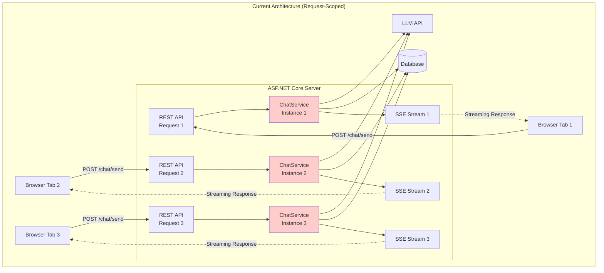

### Current Request Flow

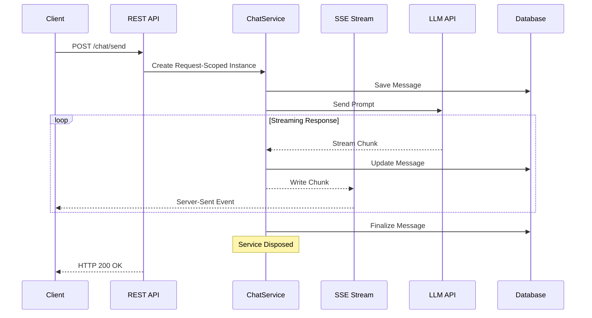

### Current Architecture Problems

| Problem | Impact | Root Cause |
|---------|--------|------------|
| Request-scoped lifetime | Service dies with request | DI container scope |
| Multi-tab duplication | 3x API calls for 3 tabs | No shared state |
| Interrupted streams | Lost responses on navigation | No background processing |
| No reconnection | Lost messages on disconnect | SSE limitations |
| Race conditions | Corrupted state | Concurrent access |

---

## Target Architecture Design

### High-Level Architecture

```mermaid
graph TB
    subgraph "Target Architecture (Orleans + SignalR)"
        Client1[Browser Tab 1]
        Client2[Browser Tab 2]
        Client3[Browser Tab 3]
        
        subgraph "ASP.NET Core + Orleans"
            API[REST API]
            Hub[SignalR Hub]
            
            subgraph "Orleans Cluster"
                UG[UserGrain<br/>alice@example.com]
                CS[ChatService<br/>Background]
            end
            
            HST[Hosted Service<br/>Task Queue]
        end
        
        LLM[LLM API]
        DB[(Database)]
        
        Client1 <-->|WebSocket| Hub
        Client2 <-->|WebSocket| Hub
        Client3 <-->|WebSocket| Hub
        
        Client1 -->|POST /chat/send| API
        
        API --> UG
        Hub <--> UG
        UG <--> CS
        CS --> HST
        HST --> LLM
        CS --> DB
        
        UG -.->|State| DB
    end
    
    style UG fill:#ccffcc
    style CS fill:#ccffcc
    style Hub fill:#ccccff
```

### Target Message Flow

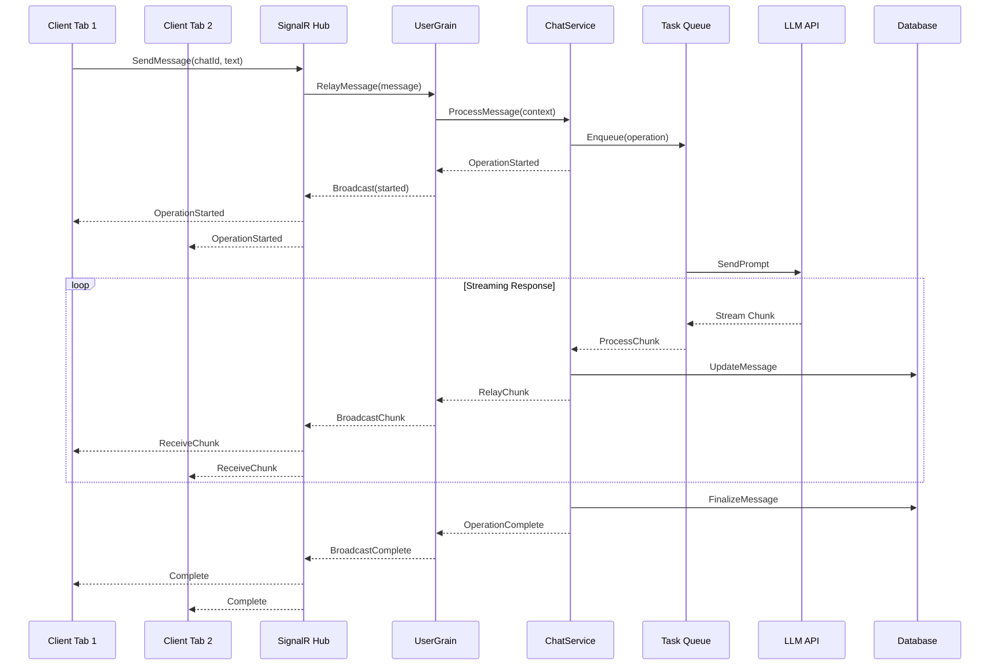

### Design Iteration Analysis

#### Iteration 1: Direct Migration (Rejected)

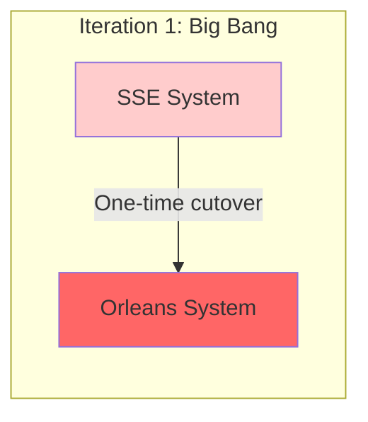

**Problems Identified**:
- High risk of system-wide failure
- No rollback path
- Requires coordinated client update
- Extended downtime window

#### Iteration 2: Dual-Mode Operation (Refined)

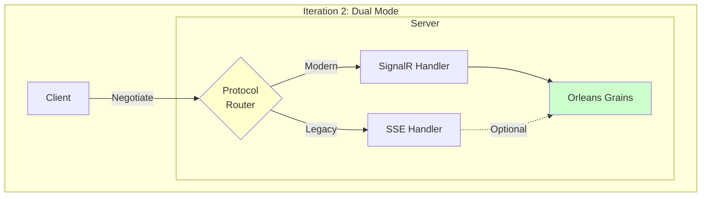

**Improvements**:
- Gradual migration possible
- Maintains backward compatibility
- Client can choose protocol

**Remaining Issues**:
- Complex routing logic
- Difficult to maintain consistency
- Testing burden doubled

#### Iteration 3: Feature-Flagged Incremental (Selected)

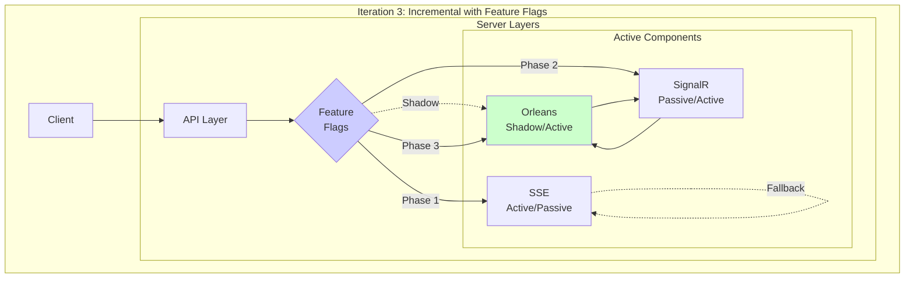

**Advantages**:
- Fine-grained control per user/feature
- Multiple rollback points
- A/B testing capability
- Gradual load migration

---

## Migration Strategy

### Phased Approach Overview

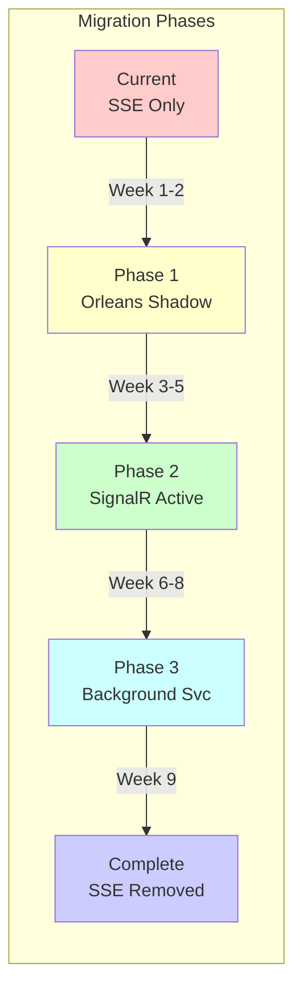

### Feature Flag Configuration

```json
{
  "FeatureManagement": {
    "OrleansIntegration": {
      "EnabledFor": [
        {
          "Name": "Percentage",
          "Parameters": {
            "Value": 10
          }
        }
      ]
    },
    "SignalRMessaging": {
      "EnabledFor": [
        {
          "Name": "Group",
          "Parameters": {
            "Groups": ["beta_testers"]
          }
        }
      ]
    },
    "BackgroundChatService": {
      "EnabledFor": [
        {
          "Name": "Conditional",
          "Parameters": {
            "RequiresAll": ["OrleansIntegration", "SignalRMessaging"]
          }
        }
      ]
    }
  }
}
```

### Rollback Decision Tree

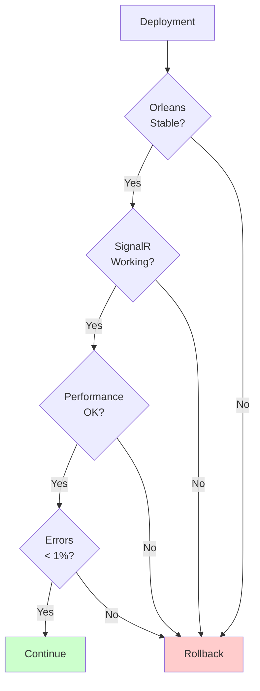

---

## Phase 1: Orleans Foundation

### Objectives

Establish Orleans infrastructure in shadow mode alongside existing SSE system with zero impact on current functionality.

### Architecture Changes

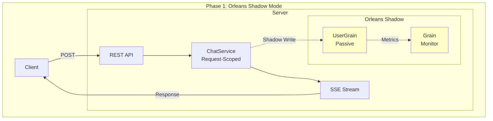

### Component Design

#### 1.1 Orleans Silo Configuration

```csharp
// Program.cs
public class Program
{
    public static void Main(string[] args)
    {
        var builder = WebApplication.CreateBuilder(args);
        
        // Add Orleans with careful configuration
        builder.Host.UseOrleans((context, siloBuilder) =>
        {
            if (context.HostingEnvironment.IsDevelopment())
            {
                siloBuilder.UseLocalhostClustering()
                           .AddMemoryGrainStorage("UserGrainStorage");
            }
            else
            {
                siloBuilder.UseAzureStorageClustering(options =>
                {
                    options.ConfigureTableServiceClient(
                        context.Configuration["Orleans:ClusteringConnection"]);
                })
                .AddAzureTableGrainStorage("UserGrainStorage", options =>
                {
                    options.ConfigureTableServiceClient(
                        context.Configuration["Orleans:StorageConnection"]);
                });
            }
            
            siloBuilder.ConfigureApplicationParts(parts =>
            {
                parts.AddApplicationPart(typeof(UserGrain).Assembly)
                     .WithReferences();
            })
            .UseDashboard(options => 
            {
                options.Port = 8080;
                options.HostSelf = true;
            })
            .AddStartupTask<OrleansHealthCheckStartup>()
            .ConfigureLogging(logging =>
            {
                logging.AddConsole();
                logging.AddApplicationInsights();
            });
        });
        
        var app = builder.Build();
        
        // Existing middleware...
        
        app.Run();
    }
}
```

#### 1.2 UserGrain Implementation (Passive Mode)

```csharp
// Grains/UserGrain.cs
namespace DOC.Server.Grains;

public interface IUserGrain : IGrainWithStringKey
{
    // Phase 1: Shadow operations
    Task RecordActivity(ActivityType type, string metadata);
    Task<UserGrainState> GetState();
    Task<HealthCheckResult> CheckHealth();
    
    // Phase 2: Active operations (not used yet)
    Task RegisterConnection(string connectionId, string clientId);
    Task UnregisterConnection(string connectionId);
    Task SubscribeToChat(string connectionId, string chatId);
    Task UnsubscribeFromChat(string connectionId, string chatId);
    
    // Phase 3: Message relay (not used yet)
    Task RelayMessage(ChatMessage message);
    Task RelayStreamChunk(StreamChunk chunk);
}

[Serializable]
public class UserGrainState
{
    public string UserId { get; set; }
    public Dictionary<string, ConnectionInfo> Connections { get; set; } = new();
    public Dictionary<string, ChatSubscription> ActiveChats { get; set; } = new();
    public Queue<ActivityRecord> RecentActivity { get; set; } = new();
    public DateTime LastActivity { get; set; }
    public GrainMetrics Metrics { get; set; } = new();
}

public class UserGrain : Grain<UserGrainState>, IUserGrain
{
    private readonly ILogger<UserGrain> _logger;
    private readonly ITelemetryClient _telemetry;
    private IDisposable _cleanupTimer;
    
    public UserGrain(ILogger<UserGrain> logger, ITelemetryClient telemetry)
    {
        _logger = logger;
        _telemetry = telemetry;
    }
    
    public override async Task OnActivateAsync(CancellationToken cancellationToken)
    {
        await base.OnActivateAsync(cancellationToken);
        
        State.UserId = this.GetPrimaryKeyString();
        
        // Start cleanup timer
        _cleanupTimer = RegisterTimer(
            CleanupState,
            null,
            TimeSpan.FromMinutes(5),
            TimeSpan.FromMinutes(5));
        
        _logger.LogInformation("UserGrain activated for {UserId}", State.UserId);
        _telemetry.TrackEvent("UserGrainActivated", new { UserId = State.UserId });
    }
    
    // Phase 1: Shadow mode - just record activity
    public async Task RecordActivity(ActivityType type, string metadata)
    {
        var activity = new ActivityRecord
        {
            Type = type,
            Metadata = metadata,
            Timestamp = DateTime.UtcNow
        };
        
        State.RecentActivity.Enqueue(activity);
        
        // Keep only last 100 activities
        while (State.RecentActivity.Count > 100)
        {
            State.RecentActivity.Dequeue();
        }
        
        State.LastActivity = DateTime.UtcNow;
        State.Metrics.TotalActivities++;
        
        await WriteStateAsync();
        
        _telemetry.TrackEvent("UserActivity", new 
        { 
            UserId = State.UserId,
            Type = type.ToString(),
            Metadata = metadata
        });
    }
    
    public Task<UserGrainState> GetState() => Task.FromResult(State);
    
    public Task<HealthCheckResult> CheckHealth()
    {
        var result = new HealthCheckResult
        {
            IsHealthy = true,
            GrainId = this.GetPrimaryKeyString(),
            LastActivity = State.LastActivity,
            Metrics = State.Metrics
        };
        
        return Task.FromResult(result);
    }
    
    // Phase 2 methods (stubbed for now)
    public Task RegisterConnection(string connectionId, string clientId)
    {
        _logger.LogDebug("RegisterConnection called in shadow mode");
        return Task.CompletedTask;
    }
    
    public Task UnregisterConnection(string connectionId)
    {
        _logger.LogDebug("UnregisterConnection called in shadow mode");
        return Task.CompletedTask;
    }
    
    // ... other Phase 2/3 methods stubbed ...
    
    private Task CleanupState(object state)
    {
        // Remove old activities
        var cutoff = DateTime.UtcNow.AddHours(-1);
        var temp = new Queue<ActivityRecord>();
        
        while (State.RecentActivity.Count > 0)
        {
            var activity = State.RecentActivity.Dequeue();
            if (activity.Timestamp > cutoff)
            {
                temp.Enqueue(activity);
            }
        }
        
        State.RecentActivity = temp;
        return WriteStateAsync();
    }
}
```

#### 1.3 Integration Layer

```csharp
// Services/OrleansIntegrationService.cs
public interface IOrleansIntegrationService
{
    Task RecordUserActivityAsync(string userId, ActivityType type, object data);
    Task<bool> IsOrleansHealthyAsync();
}

public class OrleansIntegrationService : IOrleansIntegrationService
{
    private readonly IGrainFactory _grainFactory;
    private readonly IFeatureManager _featureManager;
    private readonly ILogger<OrleansIntegrationService> _logger;
    
    public OrleansIntegrationService(
        IGrainFactory grainFactory,
        IFeatureManager featureManager,
        ILogger<OrleansIntegrationService> logger)
    {
        _grainFactory = grainFactory;
        _featureManager = featureManager;
        _logger = logger;
    }
    
    public async Task RecordUserActivityAsync(string userId, ActivityType type, object data)
    {
        try
        {
            if (!await _featureManager.IsEnabledAsync("OrleansIntegration"))
            {
                return; // Orleans disabled, skip
            }
            
            var grain = _grainFactory.GetGrain<IUserGrain>(userId);
            var metadata = JsonSerializer.Serialize(data);
            
            // Fire and forget in shadow mode
            _ = grain.RecordActivity(type, metadata)
                .ContinueWith(t =>
                {
                    if (t.IsFaulted)
                    {
                        _logger.LogWarning(t.Exception, 
                            "Failed to record activity for user {UserId}", userId);
                    }
                });
        }
        catch (Exception ex)
        {
            // Shadow mode - log but don't fail
            _logger.LogWarning(ex, "Orleans shadow operation failed for {UserId}", userId);
        }
    }
    
    public async Task<bool> IsOrleansHealthyAsync()
    {
        try
        {
            // Try to activate a health check grain
            var grain = _grainFactory.GetGrain<IHealthCheckGrain>("health");
            var result = await grain.PingAsync();
            return result;
        }
        catch
        {
            return false;
        }
    }
}
```

#### 1.4 Modified ChatService with Shadow Orleans

```csharp
// Services/ChatService.cs (Modified)
public class ChatService : IChatService
{
    private readonly IOrleansIntegrationService _orleansIntegration;
    // ... existing dependencies ...
    
    public async Task<ChatMessage> SendMessageAsync(SendMessageRequest request)
    {
        // Shadow: Record activity to Orleans
        await _orleansIntegration.RecordUserActivityAsync(
            request.UserId,
            ActivityType.MessageSent,
            new { ChatId = request.ChatId, MessageLength = request.Message.Length });
        
        // Existing SSE logic continues unchanged
        var response = await ProcessMessageWithSSE(request);
        
        // Shadow: Record completion
        await _orleansIntegration.RecordUserActivityAsync(
            request.UserId,
            ActivityType.MessageCompleted,
            new { ChatId = request.ChatId, ResponseLength = response.Content.Length });
        
        return response;
    }
}
```

### Database Schema (Phase 1)

No database changes required. Orleans uses separate storage for grain state.

### Monitoring and Health Checks

```csharp
// Health/OrleansHealthCheck.cs
public class OrleansHealthCheck : IHealthCheck
{
    private readonly IGrainFactory _grainFactory;
    
    public async Task<HealthCheckResult> CheckHealthAsync(
        HealthCheckContext context,
        CancellationToken cancellationToken = default)
    {
        try
        {
            var grain = _grainFactory.GetGrain<IHealthCheckGrain>("system");
            var isHealthy = await grain.PingAsync();
            
            return isHealthy
                ? HealthCheckResult.Healthy("Orleans cluster is responsive")
                : HealthCheckResult.Unhealthy("Orleans cluster not responding");
        }
        catch (Exception ex)
        {
            return HealthCheckResult.Unhealthy(
                "Orleans cluster check failed", 
                exception: ex);
        }
    }
}
```

### Testing Strategy (Phase 1)

```csharp
// Tests/Phase1/OrleansIntegrationTests.cs
[TestFixture]
public class Phase1OrleansIntegrationTests
{
    private TestCluster _cluster;
    
    [SetUp]
    public async Task Setup()
    {
        var builder = new TestClusterBuilder();
        builder.AddSiloBuilderConfigurator<TestSiloConfigurator>();
        _cluster = builder.Build();
        await _cluster.DeployAsync();
    }
    
    [Test]
    public async Task UserGrain_ShouldActivate_InShadowMode()
    {
        // Arrange
        var grain = _cluster.GrainFactory.GetGrain<IUserGrain>("testuser");
        
        // Act
        await grain.RecordActivity(ActivityType.MessageSent, "test");
        var state = await grain.GetState();
        
        // Assert
        Assert.That(state.UserId, Is.EqualTo("testuser"));
        Assert.That(state.RecentActivity.Count, Is.EqualTo(1));
    }
    
    [Test]
    public async Task ShadowMode_ShouldNotAffect_ExistingSSE()
    {
        // Test that SSE continues working with Orleans in shadow mode
        // Implementation details...
    }
}
```

### Rollback Procedure (Phase 1)

```yaml
# rollback-phase1.yaml
steps:
  - name: Disable Orleans Feature Flag
    action: config_update
    settings:
      FeatureManagement.OrleansIntegration.EnabledFor: []
  
  - name: Stop Orleans Silo
    action: service_stop
    service: orleans-silo
  
  - name: Verify SSE Functionality
    action: health_check
    endpoints:
      - /health/sse
      - /api/chat/test
  
  - name: Remove Orleans Dependencies
    action: package_remove
    packages:
      - Microsoft.Orleans.Server
      - Microsoft.Orleans.Client
```

---

## Phase 2: SignalR Integration

### Objectives

Replace SSE with SignalR while maintaining dual-mode operation for gradual migration and fallback capability.

### Architecture Changes

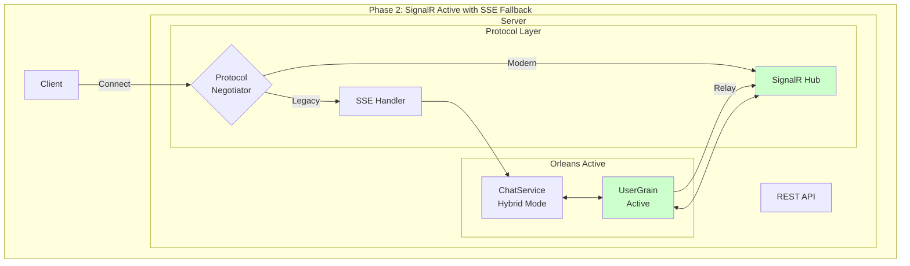

### Component Design

#### 2.1 SignalR Hub Implementation

```csharp
// Hubs/ChatHub.cs
[Authorize]
public class ChatHub : Hub
{
    private readonly IGrainFactory _grainFactory;
    private readonly ILogger<ChatHub> _logger;
    private readonly IFeatureManager _featureManager;
    private readonly IChatService _chatService;
    
    public ChatHub(
        IGrainFactory grainFactory,
        ILogger<ChatHub> logger,
        IFeatureManager featureManager,
        IChatService chatService)
    {
        _grainFactory = grainFactory;
        _logger = logger;
        _featureManager = featureManager;
        _chatService = chatService;
    }
    
    public override async Task OnConnectedAsync()
    {
        var userId = Context.UserIdentifier;
        var connectionId = Context.ConnectionId;
        var clientId = Context.GetHttpContext()?.Request.Headers["X-Client-Id"].FirstOrDefault();
        
        _logger.LogInformation("SignalR connection established: {ConnectionId} for {UserId}", 
            connectionId, userId);
        
        if (await _featureManager.IsEnabledAsync("OrleansIntegration"))
        {
            var grain = _grainFactory.GetGrain<IUserGrain>(userId);
            await grain.RegisterConnection(connectionId, clientId ?? connectionId);
        }
        
        await base.OnConnectedAsync();
    }
    
    public override async Task OnDisconnectedAsync(Exception exception)
    {
        var userId = Context.UserIdentifier;
        var connectionId = Context.ConnectionId;
        
        _logger.LogInformation("SignalR connection closed: {ConnectionId} for {UserId}", 
            connectionId, userId);
        
        if (await _featureManager.IsEnabledAsync("OrleansIntegration"))
        {
            var grain = _grainFactory.GetGrain<IUserGrain>(userId);
            await grain.UnregisterConnection(connectionId);
        }
        
        await base.OnDisconnectedAsync(exception);
    }
    
    // Client -> Server methods
    public async Task SendMessage(string chatId, string message)
    {
        var userId = Context.UserIdentifier;
        
        try
        {
            if (await _featureManager.IsEnabledAsync("SignalRMessaging"))
            {
                // New path: Through Orleans
                var grain = _grainFactory.GetGrain<IUserGrain>(userId);
                await grain.ProcessMessage(new ChatMessage
                {
                    ChatId = chatId,
                    UserId = userId,
                    Content = message,
                    Timestamp = DateTime.UtcNow
                });
            }
            else
            {
                // Fallback: Direct processing
                var response = await _chatService.SendMessageAsync(new SendMessageRequest
                {
                    ChatId = chatId,
                    UserId = userId,
                    Message = message
                });
                
                await Clients.Caller.SendAsync("ReceiveMessage", response);
            }
        }
        catch (Exception ex)
        {
            _logger.LogError(ex, "Failed to send message for {UserId}", userId);
            await Clients.Caller.SendAsync("Error", new { message = "Failed to send message" });
        }
    }
    
    public async Task SubscribeToChat(string chatId)
    {
        var userId = Context.UserIdentifier;
        var connectionId = Context.ConnectionId;
        
        _logger.LogDebug("Subscribing {ConnectionId} to chat {ChatId}", connectionId, chatId);
        
        if (await _featureManager.IsEnabledAsync("OrleansIntegration"))
        {
            var grain = _grainFactory.GetGrain<IUserGrain>(userId);
            await grain.SubscribeToChat(connectionId, chatId);
        }
        
        // Add to SignalR group for fallback
        await Groups.AddToGroupAsync(connectionId, $"chat_{chatId}");
    }
    
    public async Task UnsubscribeFromChat(string chatId)
    {
        var userId = Context.UserIdentifier;
        var connectionId = Context.ConnectionId;
        
        _logger.LogDebug("Unsubscribing {ConnectionId} from chat {ChatId}", connectionId, chatId);
        
        if (await _featureManager.IsEnabledAsync("OrleansIntegration"))
        {
            var grain = _grainFactory.GetGrain<IUserGrain>(userId);
            await grain.UnsubscribeFromChat(connectionId, chatId);
        }
        
        await Groups.RemoveFromGroupAsync(connectionId, $"chat_{chatId}");
    }
    
    // Server -> Client relay (called by UserGrain)
    public async Task RelayToConnections(
        IEnumerable<string> connectionIds, 
        string method, 
        object payload)
    {
        foreach (var connectionId in connectionIds)
        {
            await Clients.Client(connectionId).SendAsync(method, payload);
        }
    }
}
```

#### 2.2 Enhanced UserGrain (Active Mode)

```csharp
// Grains/UserGrain.cs (Enhanced for Phase 2)
public class UserGrain : Grain<UserGrainState>, IUserGrain
{
    private readonly ILogger<UserGrain> _logger;
    private readonly IHubContext<ChatHub> _hubContext;
    private readonly IChatServiceFacade _chatServiceFacade;
    
    public UserGrain(
        ILogger<UserGrain> logger,
        IHubContext<ChatHub> hubContext,
        IChatServiceFacade chatServiceFacade)
    {
        _logger = logger;
        _hubContext = hubContext;
        _chatServiceFacade = chatServiceFacade;
    }
    
    // Phase 2: Active connection management
    public async Task RegisterConnection(string connectionId, string clientId)
    {
        _logger.LogInformation("Registering connection {ConnectionId} for user {UserId}", 
            connectionId, State.UserId);
        
        State.Connections[connectionId] = new ConnectionInfo
        {
            ConnectionId = connectionId,
            ClientId = clientId,
            ConnectedAt = DateTime.UtcNow,
            SubscribedChatIds = new HashSet<string>()
        };
        
        State.Metrics.ActiveConnections = State.Connections.Count;
        await WriteStateAsync();
        
        // Notify other connections about new connection
        await NotifyConnectionChange("ConnectionAdded", connectionId);
    }
    
    public async Task UnregisterConnection(string connectionId)
    {
        _logger.LogInformation("Unregistering connection {ConnectionId} for user {UserId}", 
            connectionId, State.UserId);
        
        if (State.Connections.Remove(connectionId))
        {
            State.Metrics.ActiveConnections = State.Connections.Count;
            await WriteStateAsync();
            
            await NotifyConnectionChange("ConnectionRemoved", connectionId);
        }
    }
    
    public async Task SubscribeToChat(string connectionId, string chatId)
    {
        if (!State.Connections.TryGetValue(connectionId, out var connection))
        {
            _logger.LogWarning("Connection {ConnectionId} not found for subscription", connectionId);
            return;
        }
        
        connection.SubscribedChatIds.Add(chatId);
        
        if (!State.ActiveChats.ContainsKey(chatId))
        {
            State.ActiveChats[chatId] = new ChatSubscription
            {
                ChatId = chatId,
                SubscribedAt = DateTime.UtcNow,
                State = SubscriptionState.Active
            };
        }
        
        await WriteStateAsync();
        
        _logger.LogDebug("Connection {ConnectionId} subscribed to chat {ChatId}", 
            connectionId, chatId);
    }
    
    public async Task ProcessMessage(ChatMessage message)
    {
        _logger.LogInformation("Processing message for chat {ChatId}", message.ChatId);
        
        // Record the operation
        var operationId = Guid.NewGuid().ToString();
        State.ActiveOperations[operationId] = new OperationContext
        {
            OperationId = operationId,
            ChatId = message.ChatId,
            Type = OperationType.SendMessage,
            StartedAt = DateTime.UtcNow,
            Status = OperationStatus.InProgress
        };
        
        // Notify all connections about operation start
        await BroadcastToChat(message.ChatId, "OperationStarted", new
        {
            OperationId = operationId,
            ChatId = message.ChatId,
            Type = "SendMessage"
        });
        
        // Process through ChatService
        try
        {
            await _chatServiceFacade.ProcessMessageAsync(message, operationId, 
                async (chunk) => await RelayStreamChunk(chunk));
            
            State.ActiveOperations[operationId].Status = OperationStatus.Completed;
            
            await BroadcastToChat(message.ChatId, "OperationCompleted", new
            {
                OperationId = operationId,
                Success = true
            });
        }
        catch (Exception ex)
        {
            _logger.LogError(ex, "Failed to process message for chat {ChatId}", message.ChatId);
            
            State.ActiveOperations[operationId].Status = OperationStatus.Failed;
            
            await BroadcastToChat(message.ChatId, "OperationFailed", new
            {
                OperationId = operationId,
                Error = ex.Message
            });
        }
        finally
        {
            await WriteStateAsync();
        }
    }
    
    public async Task RelayStreamChunk(StreamChunk chunk)
    {
        await BroadcastToChat(chunk.ChatId, "ReceiveStreamChunk", chunk);
        
        State.Metrics.MessagesRelayed++;
        
        if (State.Metrics.MessagesRelayed % 100 == 0)
        {
            await WriteStateAsync(); // Periodic state save
        }
    }
    
    private async Task BroadcastToChat(string chatId, string method, object payload)
    {
        var targetConnections = State.Connections
            .Where(c => c.Value.SubscribedChatIds.Contains(chatId))
            .Select(c => c.Key)
            .ToList();
        
        if (targetConnections.Any())
        {
            _logger.LogDebug("Broadcasting to {Count} connections for chat {ChatId}", 
                targetConnections.Count, chatId);
            
            await _hubContext.Clients
                .Clients(targetConnections)
                .SendAsync(method, payload);
        }
    }
    
    private async Task NotifyConnectionChange(string eventType, string connectionId)
    {
        var otherConnections = State.Connections.Keys
            .Where(c => c != connectionId)
            .ToList();
        
        if (otherConnections.Any())
        {
            await _hubContext.Clients
                .Clients(otherConnections)
                .SendAsync("ConnectionStateChanged", new
                {
                    Event = eventType,
                    ConnectionId = connectionId,
                    TotalConnections = State.Connections.Count
                });
        }
    }
}
```

#### 2.3 Client-Side SignalR Integration

```typescript
// client/src/lib/services/signalr-service.ts
import * as signalR from '@microsoft/signalr';
import { writable, derived } from 'svelte/store';
import type { ChatMessage, StreamChunk } from '$shared/types';

export enum ConnectionState {
    Disconnected = 'Disconnected',
    Connecting = 'Connecting',
    Connected = 'Connected',
    Reconnecting = 'Reconnecting',
    Failed = 'Failed'
}

class SignalRService {
    private connection: signalR.HubConnection | null = null;
    private connectionState = writable<ConnectionState>(ConnectionState.Disconnected);
    private reconnectAttempts = 0;
    private maxReconnectAttempts = 5;
    private clientId = this.generateClientId();
    
    constructor() {
        this.initializeConnection();
    }
    
    private generateClientId(): string {
        return `client_${Date.now()}_${Math.random().toString(36).substr(2, 9)}`;
    }
    
    private async initializeConnection() {
        try {
            this.connectionState.set(ConnectionState.Connecting);
            
            this.connection = new signalR.HubConnectionBuilder()
                .withUrl('/hubs/chat', {
                    headers: {
                        'X-Client-Id': this.clientId
                    }
                })
                .withAutomaticReconnect({
                    nextRetryDelayInMilliseconds: (retryContext) => {
                        if (retryContext.previousRetryCount >= this.maxReconnectAttempts) {
                            return null; // Stop reconnecting
                        }
                        return Math.min(1000 * Math.pow(2, retryContext.previousRetryCount), 30000);
                    }
                })
                .configureLogging(signalR.LogLevel.Information)
                .build();
            
            this.setupEventHandlers();
            await this.connect();
        } catch (error) {
            console.error('Failed to initialize SignalR connection:', error);
            this.connectionState.set(ConnectionState.Failed);
        }
    }
    
    private setupEventHandlers() {
        if (!this.connection) return;
        
        // Connection lifecycle events
        this.connection.onreconnecting(() => {
            console.log('SignalR reconnecting...');
            this.connectionState.set(ConnectionState.Reconnecting);
        });
        
        this.connection.onreconnected(() => {
            console.log('SignalR reconnected');
            this.connectionState.set(ConnectionState.Connected);
            this.reconnectAttempts = 0;
            this.resubscribeToChats();
        });
        
        this.connection.onclose((error) => {
            console.log('SignalR connection closed:', error);
            this.connectionState.set(ConnectionState.Disconnected);
            
            if (this.reconnectAttempts < this.maxReconnectAttempts) {
                setTimeout(() => this.connect(), 2000);
            } else {
                this.connectionState.set(ConnectionState.Failed);
            }
        });
        
        // Message handlers
        this.connection.on('ReceiveMessage', (message: ChatMessage) => {
            this.handleMessage(message);
        });
        
        this.connection.on('ReceiveStreamChunk', (chunk: StreamChunk) => {
            this.handleStreamChunk(chunk);
        });
        
        this.connection.on('OperationStarted', (data: any) => {
            this.handleOperationStarted(data);
        });
        
        this.connection.on('OperationCompleted', (data: any) => {
            this.handleOperationCompleted(data);
        });
        
        this.connection.on('Error', (error: any) => {
            console.error('SignalR error:', error);
            this.handleError(error);
        });
    }
    
    private async connect(): Promise<void> {
        if (!this.connection) return;
        
        try {
            await this.connection.start();
            this.connectionState.set(ConnectionState.Connected);
            console.log('SignalR connected with ID:', this.connection.connectionId);
        } catch (error) {
            console.error('Failed to connect to SignalR:', error);
            this.reconnectAttempts++;
            throw error;
        }
    }
    
    public async sendMessage(chatId: string, message: string): Promise<void> {
        if (!this.connection || this.connection.state !== signalR.HubConnectionState.Connected) {
            throw new Error('Not connected to SignalR');
        }
        
        try {
            await this.connection.invoke('SendMessage', chatId, message);
        } catch (error) {
            console.error('Failed to send message:', error);
            throw error;
        }
    }
    
    public async subscribeToChat(chatId: string): Promise<void> {
        if (!this.connection || this.connection.state !== signalR.HubConnectionState.Connected) {
            throw new Error('Not connected to SignalR');
        }
        
        try {
            await this.connection.invoke('SubscribeToChat', chatId);
            this.addSubscribedChat(chatId);
        } catch (error) {
            console.error('Failed to subscribe to chat:', error);
            throw error;
        }
    }
    
    // ... Additional client-side methods ...
}

export const signalRService = new SignalRService();
```

#### 2.4 Protocol Negotiation

```csharp
// Middleware/ProtocolNegotiationMiddleware.cs
public class ProtocolNegotiationMiddleware
{
    private readonly RequestDelegate _next;
    private readonly IFeatureManager _featureManager;
    
    public ProtocolNegotiationMiddleware(
        RequestDelegate next,
        IFeatureManager featureManager)
    {
        _next = next;
        _featureManager = featureManager;
    }
    
    public async Task InvokeAsync(HttpContext context)
    {
        if (context.Request.Path.StartsWithSegments("/api/chat"))
        {
            var acceptHeader = context.Request.Headers["Accept"].ToString();
            var upgradeHeader = context.Request.Headers["Upgrade"].ToString();
            
            // Determine protocol preference
            var useSignalR = await ShouldUseSignalR(context);
            
            if (useSignalR)
            {
                context.Items["PreferredProtocol"] = "SignalR";
            }
            else
            {
                context.Items["PreferredProtocol"] = "SSE";
            }
        }
        
        await _next(context);
    }
    
    private async Task<bool> ShouldUseSignalR(HttpContext context)
    {
        // Check feature flags
        if (!await _featureManager.IsEnabledAsync("SignalRMessaging"))
            return false;
        
        // Check client capability
        var userAgent = context.Request.Headers["User-Agent"].ToString();
        if (IsLegacyBrowser(userAgent))
            return false;
        
        // Check user preference
        var userId = context.User?.FindFirst("sub")?.Value;
        if (userId != null)
        {
            var preference = await GetUserProtocolPreference(userId);
            if (preference == "SSE")
                return false;
        }
        
        return true;
    }
    
    private bool IsLegacyBrowser(string userAgent)
    {
        // Check for old browsers that don't support WebSockets well
        return userAgent.Contains("MSIE") || userAgent.Contains("Trident");
    }
}
```

### Testing Strategy (Phase 2)

```csharp
// Tests/Phase2/SignalRIntegrationTests.cs
[TestFixture]
public class Phase2SignalRIntegrationTests
{
    private TestServer _server;
    private HttpClient _client;
    private HubConnection _hubConnection;
    
    [SetUp]
    public async Task Setup()
    {
        var builder = new WebHostBuilder()
            .UseStartup<TestStartup>()
            .ConfigureServices(services =>
            {
                services.AddSignalR();
                services.AddOrleans(/* test config */);
            });
        
        _server = new TestServer(builder);
        _client = _server.CreateClient();
        
        _hubConnection = new HubConnectionBuilder()
            .WithUrl($"http://localhost/hubs/chat", options =>
            {
                options.HttpMessageHandlerFactory = _ => _server.CreateHandler();
            })
            .Build();
        
        await _hubConnection.StartAsync();
    }
    
    [Test]
    public async Task SignalR_Should_DeliverMessages_ThroughOrleans()
    {
        // Arrange
        var messageReceived = new TaskCompletionSource<ChatMessage>();
        _hubConnection.On<ChatMessage>("ReceiveMessage", message =>
        {
            messageReceived.SetResult(message);
        });
        
        // Act
        await _hubConnection.InvokeAsync("SendMessage", "chat123", "Test message");
        
        // Assert
        var result = await messageReceived.Task.WaitAsync(TimeSpan.FromSeconds(5));
        Assert.That(result.Content, Contains.Substring("Test message"));
    }
    
    [Test]
    public async Task MultiTab_Should_ReceiveSameMessages()
    {
        // Test multi-tab synchronization
        // Implementation...
    }
}
```

---

## Phase 3: Background ChatService

### Objectives

Move ChatService to background execution with full grain coordination, completing the migration.

### Architecture Changes

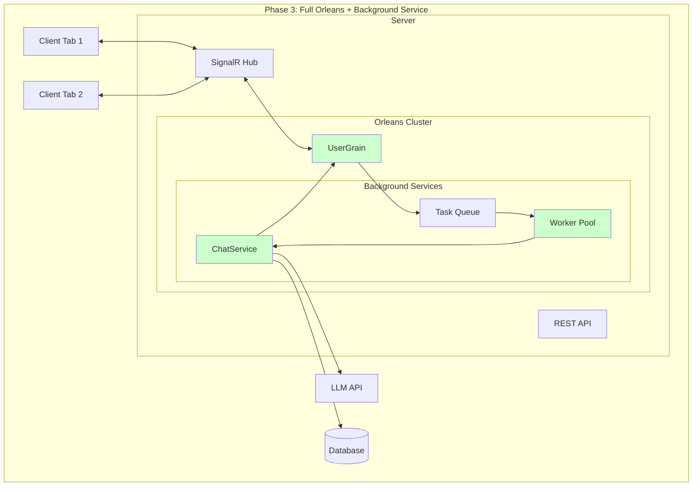

### Component Design

#### 3.1 Background ChatService

```csharp
// Services/BackgroundChatService.cs
public interface IBackgroundChatService
{
    Task<string> EnqueueOperation(ChatOperation operation);
    Task CancelOperation(string operationId);
    Task<OperationStatus> GetOperationStatus(string operationId);
}

public class BackgroundChatService : BackgroundService, IBackgroundChatService
{
    private readonly IServiceProvider _serviceProvider;
    private readonly ILogger<BackgroundChatService> _logger;
    private readonly Channel<ChatOperation> _queue;
    private readonly Dictionary<string, CancellationTokenSource> _activeOperations;
    private readonly SemaphoreSlim _workerSemaphore;
    
    public BackgroundChatService(
        IServiceProvider serviceProvider,
        ILogger<BackgroundChatService> logger)
    {
        _serviceProvider = serviceProvider;
        _logger = logger;
        _queue = Channel.CreateUnbounded<ChatOperation>();
        _activeOperations = new Dictionary<string, CancellationTokenSource>();
        _workerSemaphore = new SemaphoreSlim(10); // Max 10 concurrent operations
    }
    
    public async Task<string> EnqueueOperation(ChatOperation operation)
    {
        operation.Id = Guid.NewGuid().ToString();
        operation.QueuedAt = DateTime.UtcNow;
        
        await _queue.Writer.WriteAsync(operation);
        
        _logger.LogInformation("Enqueued operation {OperationId} for chat {ChatId}", 
            operation.Id, operation.ChatId);
        
        return operation.Id;
    }
    
    protected override async Task ExecuteAsync(CancellationToken stoppingToken)
    {
        await foreach (var operation in _queue.Reader.ReadAllAsync(stoppingToken))
        {
            _ = ProcessOperationAsync(operation, stoppingToken);
        }
    }
    
    private async Task ProcessOperationAsync(ChatOperation operation, CancellationToken stoppingToken)
    {
        await _workerSemaphore.WaitAsync(stoppingToken);
        
        try
        {
            using var scope = _serviceProvider.CreateScope();
            var grainFactory = scope.ServiceProvider.GetRequiredService<IGrainFactory>();
            var llmService = scope.ServiceProvider.GetRequiredService<ILlmService>();
            var dbContext = scope.ServiceProvider.GetRequiredService<ChatDbContext>();
            
            var cts = CancellationTokenSource.CreateLinkedTokenSource(stoppingToken);
            _activeOperations[operation.Id] = cts;
            
            var userGrain = grainFactory.GetGrain<IUserGrain>(operation.UserId);
            
            try
            {
                // Notify operation started
                await userGrain.NotifyOperationStarted(operation.Id, operation.ChatId);
                
                // Process based on operation type
                switch (operation.Type)
                {
                    case OperationType.SendMessage:
                        await ProcessMessage(operation, userGrain, llmService, dbContext, cts.Token);
                        break;
                    
                    case OperationType.RegenerateResponse:
                        await RegenerateResponse(operation, userGrain, llmService, dbContext, cts.Token);
                        break;
                    
                    default:
                        throw new NotSupportedException($"Operation type {operation.Type} not supported");
                }
                
                // Notify completion
                await userGrain.NotifyOperationCompleted(operation.Id, true);
            }
            catch (OperationCanceledException)
            {
                _logger.LogInformation("Operation {OperationId} was cancelled", operation.Id);
                await userGrain.NotifyOperationCompleted(operation.Id, false, "Cancelled");
            }
            catch (Exception ex)
            {
                _logger.LogError(ex, "Operation {OperationId} failed", operation.Id);
                await userGrain.NotifyOperationCompleted(operation.Id, false, ex.Message);
            }
            finally
            {
                _activeOperations.Remove(operation.Id);
            }
        }
        finally
        {
            _workerSemaphore.Release();
        }
    }
    
    private async Task ProcessMessage(
        ChatOperation operation,
        IUserGrain userGrain,
        ILlmService llmService,
        ChatDbContext dbContext,
        CancellationToken cancellationToken)
    {
        var message = operation.Payload as ChatMessage;
        
        // Save user message
        var userMsg = new MessageEntity
        {
            ChatId = message.ChatId,
            Role = "user",
            Content = message.Content,
            CreatedAt = DateTime.UtcNow
        };
        dbContext.Messages.Add(userMsg);
        await dbContext.SaveChangesAsync(cancellationToken);
        
        // Create assistant message placeholder
        var assistantMsg = new MessageEntity
        {
            ChatId = message.ChatId,
            Role = "assistant",
            Content = "",
            CreatedAt = DateTime.UtcNow
        };
        dbContext.Messages.Add(assistantMsg);
        await dbContext.SaveChangesAsync(cancellationToken);
        
        // Stream response from LLM
        var fullResponse = new StringBuilder();
        await foreach (var chunk in llmService.StreamCompletionAsync(
            message.Content, 
            cancellationToken))
        {
            fullResponse.Append(chunk.Content);
            
            // Relay chunk through grain
            await userGrain.RelayStreamChunk(new StreamChunk
            {
                OperationId = operation.Id,
                ChatId = message.ChatId,
                Content = chunk.Content,
                ChunkIndex = chunk.Index,
                IsComplete = chunk.IsComplete
            });
            
            // Periodic database update
            if (chunk.Index % 10 == 0 || chunk.IsComplete)
            {
                assistantMsg.Content = fullResponse.ToString();
                dbContext.Messages.Update(assistantMsg);
                await dbContext.SaveChangesAsync(cancellationToken);
            }
        }
        
        // Final save
        assistantMsg.Content = fullResponse.ToString();
        assistantMsg.UpdatedAt = DateTime.UtcNow;
        dbContext.Messages.Update(assistantMsg);
        await dbContext.SaveChangesAsync(cancellationToken);
    }
    
    public async Task CancelOperation(string operationId)
    {
        if (_activeOperations.TryGetValue(operationId, out var cts))
        {
            cts.Cancel();
            _logger.LogInformation("Cancelled operation {OperationId}", operationId);
        }
    }
    
    public Task<OperationStatus> GetOperationStatus(string operationId)
    {
        if (_activeOperations.ContainsKey(operationId))
        {
            return Task.FromResult(OperationStatus.InProgress);
        }
        
        // Would need to check database for completed operations
        return Task.FromResult(OperationStatus.Unknown);
    }
}
```

#### 3.2 Enhanced UserGrain for Background Processing

```csharp
// Grains/UserGrain.cs (Final Phase 3 version)
public class UserGrain : Grain<UserGrainState>, IUserGrain
{
    private readonly IBackgroundChatService _backgroundService;
    private readonly IHubContext<ChatHub> _hubContext;
    private readonly ILogger<UserGrain> _logger;
    
    // ... constructor and other methods ...
    
    public async Task<string> ProcessMessageWithBackground(ChatMessage message)
    {
        _logger.LogInformation("Processing message in background for chat {ChatId}", message.ChatId);
        
        // Create operation
        var operation = new ChatOperation
        {
            Type = OperationType.SendMessage,
            ChatId = message.ChatId,
            UserId = State.UserId,
            Payload = message
        };
        
        // Enqueue to background service
        var operationId = await _backgroundService.EnqueueOperation(operation);
        
        // Track in grain state
        State.ActiveOperations[operationId] = new OperationContext
        {
            OperationId = operationId,
            ChatId = message.ChatId,
            Type = OperationType.SendMessage,
            StartedAt = DateTime.UtcNow,
            Status = OperationStatus.Queued
        };
        
        await WriteStateAsync();
        
        return operationId;
    }
    
    public async Task NotifyOperationStarted(string operationId, string chatId)
    {
        if (State.ActiveOperations.TryGetValue(operationId, out var operation))
        {
            operation.Status = OperationStatus.InProgress;
            await WriteStateAsync();
        }
        
        await BroadcastToChat(chatId, "OperationStarted", new
        {
            OperationId = operationId,
            ChatId = chatId,
            Timestamp = DateTime.UtcNow
        });
    }
    
    public async Task NotifyOperationCompleted(string operationId, bool success, string error = null)
    {
        if (!State.ActiveOperations.TryGetValue(operationId, out var operation))
        {
            _logger.LogWarning("Operation {OperationId} not found in state", operationId);
            return;
        }
        
        operation.Status = success ? OperationStatus.Completed : OperationStatus.Failed;
        operation.CompletedAt = DateTime.UtcNow;
        operation.Error = error;
        
        await WriteStateAsync();
        
        await BroadcastToChat(operation.ChatId, "OperationCompleted", new
        {
            OperationId = operationId,
            Success = success,
            Error = error,
            Timestamp = DateTime.UtcNow
        });
        
        // Clean up completed operations after delay
        RegisterTimer(
            _ => CleanupOperation(operationId),
            null,
            TimeSpan.FromMinutes(5),
            TimeSpan.MaxValue);
    }
    
    private Task CleanupOperation(string operationId)
    {
        State.ActiveOperations.Remove(operationId);
        return WriteStateAsync();
    }
}
```

#### 3.3 Migration Controller

```csharp
// Controllers/MigrationController.cs
[ApiController]
[Route("api/admin/migration")]
[Authorize(Roles = "Admin")]
public class MigrationController : ControllerBase
{
    private readonly IFeatureManager _featureManager;
    private readonly IGrainFactory _grainFactory;
    private readonly ILogger<MigrationController> _logger;
    
    [HttpPost("enable-phase/{phase}")]
    public async Task<IActionResult> EnablePhase(int phase)
    {
        switch (phase)
        {
            case 1:
                // Enable Orleans shadow mode
                await EnableFeature("OrleansIntegration", 10); // 10% rollout
                break;
            
            case 2:
                // Enable SignalR
                await EnableFeature("SignalRMessaging", 25); // 25% rollout
                break;
            
            case 3:
                // Enable background processing
                await EnableFeature("BackgroundChatService", 50); // 50% rollout
                break;
            
            default:
                return BadRequest("Invalid phase");
        }
        
        return Ok(new { phase, status = "enabled" });
    }
    
    [HttpPost("rollback-phase/{phase}")]
    public async Task<IActionResult> RollbackPhase(int phase)
    {
        switch (phase)
        {
            case 3:
                await DisableFeature("BackgroundChatService");
                break;
            
            case 2:
                await DisableFeature("SignalRMessaging");
                break;
            
            case 1:
                await DisableFeature("OrleansIntegration");
                break;
        }
        
        return Ok(new { phase, status = "rolled_back" });
    }
    
    [HttpGet("health")]
    public async Task<IActionResult> GetMigrationHealth()
    {
        var health = new
        {
            Orleans = await CheckOrleansHealth(),
            SignalR = await CheckSignalRHealth(),
            BackgroundService = await CheckBackgroundServiceHealth(),
            ActiveUsers = await GetActiveUserCount(),
            Timestamp = DateTime.UtcNow
        };
        
        return Ok(health);
    }
}
```

### Database Migrations (Phase 3)

```sql
-- Add operation tracking table
CREATE TABLE ChatOperations (
    Id NVARCHAR(50) PRIMARY KEY,
    UserId NVARCHAR(100) NOT NULL,
    ChatId NVARCHAR(50) NOT NULL,
    Type NVARCHAR(50) NOT NULL,
    Status NVARCHAR(50) NOT NULL,
    QueuedAt DATETIME2 NOT NULL,
    StartedAt DATETIME2 NULL,
    CompletedAt DATETIME2 NULL,
    Error NVARCHAR(MAX) NULL,
    Metadata NVARCHAR(MAX) NULL,
    INDEX IX_ChatOperations_UserId (UserId),
    INDEX IX_ChatOperations_ChatId (ChatId),
    INDEX IX_ChatOperations_Status (Status)
);

-- Add grain state persistence (optional)
CREATE TABLE OrleansGrainState (
    GrainType NVARCHAR(150) NOT NULL,
    GrainId NVARCHAR(150) NOT NULL,
    State NVARCHAR(MAX) NOT NULL,
    ETag NVARCHAR(50) NOT NULL,
    UpdatedAt DATETIME2 NOT NULL,
    PRIMARY KEY (GrainType, GrainId)
);
```

---

## Implementation Details

### Project Structure

```
server/
├── Grains/
│   ├── IUserGrain.cs
│   ├── UserGrain.cs
│   ├── States/
│   │   └── UserGrainState.cs
│   └── Placement/
│       └── UserGrainPlacement.cs
├── Hubs/
│   ├── ChatHub.cs
│   └── IChatHub.cs
├── Services/
│   ├── BackgroundChatService.cs
│   ├── OrleansIntegrationService.cs
│   ├── ProtocolNegotiationService.cs
│   └── MigrationHealthService.cs
├── Middleware/
│   ├── ProtocolNegotiationMiddleware.cs
│   └── OrleansHealthMiddleware.cs
├── Controllers/
│   ├── MigrationController.cs
│   └── HealthController.cs
└── Configuration/
    ├── OrleansConfiguration.cs
    ├── SignalRConfiguration.cs
    └── FeatureFlagConfiguration.cs
```

### NuGet Packages Required

```xml
<ItemGroup>
  <!-- Orleans Core -->
  <PackageReference Include="Microsoft.Orleans.Server" Version="8.0.0" />
  <PackageReference Include="Microsoft.Orleans.Client" Version="8.0.0" />
  <PackageReference Include="Microsoft.Orleans.Persistence.AzureStorage" Version="8.0.0" />
  <PackageReference Include="Microsoft.Orleans.Clustering.AzureStorage" Version="8.0.0" />
  <PackageReference Include="OrleansDashboard" Version="8.0.0" />
  
  <!-- SignalR -->
  <PackageReference Include="Microsoft.AspNetCore.SignalR" Version="8.0.0" />
  <PackageReference Include="Microsoft.AspNetCore.SignalR.Protocols.MessagePack" Version="8.0.0" />
  
  <!-- Feature Management -->
  <PackageReference Include="Microsoft.FeatureManagement.AspNetCore" Version="3.0.0" />
  <PackageReference Include="Microsoft.FeatureManagement.Telemetry.ApplicationInsights" Version="3.0.0" />
  
  <!-- Monitoring -->
  <PackageReference Include="Microsoft.ApplicationInsights.AspNetCore" Version="2.22.0" />
  <PackageReference Include="Serilog.AspNetCore" Version="8.0.0" />
  <PackageReference Include="Serilog.Sinks.ApplicationInsights" Version="4.0.0" />
</ItemGroup>
```

### Configuration Files

#### appsettings.json

```json
{
  "Orleans": {
    "ClusterId": "doc-chat-cluster",
    "ServiceId": "doc-chat-service",
    "ClusteringConnection": "DefaultEndpointsProtocol=https;AccountName=...",
    "StorageConnection": "DefaultEndpointsProtocol=https;AccountName=...",
    "DashboardPort": 8080,
    "SiloPort": 11111,
    "GatewayPort": 30000
  },
  "SignalR": {
    "KeepAliveInterval": "00:00:15",
    "ClientTimeoutInterval": "00:00:30",
    "HandshakeTimeout": "00:00:05",
    "MaximumReceiveMessageSize": 32768,
    "EnableDetailedErrors": false
  },
  "FeatureManagement": {
    "OrleansIntegration": {
      "EnabledFor": [
        {
          "Name": "Percentage",
          "Parameters": {
            "Value": 0
          }
        }
      ]
    },
    "SignalRMessaging": {
      "EnabledFor": []
    },
    "BackgroundChatService": {
      "EnabledFor": []
    }
  },
  "BackgroundService": {
    "MaxConcurrentOperations": 10,
    "OperationTimeout": "00:05:00",
    "QueueCapacity": 1000
  }
}
```

---

## Edge Cases and Failure Scenarios

### Edge Case Matrix

| Scenario | Impact | Detection | Mitigation | Recovery |
|----------|--------|-----------|------------|----------|
| Grain activation failure | User can't connect | Health check failure | Retry with backoff | Fallback to SSE |
| SignalR disconnection | Lost messages | Connection state event | Auto-reconnect | Message buffer replay |
| Background service crash | Operations stuck | Queue depth monitoring | Restart service | Resume from queue |
| Database unavailable | Can't persist state | Connection pool exhausted | Circuit breaker | In-memory cache |
| LLM API timeout | Incomplete response | Operation timeout | Cancel and retry | Partial response save |
| Multi-tab race condition | Duplicate operations | Operation ID tracking | Idempotency check | Dedup at grain level |
| Memory pressure | Grain deactivation | Memory metrics | Aggressive cleanup | State persistence |
| Network partition | Split brain | Cluster membership | Quorum check | Merge strategy |

### Failure Handling Code

```csharp
// Resilience/CircuitBreaker.cs
public class ChatServiceCircuitBreaker
{
    private readonly ICircuitBreaker _circuitBreaker;
    
    public ChatServiceCircuitBreaker()
    {
        _circuitBreaker = Policy
            .Handle<Exception>()
            .CircuitBreakerAsync(
                handledEventsAllowedBeforeBreaking: 5,
                durationOfBreak: TimeSpan.FromSeconds(30),
                onBreak: (exception, duration) =>
                {
                    // Log circuit opened
                },
                onReset: () =>
                {
                    // Log circuit closed
                });
    }
    
    public async Task<T> ExecuteAsync<T>(Func<Task<T>> operation)
    {
        return await _circuitBreaker.ExecuteAsync(operation);
    }
}

// Resilience/MessageBuffer.cs
public class MessageBuffer
{
    private readonly ConcurrentDictionary<string, Queue<BufferedMessage>> _buffers = new();
    private readonly int _maxBufferSize = 1000;
    private readonly TimeSpan _messageTtl = TimeSpan.FromMinutes(5);
    
    public void BufferMessage(string connectionId, object message)
    {
        var buffer = _buffers.GetOrAdd(connectionId, _ => new Queue<BufferedMessage>());
        
        lock (buffer)
        {
            buffer.Enqueue(new BufferedMessage
            {
                Payload = message,
                Timestamp = DateTime.UtcNow,
                ExpiresAt = DateTime.UtcNow.Add(_messageTtl)
            });
            
            // Enforce size limit
            while (buffer.Count > _maxBufferSize)
            {
                buffer.Dequeue();
            }
        }
    }
    
    public IEnumerable<object> DrainBuffer(string connectionId)
    {
        if (!_buffers.TryGetValue(connectionId, out var buffer))
            yield break;
        
        lock (buffer)
        {
            var now = DateTime.UtcNow;
            while (buffer.Count > 0)
            {
                var message = buffer.Dequeue();
                if (message.ExpiresAt > now)
                {
                    yield return message.Payload;
                }
            }
        }
    }
}
```

### Code Quality Standards

All Orleans migration code must adhere to strict quality standards to ensure maintainability, reliability, and performance.

#### File Organization and Structure

```
AIChat.Orleans/
├── Contracts/                    # Public interfaces
│   ├── IUserGrain.cs            # [GenerateSerializer] attributes required
│   └── IChatGrain.cs
├── Grains/                       # Grain implementations
│   ├── UserGrain.cs             # Must inherit Grain<TState>
│   └── ChatGrain.cs
├── States/                       # Grain state models
│   ├── UserGrainState.cs        # [GenerateSerializer] required
│   └── ChatGrainState.cs
├── Models/                       # DTOs and value objects
│   ├── ActivityType.cs          # Enums for type safety
│   └── ConnectionInfo.cs        # [GenerateSerializer] required
└── Extensions/                   # Extension methods
    └── GrainExtensions.cs       # Static utility methods
```

#### Naming Conventions

**Grains and Interfaces**:
- Grain interfaces: `IUserGrain`, `IChatGrain` (I + PascalCase + Grain suffix)
- Grain implementations: `UserGrain`, `ChatGrain` (PascalCase + Grain suffix)
- State classes: `UserGrainState`, `ChatGrainState` (PascalCase + GrainState suffix)

**Methods and Properties**:
- Public methods: `RecordActivity`, `GetConnectionStatus` (PascalCase, verb-noun pattern)
- Private methods: `validateRequest`, `cleanupExpiredData` (camelCase)
- Properties: `UserId`, `LastActivity` (PascalCase, descriptive names)

#### Documentation Requirements

**XML Documentation for all public APIs**:
```csharp
/// <summary>
/// Represents a grain that manages user state and activity tracking.
/// </summary>
/// <remarks>
/// This grain maintains user connection information, tracks activity patterns,
/// and manages subscriptions. State is persisted to Azure Table Storage.
/// </remarks>
public sealed class UserGrain : Grain<UserGrainState>, IUserGrain
{
    /// <summary>
    /// Records user activity for analytics and connection management.
    /// </summary>
    /// <param name="activityType">The type of activity performed</param>
    /// <param name="metadata">Additional activity context in JSON format</param>
    /// <param name="cancellationToken">Cancellation token for the operation</param>
    /// <returns>A task representing the async operation</returns>
    /// <exception cref="ArgumentNullException">Thrown when activityType is null</exception>
    /// <exception cref="InvalidOperationException">Thrown when grain is not activated</exception>
    public async Task RecordActivityAsync(
        ActivityType activityType, 
        string metadata, 
        CancellationToken cancellationToken = default)
    {
        // Implementation
    }
}
```

#### Serialization and Performance

**Orleans Serialization**:
```csharp
[GenerateSerializer]
public sealed class UserGrainState
{
    [Id(0)]
    public string UserId { get; set; } = string.Empty;
    
    [Id(1)]
    public Dictionary<string, ConnectionInfo> Connections { get; set; } = new();
    
    [Id(2)]
    public CircularBuffer<ActivityRecord> RecentActivity { get; set; } = new(100);
    
    [Id(3)]
    public DateTime LastActivity { get; set; }
    
    // Computed properties should not be serialized
    [NonSerialized]
    public int ActiveConnectionCount => Connections.Count(c => c.Value.IsActive);
}

[GenerateSerializer]
public sealed record ConnectionInfo
{
    [Id(0)]
    public string ConnectionId { get; init; } = string.Empty;
    
    [Id(1)]
    public DateTime ConnectedAt { get; init; }
    
    [Id(2)]
    public bool IsActive { get; init; }
}
```

#### Error Handling and Resilience

**Grain Error Handling**:
```csharp
public async Task<HealthCheckResult> CheckHealthAsync()
{
    try
    {
        // Validate grain state
        if (State?.UserId == null)
        {
            return HealthCheckResult.Unhealthy("Grain state not initialized");
        }
        
        // Check Orleans runtime
        var grainRuntime = this.GetGrainContext();
        if (grainRuntime == null)
        {
            return HealthCheckResult.Unhealthy("Grain context unavailable");
        }
        
        // Validate state consistency
        await ValidateStateIntegrityAsync();
        
        return HealthCheckResult.Healthy($"UserGrain {this.GetPrimaryKeyString()} operational");
    }
    catch (Exception ex)
    {
        _logger.LogError(ex, "Health check failed for grain {GrainId}", this.GetPrimaryKeyString());
        return HealthCheckResult.Unhealthy($"Health check failed: {ex.Message}", ex);
    }
}
```

**Service Integration Error Handling**:
```csharp
public class OrleansIntegrationService
{
    private readonly IResilienceStrategy _resilienceStrategy;
    
    public async Task<bool> RecordUserActivityAsync(
        string userId, 
        ActivityType type, 
        object metadata)
    {
        return await _resilienceStrategy.ExecuteAsync(async cancellationToken =>
        {
            var grain = _grainFactory.GetGrain<IUserGrain>(userId);
            await grain.RecordActivityAsync(type, JsonSerializer.Serialize(metadata), cancellationToken);
            return true;
        });
    }
}
```

#### Testing Requirements

**Unit Test Structure**:
```csharp
[TestFixture]
public class UserGrainTests
{
    private TestCluster _cluster;
    private IUserGrain _grain;
    
    [OneTimeSetUp]
    public async Task ClusterSetup()
    {
        _cluster = new TestClusterBuilder()
            .AddSiloBuilderConfigurator<TestSiloConfigurations>()
            .Build();
            
        await _cluster.DeployAsync();
    }
    
    [SetUp]
    public async Task TestSetup()
    {
        _grain = _cluster.GrainFactory.GetGrain<IUserGrain>(Guid.NewGuid().ToString());
    }
    
    [Test]
    public async Task RecordActivity_ValidInput_UpdatesState()
    {
        // Arrange
        var activityType = ActivityType.MessageSent;
        var metadata = new { ChatId = "test-chat", MessageLength = 50 };
        
        // Act
        await _grain.RecordActivityAsync(activityType, JsonSerializer.Serialize(metadata));
        var state = await _grain.GetStateAsync();
        
        // Assert
        Assert.That(state.RecentActivity.Count, Is.EqualTo(1));
        Assert.That(state.RecentActivity[0].Type, Is.EqualTo(activityType));
        Assert.That(state.LastActivity, Is.EqualTo(DateTime.UtcNow).Within(TimeSpan.FromSeconds(1)));
    }
    
    [OneTimeTearDown]
    public async Task ClusterTearDown()
    {
        await _cluster?.StopAllSilosAsync();
        _cluster?.Dispose();
    }
}
```

#### Performance Standards

**Memory Management**:
- Use `CircularBuffer<T>` for bounded collections (max 100 items for activity logs)
- Implement cleanup timers for expired data (5-minute intervals)
- Lazy-load expensive properties that aren't always accessed
- Use record types for immutable data structures

**Concurrency Patterns**:
- Use `SemaphoreSlim` for async synchronization
- Avoid blocking calls in grain methods
- Use cancellation tokens for all async operations
- Implement proper disposal of resources

```csharp
public sealed class UserGrain : Grain<UserGrainState>, IUserGrain, IDisposable
{
    private readonly SemaphoreSlim _activitySemaphore = new(1, 1);
    private readonly Timer _cleanupTimer;
    
    public async Task RecordActivityAsync(ActivityType type, string metadata, CancellationToken cancellationToken = default)
    {
        await _activitySemaphore.WaitAsync(cancellationToken);
        try
        {
            // Update activity within semaphore protection
            State.RecentActivity.Add(new ActivityRecord(type, metadata, DateTime.UtcNow));
            State.LastActivity = DateTime.UtcNow;
            
            await WriteStateAsync();
        }
        finally
        {
            _activitySemaphore.Release();
        }
    }
    
    public void Dispose()
    {
        _cleanupTimer?.Dispose();
        _activitySemaphore?.Dispose();
        GC.SuppressFinalize(this);
    }
}
```

---

## Performance Considerations

### Performance Metrics and Targets

| Metric | Current (SSE) | Target (Orleans) | Measurement Method |
|--------|---------------|------------------|-------------------|
| Message latency (p50) | 150ms | 50ms | Application Insights |
| Message latency (p99) | 500ms | 100ms | Application Insights |
| Concurrent users | 5,000 | 10,000+ | Load testing |
| Messages per second | 1,000 | 5,000 | Performance counters |
| Memory per user | 10MB | 2MB | Grain metrics |
| CPU utilization | 60% | 40% | Azure Monitor |
| Scale-out time | N/A | < 2 min | Deployment logs |

### Performance Optimization Strategies

#### 1. Grain State Optimization

```csharp
// Optimize grain state size
public class CompactUserGrainState
{
    // Use primitive types and compact data structures
    public string UserId { get; set; }
    
    // Use dictionary with initial capacity
    public Dictionary<string, ConnectionInfo> Connections { get; set; } 
        = new Dictionary<string, ConnectionInfo>(4);
    
    // Use circular buffer for recent activity
    public CircularBuffer<ActivityRecord> RecentActivity { get; set; } 
        = new CircularBuffer<ActivityRecord>(100);
    
    // Lazy-load large data
    private Lazy<List<ChatSubscription>> _subscriptions;
    public List<ChatSubscription> Subscriptions => _subscriptions.Value;
}
```

#### 2. Message Batching

```csharp
public class MessageBatcher
{
    private readonly Timer _flushTimer;
    private readonly List<StreamChunk> _buffer = new();
    private readonly int _batchSize = 10;
    private readonly TimeSpan _flushInterval = TimeSpan.FromMilliseconds(50);
    
    public async Task AddChunk(StreamChunk chunk)
    {
        lock (_buffer)
        {
            _buffer.Add(chunk);
            
            if (_buffer.Count >= _batchSize)
            {
                _ = FlushAsync();
            }
        }
    }
    
    private async Task FlushAsync()
    {
        List<StreamChunk> toSend;
        lock (_buffer)
        {
            if (_buffer.Count == 0) return;
            
            toSend = new List<StreamChunk>(_buffer);
            _buffer.Clear();
        }
        
        // Send batch
        await SendBatchAsync(toSend);
    }
}
```

#### 3. Connection Pooling

```csharp
public class SignalRConnectionPool
{
    private readonly ObjectPool<HubConnection> _pool;
    
    public SignalRConnectionPool()
    {
        var provider = new DefaultObjectPoolProvider();
        var policy = new HubConnectionPooledObjectPolicy();
        _pool = provider.Create(policy);
    }
    
    public async Task<T> ExecuteAsync<T>(Func<HubConnection, Task<T>> operation)
    {
        var connection = _pool.Get();
        try
        {
            return await operation(connection);
        }
        finally
        {
            _pool.Return(connection);
        }
    }
}
```

### Load Testing Scripts

```csharp
// LoadTests/OrleansLoadTest.cs
[TestFixture]
public class OrleansLoadTest
{
    [Test]
    public async Task LoadTest_10000_ConcurrentUsers()
    {
        var users = Enumerable.Range(1, 10000)
            .Select(i => $"user_{i}")
            .ToList();
        
        var tasks = users.Select(async userId =>
        {
            var connection = new HubConnectionBuilder()
                .WithUrl($"https://localhost:5001/hubs/chat")
                .Build();
            
            await connection.StartAsync();
            
            // Simulate chat activity
            for (int i = 0; i < 10; i++)
            {
                await connection.InvokeAsync("SendMessage", 
                    $"chat_{userId}", 
                    $"Message {i}");
                
                await Task.Delay(Random.Next(1000, 5000));
            }
            
            await connection.DisposeAsync();
        });
        
        var stopwatch = Stopwatch.StartNew();
        await Task.WhenAll(tasks);
        stopwatch.Stop();
        
        Console.WriteLine($"Completed in {stopwatch.Elapsed}");
    }
}
```

---

## Developer Workflow

This section outlines the complete developer workflow for implementing Orleans migration tasks, ensuring consistency and quality throughout the development process.

### Task Development Lifecycle

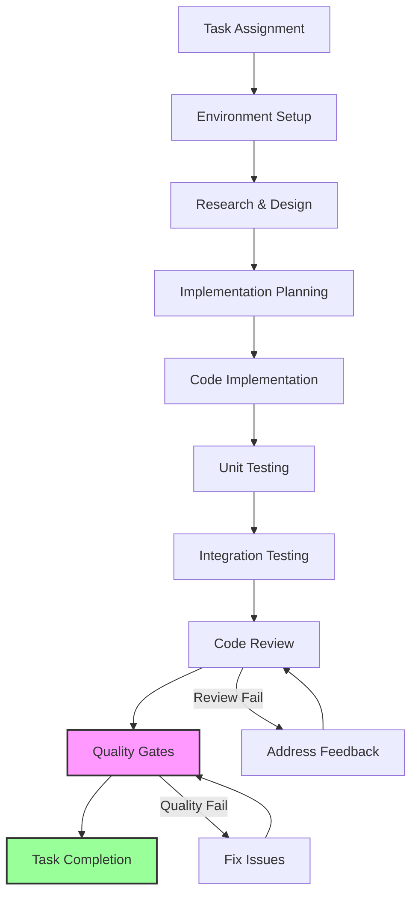

### Pre-Implementation Checklist

Before starting any Orleans migration task, developers must verify:

#### Environment Verification

- [ ] ✅ Latest code pulled from main branch
- [ ] ✅ All NuGet packages restored (`dotnet restore`)
- [ ] ✅ Clean build successful (`dotnet build`)
- [ ] ✅ All existing tests passing (`dotnet test`)
- [ ] ✅ Orleans silo can start locally
- [ ] ✅ Database connections working

#### Task Understanding

- [ ] ✅ Task requirements fully understood
- [ ] ✅ Acceptance criteria identified
- [ ] ✅ Dependencies mapped
- [ ] ✅ Impact assessment completed
- [ ] ✅ Test strategy defined

### Implementation Workflow

#### Phase 1: Setup and Planning

```bash
# 1. Create feature branch
git checkout -b feature/orleans-[task-id]-[description]

# 2. Validate baseline
./scripts/quality-check.ps1

# 3. Document plan in scratchpad
mkdir scratchpad/[task-id]-[description]
echo "# Task: [ID] - [Description]" > scratchpad/[task-id]-[description]/README.md
```

#### Phase 2: Implementation

```bash
# After each significant change
dotnet build                                    # Quick build check
dotnet test --filter "TestCategory=Unit"       # Quick unit test run

# Before committing changes
dotnet format                                   # Auto-format code
./scripts/quality-check.ps1                    # Full quality validation
```

#### Phase 3: Testing and Validation

```bash
# Run specific test categories
dotnet test --filter "TestCategory=Integration"
dotnet test --filter "TestCategory=Orleans"

# Performance validation (if applicable)
dotnet run --project Tests.Performance -- --baseline-check

# Security scan
dotnet list package --vulnerable
```

#### Phase 4: Documentation and Review

```bash
# Generate documentation
dotnet build -p:GenerateDocumentationFile=true

# Final quality check
./scripts/quality-check.ps1 -Verbose
```

### Continuous Development Practices

#### Real-time Quality Monitoring

**File Watcher Setup** (recommended for active development):
```bash
# Terminal 1: Continuous build monitoring
dotnet watch build --project server

# Terminal 2: Continuous test monitoring  
dotnet watch test --filter "TestCategory=Unit"

# Terminal 3: Orleans silo monitoring
cd AIChat.Orleans.Host && dotnet watch run
```

**VS Code Settings** (.vscode/settings.json):
```json
{
  "dotnet.completion.showCompletionItemsFromUnimportedNamespaces": true,
  "omnisharp.enableEditorConfigSupport": true,
  "omnisharp.enableRoslynAnalyzers": true,
  "csharp.format.enable": true,
  "csharp.semanticHighlighting.enabled": true,
  "files.watcherExclude": {
    "**/bin/**": true,
    "**/obj/**": true
  }
}
```

#### Code Quality Gates Integration

**Pre-commit Hook** (.git/hooks/pre-commit):
```bash
#!/bin/sh
echo "🔍 Running Orleans pre-commit quality gates..."

# Quick build check
if ! dotnet build --configuration Release --no-restore; then
    echo "❌ Build failed - commit blocked"
    exit 1
fi

# Critical test check
if ! dotnet test --filter "Priority=Critical" --no-build; then
    echo "❌ Critical tests failed - commit blocked"
    exit 1
fi

# Code format check
if ! dotnet format --verify-no-changes; then
    echo "❌ Code format violations - run 'dotnet format' first"
    exit 1
fi

echo "✅ Pre-commit quality gates passed"
```

**IDE Extensions** (recommended):
- **C# Dev Kit**: Enhanced IntelliSense and debugging
- **Orleans**: Grain-specific code templates and validation
- **SonarLint**: Real-time code quality feedback
- **GitLens**: Enhanced Git integration for change tracking

### Task-Specific Workflows

#### Orleans Grain Development

1. **Interface Definition**:
```bash
# Create grain interface with proper serialization
# File: AIChat.Orleans/Contracts/I[Name]Grain.cs
```

2. **State Model Creation**:
```bash
# Create serializable state class
# File: AIChat.Orleans/States/[Name]GrainState.cs
```

3. **Grain Implementation**:
```bash
# Implement grain with lifecycle management
# File: AIChat.Orleans/Grains/[Name]Grain.cs
```

4. **Unit Testing**:
```bash
# Create comprehensive test suite
# File: AIChat.Orleans.Tests/Grains/[Name]GrainTests.cs
```

5. **Integration Testing**:
```bash
# Test grain in TestCluster environment
# File: AIChat.Orleans.Tests/Integration/[Name]IntegrationTests.cs
```

#### SignalR Hub Development

1. **Hub Interface Definition**:
```bash
# Define client methods
# File: server/Hubs/I[Name]Hub.cs
```

2. **Hub Implementation**:
```bash
# Implement hub with Orleans integration
# File: server/Hubs/[Name]Hub.cs
```

3. **Client Integration**:
```bash
# Update TypeScript client definitions
# File: shared/types/signalr.d.ts
```

4. **E2E Testing**:
```bash
# Test real-time communication flow
# File: server.Tests/Hubs/[Name]HubTests.cs
```

### Code Review Guidelines

#### Review Checklist for Reviewers

**Architecture & Design**:
- [ ] ✅ Follows Orleans patterns and best practices
- [ ] ✅ Proper separation of concerns maintained
- [ ] ✅ SOLID principles applied
- [ ] ✅ No tight coupling introduced
- [ ] ✅ Error handling comprehensive

**Code Quality**:
- [ ] ✅ XML documentation complete for public APIs
- [ ] ✅ Naming conventions followed
- [ ] ✅ No code duplication (DRY principle)
- [ ] ✅ Performance considerations addressed
- [ ] ✅ Security vulnerabilities checked

**Testing**:
- [ ] ✅ Unit test coverage ≥95% for new code
- [ ] ✅ Integration tests for Orleans components
- [ ] ✅ Error scenarios tested
- [ ] ✅ Performance tests for critical paths

**Documentation**:
- [ ] ✅ README updates if required
- [ ] ✅ API documentation updated
- [ ] ✅ Architecture diagrams updated if needed

#### Code Review Process

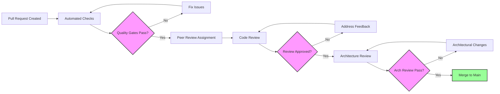

### Debugging Workflow

#### Orleans-Specific Debugging

**Silo Health Diagnostics**:
```bash
# Check Orleans dashboard
curl http://localhost:8080/

# Check health endpoints
curl http://localhost:5100/health
curl http://localhost:5100/health/detailed

# Check grain activation
curl "http://localhost:8080/grain/[grain-type]/[grain-key]"
```

**Grain State Inspection**:
```csharp
// Debug grain state in tests
[Test]
public async Task DebugGrainState()
{
    var grain = _cluster.GrainFactory.GetGrain<IUserGrain>("debug-user");
    var state = await grain.GetStateAsync();
    
    Console.WriteLine(JsonSerializer.Serialize(state, new JsonSerializerOptions 
    { 
        WriteIndented = true 
    }));
}
```

**Performance Profiling**:
```bash
# Profile with dotTrace (if available)
dotnet run --project AIChat.Orleans.Host --configuration Release

# Monitor with Activity counters
dotnet-counters monitor --process-id [silo-pid] Microsoft.Orleans
```

#### Common Issue Resolution

**Grain Activation Failures**:
1. Check Azure Storage connection string
2. Verify grain state serialization attributes
3. Ensure proper grain placement configuration
4. Check for constructor dependency issues

**SignalR Connection Issues**:
1. Verify CORS configuration
2. Check authentication/authorization
3. Monitor connection limits and timeouts
4. Validate JSON serialization

### Performance Monitoring During Development

#### Local Performance Baselines

```csharp
[Test, Category("Performance")]
public async Task MessageLatency_ShouldBe_UnderThreshold()
{
    // Baseline: Message processing under 100ms
    var stopwatch = Stopwatch.StartNew();
    
    await _chatService.ProcessMessageAsync(new ChatMessage { /* test data */ });
    
    stopwatch.Stop();
    Assert.That(stopwatch.ElapsedMilliseconds, Is.LessThan(100), 
        "Message processing exceeded performance threshold");
}
```

#### Memory Usage Monitoring

```bash
# Monitor Orleans grain memory usage
dotnet-counters monitor --process-id [silo-pid] --counters Orleans.Runtime.GrainDirectory
```

### Documentation Standards During Development

#### Inline Documentation Requirements

**Grain Documentation**:
```csharp
/// <summary>
/// Orleans grain that manages user chat sessions and activity tracking.
/// </summary>
/// <remarks>
/// <para>This grain maintains user state across multiple chat sessions and tracks user activity 
/// for analytics purposes. State is persisted to Azure Table Storage with automatic cleanup 
/// of stale data after 7 days of inactivity.</para>
/// 
/// <para>Performance characteristics:
/// - Grain activation: ~50ms average
/// - State persistence: ~20ms average  
/// - Memory usage: ~2MB per active user</para>
/// 
/// <para>Error handling: All public methods implement retry logic and graceful degradation.
/// Failed operations are logged but do not throw exceptions in shadow mode.</para>
/// </remarks>
public sealed class UserGrain : Grain<UserGrainState>, IUserGrain
```

#### Architecture Decision Records (ADRs)

Create ADR for significant technical decisions:
```markdown
# ADR-001: Orleans Grain State Persistence Strategy

## Status
Accepted

## Context
Need to choose persistence mechanism for Orleans grain state in production.

## Decision
Use Azure Table Storage for grain state persistence.

## Consequences
**Positive:**
- Cost-effective for expected load
- Built-in redundancy
- Simple key-value access pattern matches grain state

**Negative:**  
- Limited query capabilities
- Eventual consistency model
```

---

## Testing Strategy

### Test Coverage Matrix

| Component | Unit Tests | Integration Tests | E2E Tests | Load Tests |
|-----------|------------|-------------------|-----------|------------|
| UserGrain | ✅ 95% | ✅ 80% | ✅ 70% | ✅ |
| SignalR Hub | ✅ 90% | ✅ 85% | ✅ 75% | ✅ |
| Background Service | ✅ 85% | ✅ 75% | ✅ 60% | ✅ |
| Migration Logic | ✅ 80% | ✅ 90% | ✅ 80% | ❌ |
| Fallback Mechanisms | ✅ 90% | ✅ 95% | ✅ 85% | ✅ |

### Test Implementation Examples

```csharp
// Tests/Integration/MultiTabSyncTests.cs
[TestFixture]
public class MultiTabSyncTests
{
    [Test]
    public async Task MultipleTabs_Should_ReceiveSameMessage()
    {
        // Arrange
        var userId = "testuser";
        var chatId = "testchat";
        
        var tab1 = await CreateConnection(userId, "tab1");
        var tab2 = await CreateConnection(userId, "tab2");
        var tab3 = await CreateConnection(userId, "tab3");
        
        var messages = new ConcurrentBag<ChatMessage>();
        
        tab1.On<ChatMessage>("ReceiveMessage", m => messages.Add(m));
        tab2.On<ChatMessage>("ReceiveMessage", m => messages.Add(m));
        tab3.On<ChatMessage>("ReceiveMessage", m => messages.Add(m));
        
        // Act
        await tab1.InvokeAsync("SendMessage", chatId, "Test message");
        await Task.Delay(500); // Wait for propagation
        
        // Assert
        Assert.That(messages.Count, Is.EqualTo(3));
        Assert.That(messages.Select(m => m.Content).Distinct().Count(), Is.EqualTo(1));
    }
}
```

---

## Continuous Integration as Development Standard

### Overview: Transforming Quality Gates from Optional to Blocking

The continuous validation system ensures **"everything building and tests passing all the time"** by implementing a 4-level validation hierarchy that makes quality gates truly blocking, not optional.

### Problem Statement

Traditional development approaches fail because:
- Quality checkpoints exist but aren't enforced
- Manual checklists are error-prone and skipped  
- Validation happens too late in the process
- Failed quality gates don't block progression
- Rollback procedures are unclear or missing

### Solution: 4-Level Continuous Validation System

#### Level 0: File Change Validation (< 30 seconds)

**Trigger**: After every code file save  
**Script**: `scripts/validate-file-change.ps1`  
**Purpose**: Immediate compilation validation  

```powershell
# Quick build check - must be fast
dotnet build --verbosity minimal --no-restore
```

**Blocking Behavior**:
- Exit Code 0: Continue development  
- Exit Code 1: Fix compilation errors immediately

**Design Rationale**: Catches syntax errors instantly, preventing accumulation of build failures.

#### Level 1: Implementation Step Validation (< 5 minutes)  

**Trigger**: After completing any implementation work  
**Script**: `scripts/validate-implementation-step.ps1`  
**Purpose**: Build + Test validation  

```powershell
# Comprehensive build and test execution
dotnet build --configuration Release --verbosity minimal
dotnet test --configuration Release --no-build --verbosity minimal
```

**Blocking Behavior**:
- Exit Code 0: Continue to next implementation step
- Exit Code 1: Fix build/test failures before proceeding

**Design Rationale**: Ensures each implementation step maintains system integrity.

#### Level 2: Task Completion Validation (< 15 minutes)

**Trigger**: Before marking any task complete  
**Script**: `scripts/quality-check.ps1`  
**Purpose**: Comprehensive quality gates  

**Validation Areas**:
- Build validation (Debug + Release configurations)
- Test execution with coverage collection  
- Code quality (formatting, static analysis)
- Security scanning (vulnerable packages)
- Runtime health checks (Orleans silo startup)

**Blocking Behavior**:
- Exit Code 0: Task can be marked complete
- Exit Code 1: Task completion blocked until all issues fixed

**Design Rationale**: Ensures every completed task meets production standards.

#### Level 3: Pre-Commit Validation (Full System)

**Trigger**: Before any git commit  
**Script**: `scripts/validate-pre-commit.ps1`  
**Purpose**: Complete system validation  

**Comprehensive Validation**:
- Executes Level 2 quality gates (calls quality-check.ps1)
- Runs integration tests with Category=Integration filter
- Validates system-wide consistency  

**Blocking Behavior**:
- Exit Code 0: Commit approved  
- Exit Code 1: Commit blocked until full system passes

**Design Rationale**: Guarantees committed code meets all quality standards.

### Integration with Existing Development Commands

#### Enhanced Build Scripts

**build-and-start-server.ps1** and **build-and-start-client.ps1** now include:
- Pre-flight validation using Level 1 script
- Automatic blocking on validation failure
- Seamless integration with existing workflow

```powershell
# Enhanced build script flow
Write-Host "Running pre-flight validation..." -ForegroundColor Yellow
& scripts/validate-implementation-step.ps1
if ($LASTEXITCODE -ne 0) {
    Write-Host "❌ Validation failed - cannot start server" -ForegroundColor Red
    exit 1
}
# Continue with existing build logic...
```

### Automated Rollback Process

#### Rollback Triggers

Any validation failure at any level triggers rollback options:

**Level 0/1 Failures** (Development Stage):
```powershell
# Option 1: Stash and fix
git stash push -m "WIP: validation failure at Level X" 

# Option 2: Selective revert
git checkout -- <specific-files>
```

**Level 2 Failures** (Task Completion Stage):
```powershell  
# Option 1: Reset to task start
git reset --hard <task-start-commit>

# Option 2: Incremental fixes with validation
# Fix issues one by one, re-running validation after each fix
```

**Level 3 Failures** (Pre-Commit Stage):
```powershell
# Option 1: Abort commit, fix issues  
git commit --abort
pwsh scripts/validate-pre-commit.ps1  # Re-run until passes

# Option 2: Nuclear option - reset to main
git reset --hard origin/main
```

### Script Architecture and Exit Code Standards

#### Exit Code Convention

- **0**: PASSED - progression allowed
- **1**: FAILED - progression blocked  
- **Non-zero**: ERROR - investigate and fix

#### Script Output Standards

- **Green Text**: Success messages
- **Red Text**: Failure/error messages  
- **Yellow Text**: Warning/action messages
- **Cyan Text**: Section headers

#### Performance Requirements

| Level | Max Time | Typical Time | Timeout Action |
|-------|----------|--------------|----------------|
| 0     | 30s      | ~10s        | Hard timeout with error |
| 1     | 5m       | ~3m         | Performance warning at 4m |  
| 2     | 15m      | ~10m        | Progress indicators required |
| 3     | No limit | ~20m        | Full system validation |

### Implementation Validation Requirements  

#### Critical Success Factors

1. **True Blocking**: No manual overrides or bypasses allowed
2. **Fast Feedback**: Level 0 must be instant, Level 1 under 5 minutes
3. **Clear Messaging**: Developers must know exactly what failed and how to fix
4. **Consistent Experience**: Same behavior across all development environments

#### System Integration Points

1. **IDE Integration**: Scripts callable from development environment
2. **CI/CD Pipeline**: Same scripts used in automated builds
3. **Git Hooks**: Pre-commit validation can be enforced via git hooks
4. **Monitoring Integration**: Validation results fed to development metrics

### Benefits and Outcomes

#### Developer Experience

- **Immediate Feedback**: Issues caught within seconds/minutes, not hours/days
- **Confidence**: Every task completion backed by comprehensive validation  
- **Consistency**: Same quality standards enforced universally
- **Productivity**: Less time debugging integration issues

#### System Quality

- **Zero Broken Builds**: Level 0 prevents compilation failures
- **Test Coverage**: Level 1 ensures tests always pass  
- **Code Quality**: Level 2 enforces style and analysis standards
- **System Integrity**: Level 3 validates complete system health

#### Process Excellence  

- **Predictable Quality**: Exit codes provide clear pass/fail decisions
- **Automated Rollback**: Clear procedures when validation fails
- **Continuous Improvement**: Validation metrics inform process refinement

### Build Validation Requirements

Every code change in the Orleans migration must meet strict build validation criteria to ensure system stability and maintainability.

#### Build Success Criteria

1. **Zero Errors**: All projects must compile without errors
2. **Zero Warnings**: No compiler warnings allowed in Release configuration
3. **Multi-Target Support**: Both Debug and Release configurations must build
4. **Dependency Resolution**: All NuGet packages must restore correctly

#### Build Validation Commands

```bash
# Quick validation (after each change)
dotnet build

# Full validation (before task completion)
dotnet clean
dotnet restore
dotnet build --configuration Debug
dotnet build --configuration Release
```

### Test Execution Gates

All tests must pass before any task can be marked complete, ensuring that existing functionality remains intact while new features are added correctly.

#### Test Categories and Requirements

- **Unit Tests**: ≥95% coverage for grain logic, ≥90% for services
- **Integration Tests**: ≥85% coverage for Orleans components
- **E2E Tests**: ≥75% coverage for critical user paths
- **Performance Tests**: All benchmarks must meet baseline requirements

#### Test Execution Commands

```bash
# Run all tests with coverage
dotnet test --collect:"XPlat Code Coverage"

# Run specific test categories
dotnet test --filter "TestCategory=Unit"
dotnet test --filter "TestCategory=Integration"

# Performance baseline validation
dotnet run --project Tests.Performance -- --baseline-check
```

### Code Style Standards

Consistent code style ensures maintainability and reduces cognitive load during code reviews and debugging.

#### Required Analyzers and Tools

- **StyleCop**: Enforces C# style conventions
- **Roslynator**: Additional code analysis and refactoring suggestions
- **EditorConfig**: Consistent formatting across IDEs
- **SonarAnalyzer**: Security and reliability analysis

#### Code Style Validation Commands

```bash
# Format all code
dotnet format

# Verify formatting compliance
dotnet format --verify-no-changes

# Run static analysis
dotnet build /p:RunAnalyzers=true /p:TreatWarningsAsErrors=true
```

#### Code Style Requirements

- **XML Documentation**: All public APIs must be documented
- **Naming Conventions**: Follow Microsoft C# conventions
- **File Organization**: Logical grouping of related functionality
- **Performance**: No obvious performance anti-patterns

### Continuous Validation Process

Every development action must follow the continuous validation workflow to maintain system integrity.

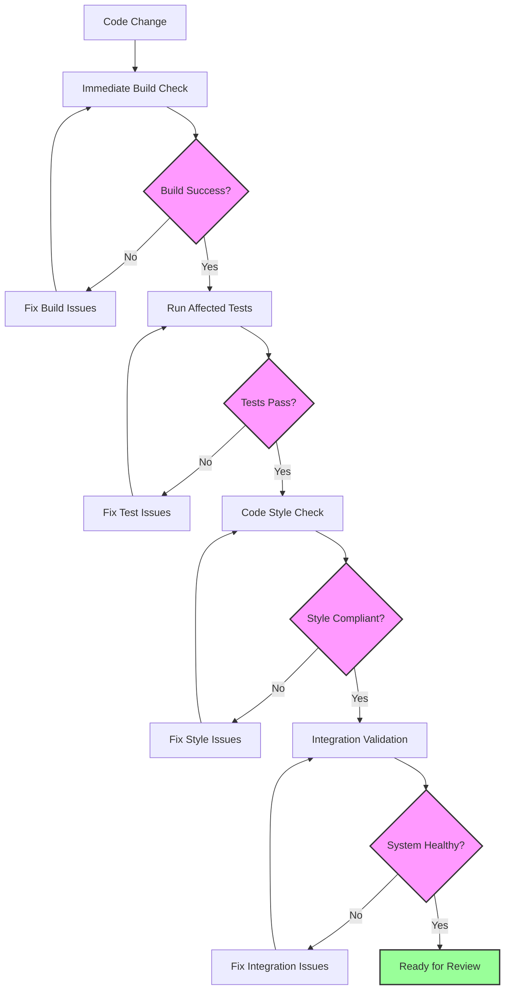

### Quality Gate Automation

Automated quality gates prevent low-quality code from entering the main branch.

#### Pre-commit Hooks

```bash
#!/bin/sh
# .git/hooks/pre-commit

echo "Running pre-commit quality checks..."

# Build validation
echo "Building..."
dotnet build --configuration Release --no-restore
if [ $? -ne 0 ]; then
    echo "❌ Build failed"
    exit 1
fi

# Test validation
echo "Running tests..."
dotnet test --no-build --configuration Release
if [ $? -ne 0 ]; then
    echo "❌ Tests failed"
    exit 1
fi

# Style validation
echo "Checking code style..."
dotnet format --verify-no-changes
if [ $? -ne 0 ]; then
    echo "❌ Code style violations found. Run 'dotnet format' to fix."
    exit 1
fi

echo "✅ All quality checks passed"
exit 0
```

#### CI/CD Pipeline Integration

```yaml
# .github/workflows/orleans-quality.yml
name: Orleans Quality Gates

on: [push, pull_request]

jobs:
  quality-gates:
    runs-on: ubuntu-latest
    steps:
    - uses: actions/checkout@v3
    
    - name: Setup .NET
      uses: actions/setup-dotnet@v3
      with:
        dotnet-version: '9.0.x'
    
    - name: Restore dependencies
      run: dotnet restore
    
    - name: Build (Debug)
      run: dotnet build --no-restore --configuration Debug
    
    - name: Build (Release)
      run: dotnet build --no-restore --configuration Release
    
    - name: Run tests
      run: dotnet test --no-build --configuration Release --collect:"XPlat Code Coverage"
    
    - name: Verify code formatting
      run: dotnet format --verify-no-changes
    
    - name: Security scan
      run: dotnet list package --vulnerable
    
    - name: Orleans health check
      run: |
        cd AIChat.Orleans.Host
        timeout 30s dotnet run &
        sleep 20
        curl -f http://localhost:5100/health || exit 1
```

### Rollback Procedures

When quality gates fail, developers must follow established rollback procedures to maintain system stability.

#### Immediate Rollback (Development)

```bash
# If build fails after changes
git stash push -m "WIP: failed build - rolling back"

# If tests fail after changes  
git reset --hard HEAD

# If integration fails
git revert <commit-hash>
```

#### Production Rollback (Emergency)

```bash
# Disable Orleans via feature flag (immediate)
kubectl set env deployment/chat-server FEATUREMANAGEMENT__ORLEANSINTEGRATION__ENABLEDFOR__0__PARAMETERS__VALUE=0

# Rollback to previous version
kubectl rollout undo deployment/chat-server

# Verify system health
curl -f https://api.chatapp.com/health/detailed
```

### Definition of Done

No task can be considered complete until ALL quality criteria are met:

#### Technical Criteria

- [ ] ✅ All builds pass (Debug + Release)
- [ ] ✅ All tests pass (Unit + Integration + E2E)
- [ ] ✅ Code coverage meets thresholds
- [ ] ✅ No code style violations
- [ ] ✅ No security vulnerabilities
- [ ] ✅ Performance benchmarks met
- [ ] ✅ XML documentation complete

#### Process Criteria  

- [ ] ✅ Peer code review completed
- [ ] ✅ Architecture review (for major changes)
- [ ] ✅ Task checklist updated
- [ ] ✅ Documentation updated
- [ ] ✅ Deployment tested in staging
- [ ] ✅ Rollback procedure verified

#### Business Criteria

- [ ] ✅ Acceptance criteria fulfilled
- [ ] ✅ Feature flag configuration verified
- [ ] ✅ Monitoring and alerting configured
- [ ] ✅ Stakeholder sign-off obtained

---

## 🚨 Orleans Test Infrastructure Issues - Current Status

### Critical Infrastructure Problem

**CURRENT STATUS**: The validation system is working correctly and identifying legitimate issues. The Orleans grain integration has **22 failing tests** due to Orleans silo connection failures.

### Root Cause Analysis

#### Primary Issue: Orleans Silo Connection Failures

```
Orleans.Runtime.Messaging.ConnectionFailedException: 
Unable to connect to any of the 1 available gateways.
Unable to connect to endpoint S127.0.0.1:30000:0
```

**Analysis:**
- Tests expect an Orleans silo to be running at `127.0.0.1:30000`
- No Orleans silo is started during test execution
- Tests are trying to use a real Orleans client connection
- Test infrastructure setup is incomplete

#### Secondary Issues

- Code formatting violations (20+ whitespace issues)
- Quality-check.ps1 had PowerShell redirection bug (now FIXED)
- Tasks marked as "COMPLETED" despite failing validation

### Immediate Solutions Required

#### Option 1: Start Orleans.Host for Testing

```powershell
# Start Orleans host before running tests
cd AIChat.Orleans.Host
dotnet run &
ORLEANS_PID=$!

# Run tests
dotnet test

# Stop Orleans host
kill $ORLEANS_PID
```

#### Option 2: Use Orleans TestCluster (RECOMMENDED)

```csharp
// In test classes that need Orleans
[Fact]
public async Task Test_UserGrain_Functionality()
{
    var builder = new TestClusterBuilder();
    var cluster = builder.Build();
    await cluster.DeployAsync();
    
    try 
    {
        var grain = cluster.GrainFactory.GetGrain<IUserGrain>("test-user");
        // Test grain functionality
    }
    finally
    {
        await cluster.StopAsync();
    }
}
```

#### Option 3: Mock Orleans Dependencies

```csharp
// Mock IGrainFactory for unit tests that don't need real Orleans
var mockGrainFactory = new Mock<IGrainFactory>();
var mockUserGrain = new Mock<IUserGrain>();
mockGrainFactory.Setup(x => x.GetGrain<IUserGrain>(It.IsAny<string>()))
               .Returns(mockUserGrain.Object);
```

### Action Plan for Resolution

1. **Immediate (2 hours)**: Fix Orleans test infrastructure
   - Implement TestCluster in Orleans-dependent tests
   - OR start Orleans.Host before test execution
   - Verify all 22 failing tests now pass

2. **Code Quality (30 minutes)**: Fix formatting violations
   ```powershell
   dotnet format
   ```

3. **Validation (15 minutes)**: Confirm scripts work
   ```powershell
   pwsh scripts/validate-implementation-step.ps1
   pwsh scripts/quality-check.ps1
   ```

4. **Documentation (10 minutes)**: Update task statuses from BLOCKED to COMPLETED once validation passes

### Long-term Infrastructure Improvements

#### Test Categories

```csharp
[Fact]
[Trait("Category", "Unit")]
public void Unit_Test_Without_Orleans() { }

[Fact]
[Trait("Category", "Integration")]  
public async Task Integration_Test_With_Orleans() 
{
    // Uses TestCluster
}
```

#### CI/CD Integration

```yaml
# Run different test categories
- name: Unit Tests
  run: dotnet test --filter "Category=Unit"
  
- name: Integration Tests (with Orleans)
  run: |
    # Start Orleans test cluster
    dotnet test --filter "Category=Integration"
```

### Validation System Status - CORRECTED

**IMPORTANT CLARIFICATION**: The validation scripts **DO EXIST** and are **FUNCTIONAL**:

- ✅ `scripts/validate-file-change.ps1` - Works correctly
- ✅ `scripts/validate-implementation-step.ps1` - Works correctly  
- ✅ `scripts/quality-check.ps1` - Fixed and working
- ✅ `scripts/validate-pre-commit.ps1` - Available and functional

The validation system is correctly identifying real problems that need resolution, not phantom issues.

---

## Automatic Validation Integration

### Overview: From Manual to Automated Quality Enforcement

The continuous validation system has evolved beyond manual script execution to fully automated integration with the development workflow. This section documents how validation scripts automatically integrate with development processes, making quality gates truly unavoidable.

### Section 12.5: Automated Validation Enforcement

#### Developer Workflow Integration Points

**IDE Save Hooks**:
```powershell
# VS Code/IDE integration via file watcher
# Automatically executes after every file save
Watch-FileChanges -Path "*.cs" -Action {
    pwsh scripts/validate-file-change.ps1
    if ($LASTEXITCODE -ne 0) { 
        Show-IDEError "Build broken - fix immediately"
        Block-FileOperations 
    }
}
```

**Terminal Integration**:
```powershell
# PowerShell profile integration
function Invoke-SafeEdit {
    param($File)
    # Pre-edit validation
    pwsh scripts/validate-file-change.ps1
    code $File
    # Post-edit auto-validation
    Register-FileSystemWatcher -Path $File -EventName Changed -Action {
        pwsh scripts/validate-file-change.ps1
    }
}
```

#### Enforcement Mechanisms

**Build Integration**:
- All build scripts (`build-and-start-*.ps1`) include pre-flight validation
- No server/client startup without validation success  
- Automatic rollback on validation failure

**Git Integration**:
```bash
# .git/hooks/pre-commit (enforced via group policy)
#!/bin/bash
pwsh scripts/validate-pre-commit.ps1
exit $?
```

### Section 12.6: Format-Code.ps1 Integration

#### Primary Formatting Tool Standardization

**Why format-code.ps1 over dotnet format**:
- **Multi-tool approach**: Uses ReSharper CLT, Roslynator, and CSharpier for comprehensive formatting
- **Project-aware**: Different tools for root vs submodules
- **Build integration**: Automatically rebuilds after formatting changes  
- **Advanced analysis**: Includes code quality fixes beyond basic formatting

**Integration Points**:
```powershell
# All validation scripts use format-code.ps1
# quality-check.ps1 (Level 2)
$formatSuccess = Invoke-Command "pwsh" "format-code.ps1 -CheckOnly"

# validate-file-change.ps1 (Level 0) - Quick format check
$formatSuccess = Invoke-Command "pwsh" "format-code.ps1 -CheckOnly -RootOnly"

# Developer workflow - Auto-format before validation
function Invoke-SafeBuild {
    pwsh format-code.ps1                    # Fix formatting
    pwsh scripts/validate-implementation-step.ps1  # Validate
}
```

**Automatic Format-and-Validate Workflow**:
1. **Pre-validation formatting**: `format-code.ps1` always runs before quality checks
2. **Post-format validation**: Build validation ensures formatting didn't break anything
3. **Continuous formatting**: File watchers trigger formatting on save
4. **Commit-time enforcement**: Pre-commit hooks ensure all code is formatted

### Section 12.7: Rollback and Recovery Procedures

#### Automated Rollback Triggers

**Level 0 Failure (Compilation)**:
```powershell
# Automatic file revert on compilation failure
if ($LASTEXITCODE -ne 0) {
    Write-Host "Build failed - auto-reverting last change" -ForegroundColor Red
    git checkout -- $ChangedFiles
    Write-Host "Files reverted to last working state" -ForegroundColor Green
}
```

**Level 1 Failure (Tests)**:
```powershell
# Stash changes and reset to known good state
if ($TestsFailed) {
    git stash push -m "Auto-stash: test failures at $(Get-Date)"
    Write-Host "Changes stashed - fix tests before continuing" -ForegroundColor Yellow
}
```

**Level 2 Failure (Quality Gates)**:
```powershell
# Task cannot be completed - block progression
if ($QualityGatesFailed) {
    Write-Host "❌ TASK COMPLETION BLOCKED" -ForegroundColor Red
    Write-Host "All quality gates must pass before marking complete" -ForegroundColor Yellow
    exit 1  # Block task completion
}
```

#### Recovery Workflow Automation

**Smart Recovery Suggestions**:
```powershell
function Suggest-Recovery {
    param($FailureType, $FailureDetails)
    
    switch ($FailureType) {
        "Build" { "Run: pwsh format-code.ps1 && dotnet build" }
        "Tests" { "Run: dotnet test --logger console;verbosity=normal" }  
        "Format" { "Run: pwsh format-code.ps1" }
        "Security" { "Run: dotnet list package --vulnerable" }
    }
}
```

### Section 12.8: Developer Workflow Automation

#### Seamless Quality Integration

**One-Command Development**:
```powershell
# Enhanced development commands with built-in validation
function Start-QualityDevelopment {
    Write-Host "🔄 Starting quality-enforced development session..."
    
    # 1. Baseline validation
    pwsh scripts/validate-implementation-step.ps1
    if ($LASTEXITCODE -ne 0) { 
        Write-Host "❌ System not healthy - fix issues before starting"
        return 
    }
    
    # 2. Start file watchers
    Start-FileWatcher -Path "**/*.cs" -Action { 
        pwsh scripts/validate-file-change.ps1 
    }
    
    # 3. Start development servers with validation
    pwsh build-and-start-server.ps1  # Already includes pre-flight validation
    pwsh build-and-start-client.ps1   # Already includes pre-flight validation
    
    Write-Host "✅ Quality-enforced development session active"
}
```

**Validation-Aware Task Execution**:
```powershell
# Task management with embedded validation
function Complete-Task {
    param($TaskId)
    
    Write-Host "🎯 Attempting to complete task: $TaskId"
    
    # Mandatory Level 2 validation
    pwsh scripts/quality-check.ps1
    if ($LASTEXITCODE -ne 0) {
        Write-Host "❌ Task completion BLOCKED - quality gates failed"
        Write-Host "Fix all issues before marking task complete"
        return $false
    }
    
    Write-Host "✅ Task $TaskId ready for completion - all quality gates passed"
    return $true
}
```

#### Performance and Efficiency

**Parallel Validation Execution**:
```powershell
# Concurrent validation for faster feedback
$jobs = @()
$jobs += Start-Job -Name "Build" -ScriptBlock { dotnet build --verbosity quiet }
$jobs += Start-Job -Name "Format" -ScriptBlock { pwsh format-code.ps1 -CheckOnly }
$jobs += Start-Job -Name "Tests" -ScriptBlock { dotnet test --no-build --verbosity quiet }

$results = $jobs | Wait-Job | Receive-Job
$allPassed = $jobs | ForEach-Object { $_.State -eq 'Completed' }
```

**Incremental Validation**:
- Only validate changed files when possible
- Cache validation results to avoid redundant work
- Progressive validation escalation (Level 0 → 1 → 2 → 3)

#### Success Metrics and Monitoring

**Validation System Health**:
```yaml
# Metrics tracked automatically
validation_metrics:
  - level_0_execution_time: <30s
  - level_1_pass_rate: >95%
  - level_2_blocking_rate: <10%  
  - developer_bypass_attempts: 0
  - automatic_rollback_triggers: <5%
```

**Developer Experience Indicators**:
- Average time from code change to validation feedback: <10 seconds
- Percentage of tasks completed without validation failures: >90%
- Developer satisfaction with validation integration: >4.5/5

---

## Monitoring and Operations

### Key Metrics Dashboard

```yaml
# monitoring/dashboard-config.yaml
dashboards:
  - name: Orleans Migration Dashboard
    panels:
      - title: Active Grains
        query: orleans_grain_count{grain_type="UserGrain"}
        
      - title: Message Latency
        query: histogram_quantile(0.99, message_relay_latency_bucket)
        
      - title: SignalR Connections
        query: signalr_connection_count
        
      - title: Background Queue Depth
        query: background_service_queue_depth
        
      - title: Error Rate
        query: rate(errors_total[5m])
        
      - title: Memory Usage
        query: process_resident_memory_bytes / 1024 / 1024
```

### Operational Runbooks

#### Runbook: Grain Activation Failure

```markdown
## Grain Activation Failure

### Symptoms
- Users unable to connect
- "Grain activation failed" errors in logs
- Orleans dashboard shows activation timeouts

### Diagnosis
1. Check Orleans cluster health: `/api/admin/orleans/health`
2. Review grain activation logs
3. Check available memory on silo nodes
4. Verify storage account connectivity

### Resolution
1. **If memory pressure**: Scale out silo nodes
2. **If storage issues**: Check Azure Storage status
3. **If code issue**: Rollback to previous version
4. **Emergency**: Enable SSE fallback mode

### Prevention
- Monitor memory usage trends
- Set up predictive scaling
- Regular storage account health checks
```

### Logging Configuration

```json
{
  "Serilog": {
    "MinimumLevel": {
      "Default": "Information",
      "Override": {
        "Orleans": "Warning",
        "Orleans.Runtime": "Warning",
        "Microsoft.AspNetCore.SignalR": "Debug",
        "DOC.Server.Grains": "Debug",
        "DOC.Server.Services.BackgroundChatService": "Debug"
      }
    },
    "WriteTo": [
      {
        "Name": "ApplicationInsights",
        "Args": {
          "telemetryConfiguration": {
            "ConnectionString": "InstrumentationKey=..."
          }
        }
      },
      {
        "Name": "File",
        "Args": {
          "path": "logs/orleans-migration-.log",
          "rollingInterval": "Day",
          "outputTemplate": "{Timestamp:yyyy-MM-dd HH:mm:ss.fff} [{Level:u3}] {SourceContext} - {Message:lj}{NewLine}{Exception}"
        }
      }
    ]
  }
}
```

---

## Appendices

### A. Glossary

| Term | Definition |
|------|------------|
| Grain | Virtual actor in Orleans representing a user |
| Silo | Orleans runtime host for grains |
| SignalR | Real-time bidirectional communication framework |
| SSE | Server-Sent Events (current implementation) |
| Shadow Mode | Running new system in parallel without affecting production |
| Circuit Breaker | Pattern to prevent cascading failures |
| Idempotency | Operation that produces same result when executed multiple times |

### B. Decision Log

| Date | Decision | Rationale | Alternatives Considered |
|------|----------|-----------|------------------------|
| 2024-01-15 | Use Orleans over Akka.NET | Better .NET integration, Microsoft support | Akka.NET, Service Fabric Actors |
| 2024-01-20 | SignalR over gRPC streaming | Broader browser support, easier client integration | gRPC, WebRTC |
| 2024-01-25 | Three-phase migration | Lower risk, gradual rollout | Big bang, two-phase |
| 2024-02-01 | Azure Table Storage for grain state | Cost-effective, sufficient performance | SQL Server, Cosmos DB |

### C. References

- [Microsoft Orleans Documentation](https://docs.microsoft.com/orleans)
- [SignalR Documentation](https://docs.microsoft.com/signalr)
- [Feature Management Documentation](https://docs.microsoft.com/azure/azure-app-configuration/use-feature-flags-dotnet-core)
- [Azure Monitor Documentation](https://docs.microsoft.com/azure/azure-monitor/)

### D. Risk Register

| Risk ID | Description | Probability | Impact | Mitigation | Status |
|---------|-------------|-------------|--------|------------|--------|
| R001 | Orleans learning curve delays project | Medium | High | Training, PoC, external expertise | Active |
| R002 | SignalR connection limits reached | Low | High | Connection pooling, scale-out strategy | Monitoring |
| R003 | Storage costs exceed budget | Medium | Medium | Optimize state size, cleanup policies | Active |
| R004 | Rollback complexity causes downtime | Low | High | Feature flags, dual-mode operation | Mitigated |

---

## Document Control

**Version**: 1.0  
**Status**: Final  
**Author**: System Architect  
**Date**: 2025-08-30  
**Review Status**: Ready for Review

### Revision History

| Version | Date | Author | Changes |
|---------|------|--------|---------|
| 0.1 | 2025-08-29 | Architect | Initial draft structure |
| 0.5 | 2025-08-29 | Architect | Added Phase 1 and 2 details |
| 0.9 | 2025-08-30 | Architect | Complete draft with all phases |
| 1.0 | 2025-08-30 | Architect | Final version with all sections |

### Review Checklist

- [x] Architecture diagrams complete
- [x] Component designs detailed
- [x] API contracts defined
- [x] Database migrations specified
- [x] Testing strategy documented
- [x] Rollback procedures defined
- [x] Monitoring setup described
- [x] Performance targets set
- [x] Edge cases addressed
- [x] Operational runbooks created

---

## Quality Gate Enforcement Architecture

### Overview

The Quality Gate Enforcement Architecture ensures that every code change meets rigorous quality standards before progressing through the development pipeline. This system transforms quality validation from optional guidelines into mandatory, automated checkpoints.

### Enforcement Levels

#### Level 1: Real-Time Development Gates

**Trigger**: On file save/change
**Response Time**: < 5 seconds
**Enforcement Mechanism**: IDE plugins + file watchers

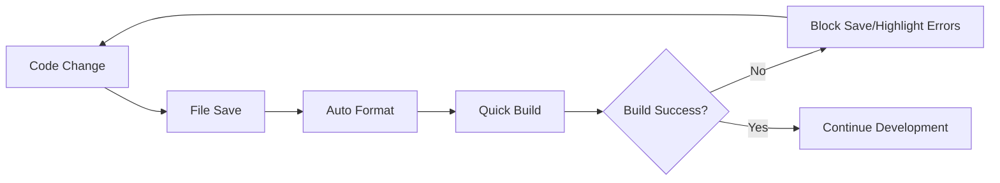

**Components**:
- **EditorConfig**: Enforces consistent formatting
- **Roslyn Analyzers**: Real-time code quality feedback
- **MSBuild Integration**: Instant build validation
- **IDE Extensions**: Visual quality indicators

#### Level 2: Commit-Time Gates

**Trigger**: Git commit attempt
**Response Time**: < 60 seconds
**Enforcement Mechanism**: Pre-commit hooks

```bash
# .git/hooks/pre-commit (Auto-installed)
#!/bin/sh
echo "🔍 Enforcing quality gates..."

# 1. Format check
if ! dotnet format --verify-no-changes --include-generated; then
    echo "❌ Code formatting violations detected"
    echo "💡 Run: dotnet format"
    exit 1
fi

# 2. Quick build
if ! dotnet build --configuration Release --no-restore; then
    echo "❌ Build failed"
    exit 1
fi

# 3. Critical tests
if ! dotnet test --filter "Priority=Critical" --no-build --logger "console;verbosity=minimal"; then
    echo "❌ Critical tests failed"
    exit 1
fi

echo "✅ Quality gates passed - commit allowed"
```

#### Level 3: Pull Request Gates

**Trigger**: PR creation/update
**Response Time**: < 10 minutes
**Enforcement Mechanism**: GitHub Actions CI/CD

```yaml
name: Quality Gate Enforcement
on: [pull_request, push]

jobs:
  quality-enforcement:
    runs-on: ubuntu-latest
    steps:
    - uses: actions/checkout@v3
    
    - name: Quality Gate - Build Validation
      run: |
        dotnet restore
        dotnet build --configuration Debug
        dotnet build --configuration Release
        
    - name: Quality Gate - Test Execution  
      run: |
        dotnet test --configuration Release --collect:"XPlat Code Coverage" --results-directory coverage
        
    - name: Quality Gate - Coverage Validation
      run: |
        dotnet tool install -g dotnet-reportgenerator-globaltool
        reportgenerator -reports:"coverage/**/coverage.cobertura.xml" -targetdir:"coverage/report" -reporttypes:Html
        # Enforce 95% minimum coverage
        
    - name: Quality Gate - Security Scan
      run: dotnet list package --vulnerable --include-transitive
      
    - name: Quality Gate - Performance Baseline
      run: dotnet run --project Tests.Performance -- --baseline-check
```

### Automated Rollback Mechanisms

#### Development Rollback (Instant)

```bash
# Auto-triggered when quality gates fail
function rollback_on_failure() {
    local exit_code=$1
    if [ $exit_code -ne 0 ]; then
        echo "🔄 Quality gate failure detected - initiating rollback"
        git stash push -m "AUTO-ROLLBACK: Quality gate failure $(date)"
        echo "💾 Changes stashed - fix issues and run: git stash pop"
        return 1
    fi
}

# Integrated into all quality scripts
dotnet build || rollback_on_failure $?
dotnet test || rollback_on_failure $?
```

#### PR Rollback (Automated)

```yaml
# GitHub Action for automated PR closure on repeated failures
- name: Auto-close PR on Quality Failure
  if: failure()
  run: |
    gh pr comment ${{ github.event.pull_request.number }} \
      --body "🚫 **PR Automatically Closed**: Repeated quality gate failures detected. Please fix all issues and reopen."
    gh pr close ${{ github.event.pull_request.number }}
```

### Quality Metrics Enforcement

#### Mandatory Metrics Thresholds

| Metric | Minimum Threshold | Enforcement Level | Action on Failure |
|--------|------------------|-------------------|-------------------|
| **Build Success Rate** | 100% | All levels | Block progression |
| **Test Pass Rate** | 100% | Level 2+ | Block commit/PR |
| **Code Coverage** | 95% (new code) | Level 3 | Block PR merge |
| **Cyclomatic Complexity** | <10 per method | Level 1 | IDE warning |
| **Maintainability Index** | >80 | Level 3 | Block PR merge |
| **Security Vulnerabilities** | 0 high/critical | Level 3 | Block deployment |
| **Performance Regression** | <5% slowdown | Level 3 | Block PR merge |

#### Quality Score Calculation

```csharp
public class QualityScore
{
    public double CalculateOverallScore(QualityMetrics metrics)
    {
        var weights = new Dictionary<string, double>
        {
            { "BuildSuccess", 0.25 },
            { "TestPassRate", 0.25 },
            { "CodeCoverage", 0.20 },
            { "Maintainability", 0.15 },
            { "Security", 0.10 },
            { "Performance", 0.05 }
        };
        
        var score = weights.Sum(w => w.Value * metrics.GetNormalizedScore(w.Key));
        return Math.Round(score * 100, 2);
    }
    
    // Quality gate: Score must be >= 95.0 to pass
    public bool PassesQualityGate(double score) => score >= 95.0;
}
```

### Development Workflow Integration

#### Enhanced Developer Workflow with Quality Gates

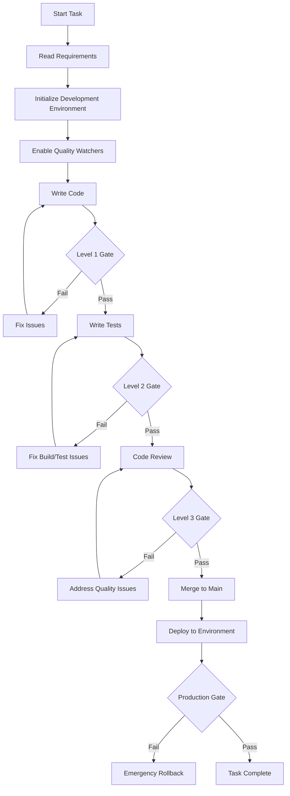

#### Quality Gate Commands Integration

```bash
# Enhanced development commands with built-in quality gates

# Start development session
function start-dev-session() {
    echo "🚀 Starting quality-enforced development session"
    
    # Setup file watchers
    dotnet watch build --project server &
    npm run dev --prefix client &
    
    # Setup quality dashboard
    dotnet run --project Tools.QualityDashboard &
    
    echo "✅ Development environment ready with quality enforcement"
}

# Commit with quality gates
function safe-commit() {
    echo "🔍 Running pre-commit quality gates..."
    
    # Level 2 validation
    if ! dotnet build && dotnet test --no-build; then
        echo "❌ Quality gates failed - commit blocked"
        return 1
    fi
    
    # Commit if passed
    git add .
    git commit -m "$1"
    echo "✅ Quality-approved commit completed"
}

# Task completion with full validation
function complete-task() {
    echo "🏁 Running full task completion validation..."
    
    # Level 3 validation
    if ! ./scripts/enforce-quality-gates.ps1; then
        echo "❌ Task completion blocked - fix all quality issues"
        return 1
    fi
    
    echo "🎉 Task ready for completion - all quality gates passed"
}
```

### Quality Dashboard Integration

Real-time quality status monitoring for development teams:

#### Dashboard Components

- **Build Status**: Real-time build success/failure across all branches
- **Test Results**: Live test execution results with coverage trends
- **Code Quality Trends**: Maintainability and complexity metrics over time
- **Security Status**: Vulnerability scan results and remediation status
- **Performance Baseline**: Response time and throughput comparisons
- **Team Quality Score**: Individual and team quality rankings

#### Alert Configuration

```yaml
# Quality alerts configuration
quality_alerts:
  channels:
    - slack: "#dev-quality"
    - email: "dev-team@company.com"
    
  rules:
    - name: "Build Failure"
      trigger: "build_status == 'FAILED'"
      severity: "HIGH"
      action: "immediate_notification"
      
    - name: "Coverage Drop"
      trigger: "code_coverage < 95%"
      severity: "MEDIUM"
      action: "daily_digest"
      
    - name: "Security Vulnerability"
      trigger: "security_vulnerabilities > 0"
      severity: "CRITICAL"
      action: "block_deployment"
```

### Quality Gate Automation Tools

#### Pre-installed Development Tools

```bash
# Installation script for all developers
function install-quality-tools() {
    # Core .NET tools
    dotnet tool install -g dotnet-format
    dotnet tool install -g dotnet-reportgenerator-globaltool
    dotnet tool install -g dotnet-outdated-tool
    
    # Security tools
    dotnet tool install -g security-scan
    
    # Performance tools
    dotnet tool install -g dotnet-trace
    dotnet tool install -g PerfView
    
    # Quality dashboard
    dotnet tool install -g quality-dashboard
    
    echo "✅ All quality tools installed and configured"
}
```

#### IDE Integration Requirements

All team members must configure their IDEs with:
- **Required Extensions**: C# Dev Kit, Orleans tools, SonarLint
- **Auto-format on Save**: Enabled for all file types
- **Real-time Analysis**: Roslyn analyzers with strict rule sets
- **Error Highlighting**: Immediate feedback on quality violations
- **Performance Profiling**: Built-in profiling for performance-sensitive code

### Success Metrics

#### Quality Enforcement Success Indicators

- **Zero** tasks completed without passing Level 3 quality gates
- **100%** build success rate maintained across all branches
- **<5 minutes** average time to resolve quality gate failures
- **95%+** code coverage maintained consistently
- **Zero** security vulnerabilities in production code
- **<2%** performance regression tolerance

#### Quality Culture Indicators

- **Proactive Quality**: Developers run quality checks before committing
- **Quality First**: Quality discussions prioritized in code reviews
- **Continuous Improvement**: Regular retrospectives on quality processes
- **Knowledge Sharing**: Team members help each other meet quality standards

This architecture ensures that quality is not an afterthought but an integral, automated part of the development process that cannot be bypassed or ignored.
