# Orleans-Based State Management Architecture Transition Design

## Executive Summary

This document outlines the architectural transition from the current hybrid state management system to a fully Orleans-based distributed state management architecture for the AIChat application. The design establishes Orleans as the exclusive state management layer for all chat operations, removing the complexity of dual-mode operation and focusing on a clean, Orleans-first architecture.

**Document Status**: Initial Design
**Date**: January 2025
**Architecture Version**: 2.0

## Table of Contents

1. [Current State Analysis](#current-state-analysis)
2. [Target Architecture](#target-architecture)
3. [Migration Strategy](#migration-strategy)
4. [Component Design](#component-design)
5. [Interface Specifications](#interface-specifications)
6. [Control Flow Diagrams](#control-flow-diagrams)
7. [Risk Assessment](#risk-assessment)
8. [Implementation Phases](#implementation-phases)
9. [Testing Strategy](#testing-strategy)
10. [Success Metrics](#success-metrics)

## Current State Analysis

### Architecture Overview

The current system operates in a **hybrid mode** with multiple state management approaches:

#### 1. Request-Scoped Services (Legacy)
- **ChatService**: Instantiated per HTTP request
- **Lifetime**: Dies with request completion
- **Issues**: Cannot handle long-running operations, multi-tab synchronization problems

#### 2. Orleans Integration (Partially Implemented)
- **Status**: Phase 4 at 87.5% completion
- **Enabled**: Development and Production environments
- **Disabled**: Test environment
- **Coverage**: SSE streaming now routes through Orleans when available

#### 3. Dual Communication Protocols
- **SSE (Server-Sent Events)**: Primary streaming protocol, now Orleans-capable
- **SignalR**: Available but not fully integrated with Orleans
- **WebSocket**: Limited implementation for real-time features

### Current Implementation Gaps

1. **Incomplete Orleans Coverage**
   - SignalR hub operations bypass Orleans grains
   - Some chat operations still use direct database access
   - Mode management not integrated with Orleans

2. **State Synchronization Issues**
   - Race conditions when multiple tabs access same chat
   - Inconsistent state between Orleans grains and database
   - No unified state recovery mechanism

3. **Operational Limitations**
   - Limited monitoring for Orleans-specific operations
   - No comprehensive load testing for Orleans paths
   - Manual failover between Orleans and direct modes

### Data Flow Analysis

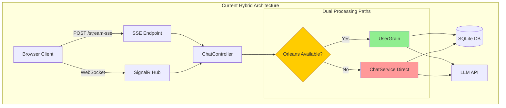

## Target Architecture

### Architectural Principles

1. **Orleans-First Processing**: All state mutations flow through Orleans grains
2. **Event-Driven Architecture**: Loosely coupled components communicate via events
3. **Resilient by Design**: Automatic recovery and state reconstruction
4. **Protocol Agnostic**: Support multiple client protocols transparently
5. **Observable Operations**: Comprehensive metrics and tracing

### Component Architecture

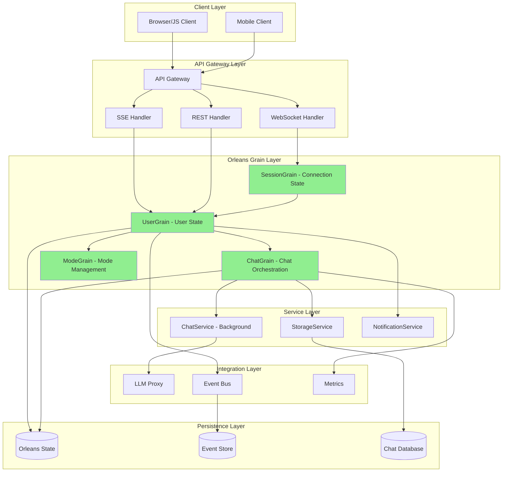

### Grain Responsibilities

#### UserGrain (Enhanced)
- **Identity**: One per authenticated user
- **Responsibilities**:
  - Coordinate all user operations
  - Manage connection lifecycle
  - Route messages to appropriate chats
  - Handle protocol translation (SSE/SignalR/REST)
  - Maintain user session state
  - Buffer messages during disconnections

#### ChatGrain (New)
- **Identity**: One per active chat
- **Responsibilities**:
  - Orchestrate chat operations
  - Coordinate message processing
  - Manage chat participant state
  - Handle mode-specific behaviors
  - Enforce chat-level policies
  - Coordinate with LLM services

#### ModeGrain (New)
- **Identity**: One per chat mode
- **Responsibilities**:
  - Manage mode configuration
  - Apply mode-specific prompts
  - Handle mode transitions
  - Cache mode settings
  - Validate mode operations

#### SessionGrain (New)
- **Identity**: One per client connection
- **Responsibilities**:
  - Track connection state
  - Handle reconnection logic
  - Manage protocol-specific state
  - Coordinate with UserGrain
  - Buffer connection-specific data

## Migration Strategy

### Guiding Principles

1. **Zero Downtime**: System remains operational throughout migration
2. **Incremental Rollout**: Features migrate individually
3. **Reversible Changes**: Each phase can be rolled back
4. **Feature Flag Control**: Runtime configuration of behaviors
5. **Data Integrity**: No data loss during transition

### Migration Approach (Simplified - Orleans Only)

Since backward compatibility is not a concern, we can take a direct migration approach:

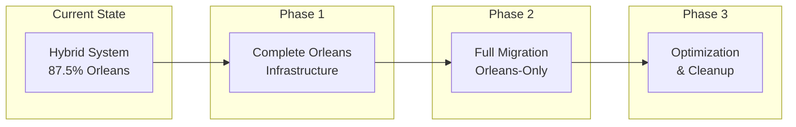

### Orleans-Only Architecture

All operations will be handled exclusively through Orleans grains:

```csharp
// No dual-mode router needed - Orleans is the only path
public interface IChatController
{
    // All requests go directly to Orleans
    async Task<IActionResult> ProcessMessage(ChatRequest request)
    {
        var userGrain = _grainFactory.GetGrain<IUserGrain>(request.UserId);
        var result = await userGrain.ProcessChatStreamAsync(request);
        return Ok(result);
    }
}
```

## Component Design

### Enhanced UserGrain Interface

```csharp
public interface IUserGrain : IGrainWithStringKey
{
    // Connection Management (Existing)
    Task RegisterConnectionAsync(ConnectionInfo connectionInfo);
    Task UnregisterConnectionAsync(string connectionId);
    Task<ImmutableList<ConnectionInfo>> GetActiveConnectionsAsync();

    // Chat Operations (Enhanced)
    Task<ChatOperationResult> ProcessChatOperationAsync(
        ChatOperation operation,
        CancellationToken cancellationToken
    );
    Task<StreamHandle> StartChatStreamAsync(
        StreamRequest request,
        CancellationToken cancellationToken
    );

    // State Management (New)
    Task<UserState> GetStateAsync();
    Task<UserState> RecoverStateAsync(DateTime? pointInTime = null);
    Task InvalidateCacheAsync(CacheInvalidationType type);

    // Event Handling (New)
    Task PublishEventAsync(UserEvent userEvent);
    Task<ImmutableList<UserEvent>> GetEventsAsync(
        DateTime since,
        int? limit = null
    );

    // Monitoring (New)
    Task<HealthCheckResult> CheckHealthAsync();
    Task<UserMetrics> GetMetricsAsync();
}
```

### ChatGrain Interface

```csharp
public interface IChatGrain : IGrainWithStringKey
{
    // Lifecycle Management
    Task<ChatState> InitializeAsync(ChatInitRequest request);
    Task<ChatState> GetStateAsync();
    Task DeactivateAsync(DeactivationReason reason);

    // Message Processing
    Task<MessageResult> ProcessMessageAsync(
        ChatMessage message,
        ProcessingOptions options
    );
    Task<StreamHandle> ProcessStreamAsync(
        StreamMessage message,
        StreamOptions options
    );

    // Participant Management
    Task<ParticipantResult> AddParticipantAsync(string userId, ParticipantRole role);
    Task<ParticipantResult> RemoveParticipantAsync(string userId);
    Task<ImmutableList<Participant>> GetParticipantsAsync();

    // Mode Integration
    Task<ModeResult> ApplyModeAsync(string modeId);
    Task<ModeState> GetModeStateAsync();

    // Event Streaming
    Task SubscribeToEventsAsync(IAsyncObserver<ChatEvent> observer);
    Task UnsubscribeFromEventsAsync(IAsyncObserver<ChatEvent> observer);
}
```

### StreamingBridge Enhancement

```csharp
public interface IEnhancedStreamingBridge
{
    // Protocol Translation
    Task<IAsyncEnumerable<T>> TranslateStreamAsync<T>(
        IAsyncEnumerable<object> sourceStream,
        ProtocolType targetProtocol,
        TranslationOptions options
    );

    // Buffering and Recovery
    Task<BufferedStream<T>> CreateBufferedStreamAsync<T>(
        IAsyncEnumerable<T> sourceStream,
        BufferConfiguration config
    );
    Task<RecoveryResult> RecoverStreamAsync(
        string streamId,
        RecoveryPoint recoveryPoint
    );

    // Metrics and Monitoring
    Task<StreamMetrics> GetStreamMetricsAsync(string streamId);
    Task RegisterStreamMonitorAsync(
        string streamId,
        IStreamMonitor monitor
    );
}
```

## Interface Specifications

### Abstraction Layer for Dual-Mode Operation

```csharp
// Core abstraction for state management
public interface IStateManager
{
    Task<T> GetStateAsync<T>(string key) where T : class;
    Task SetStateAsync<T>(string key, T state) where T : class;
    Task<bool> TryGetStateAsync<T>(string key, out T state) where T : class;
    Task InvalidateStateAsync(string key);
}

// Orleans implementation
public class OrleansStateManager : IStateManager
{
    private readonly IGrainFactory _grainFactory;

    public async Task<T> GetStateAsync<T>(string key) where T : class
    {
        var grain = _grainFactory.GetGrain<IStateGrain>(key);
        return await grain.GetStateAsync<T>();
    }
    // ... other implementations
}

// Direct database implementation (fallback)
public class DirectStateManager : IStateManager
{
    private readonly IDbContext _dbContext;

    public async Task<T> GetStateAsync<T>(string key) where T : class
    {
        return await _dbContext.GetAsync<T>(key);
    }
    // ... other implementations
}
```

### Message Router Interface

```csharp
public interface IMessageRouter
{
    // Route messages to appropriate handlers
    Task<RoutingResult> RouteMessageAsync(
        Message message,
        RoutingContext context
    );

    // Support for different routing strategies
    Task<IRoutingStrategy> GetRoutingStrategyAsync(
        MessageType messageType
    );

    // Circuit breaker for resilience
    Task<bool> IsRouteHealthyAsync(string routeId);
    Task MarkRouteUnhealthyAsync(string routeId, TimeSpan duration);
}

public class RoutingContext
{
    public string UserId { get; set; }
    public string? SessionId { get; set; }
    public Protocol Protocol { get; set; }
    public Dictionary<string, string> Headers { get; set; }
    public RoutePreference Preference { get; set; }
}
```

## Control Flow Diagrams

### Complete Chat Message Flow with Streaming (Orleans-Only)

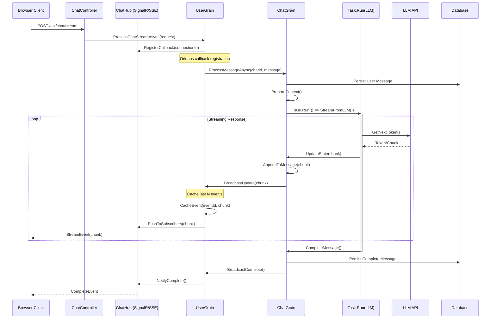

### Correct Orleans Streams Architecture

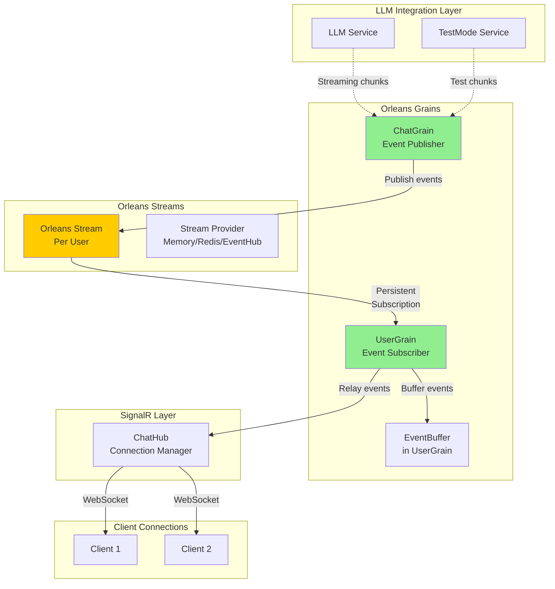

#### Why This Architecture is Correct

1. **No EventBus** - Orleans Streams provide the pub/sub mechanism, not a separate EventBus
2. **Unidirectional Flow** - Events flow in one direction: ChatGrain → Stream → UserGrain → Client
3. **ChatGrain Publishes** - ChatGrain is the source of events, publishing to Orleans Streams
4. **UserGrain Subscribes** - UserGrain subscribes to its user's stream and receives events via OnNext callback
5. **EventBuffer in UserGrain** - The EventBuffer component lives inside UserGrain, not as a separate service
6. **No Direct Distribution** - Events don't go directly to multiple grains; they flow through Orleans Streams

The correct flow:
- ChatGrain receives a message request
- ChatGrain starts streaming from LLM using Task.Run (background)
- As chunks arrive, ChatGrain publishes events to the user's Orleans Stream
- UserGrain (already subscribed) receives events through its OnNext callback
- UserGrain stores events in its EventBuffer component
- UserGrain relays events to all active connections via ChatHub
- ChatHub delivers events to clients over SignalR WebSocket connections

### Multi-Tab Synchronization Flow

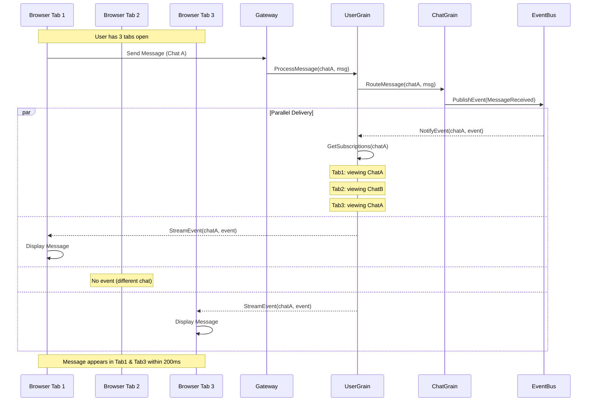

### Connection Recovery with Event Replay

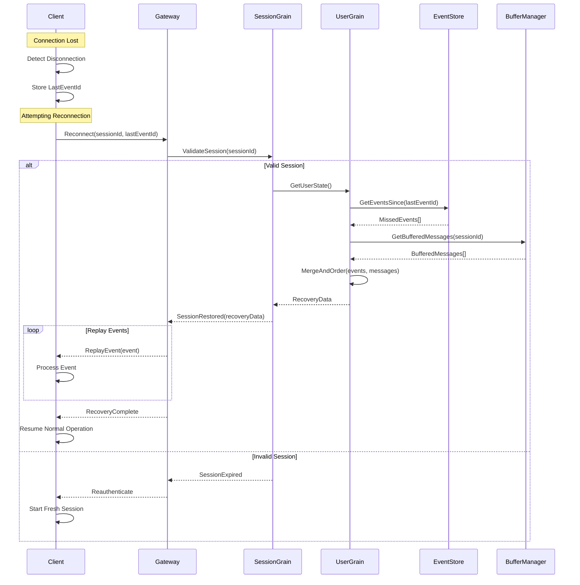

### Streaming Event Types and Flow

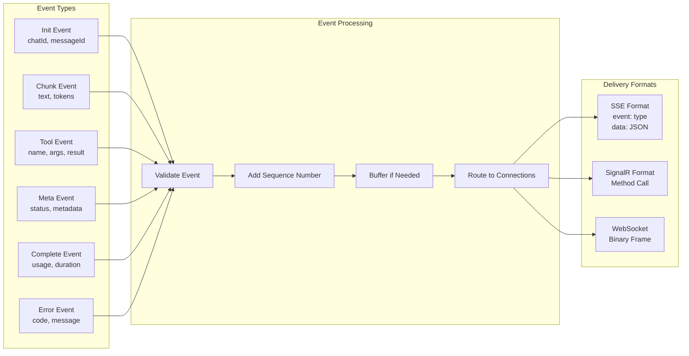

### Chat Processing State Machine

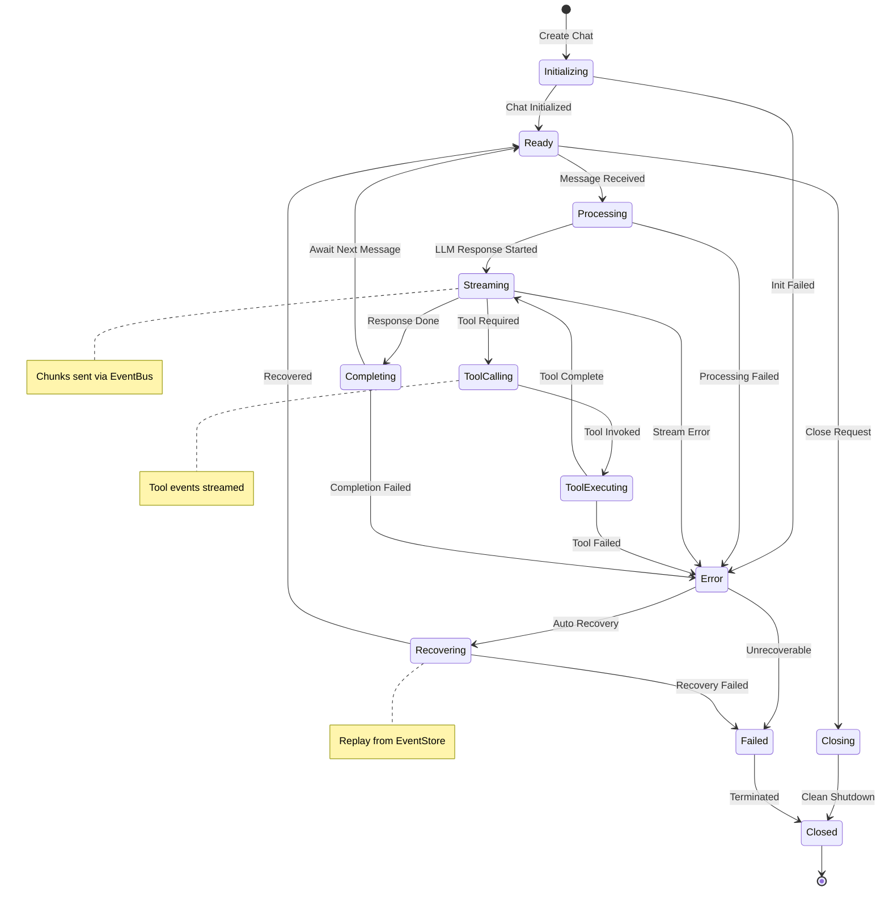

### Event Buffering and Delivery Strategy

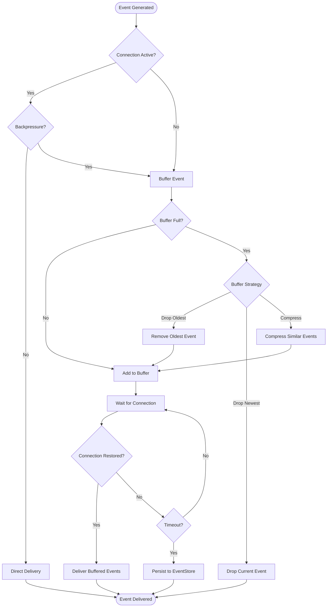

### Orleans Callback Registration and Event Flow

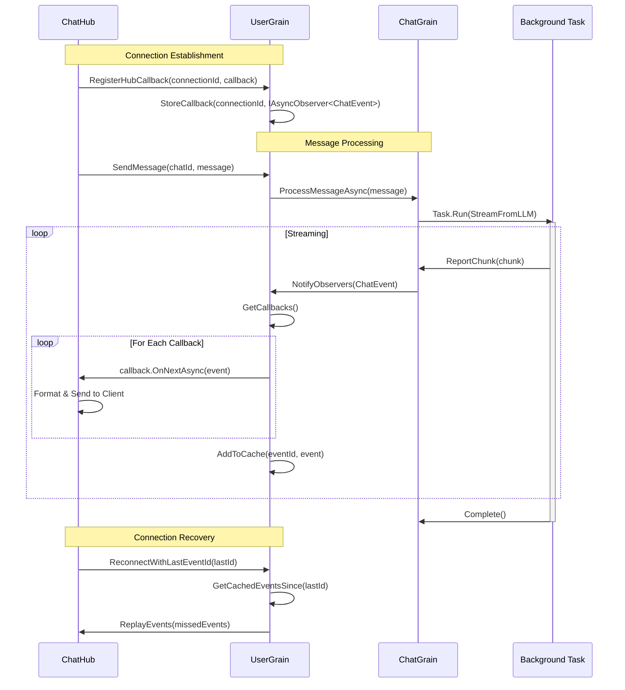

### UserGrain Event Caching Strategy

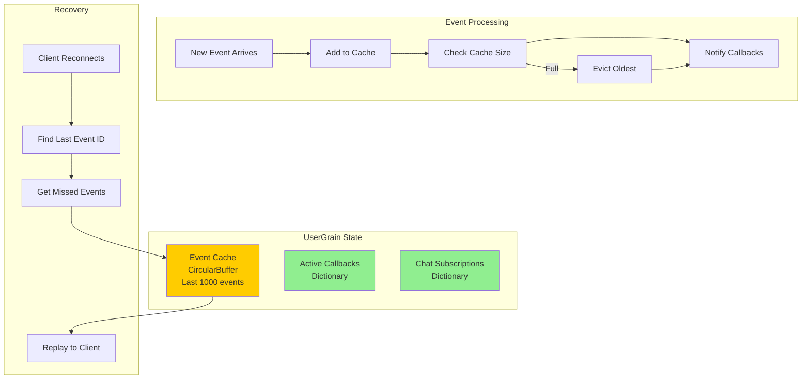

### Connection Protocol Negotiation

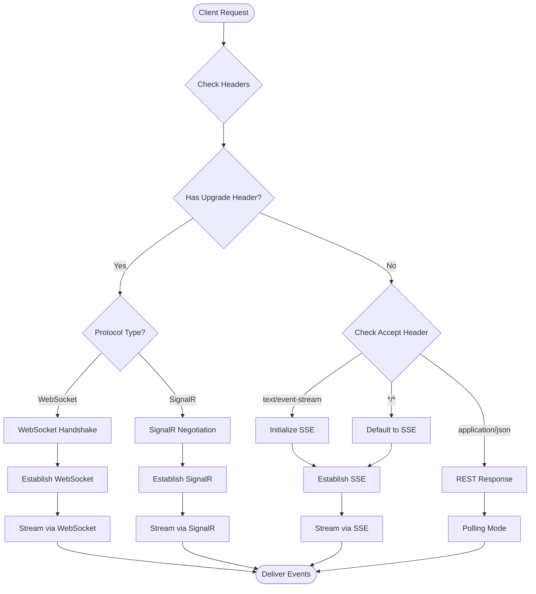

## Streaming Event Architecture Details

### Event Flow Implementation

The streaming architecture is designed to handle real-time event delivery from LLM responses to multiple connected clients efficiently. Key aspects include:

#### 1. ChatGrain-Driven LLM Streaming

ChatGrain orchestrates LLM calls within Task.Run and updates its state:

```csharp
public class ChatGrain : Grain, IChatGrain
{
    private ChatState _state;
    private readonly ILLMClient _llmClient;
    private readonly ILogger<ChatGrain> _logger;

    public async Task<StreamHandle> ProcessMessageAsync(ChatMessage message)
    {
        // Persist user message
        _state.Messages.Add(message);
        await WriteStateAsync();

        // Start background streaming task
        var streamHandle = new StreamHandle { StreamId = Guid.NewGuid().ToString() };

        _ = Task.Run(async () =>
        {
            try
            {
                await StreamFromLLMAsync(message, streamHandle.StreamId);
            }
            catch (Exception ex)
            {
                _logger.LogError(ex, "LLM streaming failed");
                await NotifyError(streamHandle.StreamId, ex);
            }
        });

        return streamHandle;
    }

    private async Task StreamFromLLMAsync(ChatMessage userMessage, string streamId)
    {
        var assistantMessage = new ChatMessage { Role = "assistant", Content = "" };
        var sequenceNumber = 0;

        // Stream tokens from LLM
        await foreach (var token in _llmClient.StreamCompletionAsync(BuildContext()))
        {
            // Update grain state
            assistantMessage.Content += token.Content;
            sequenceNumber++;

            // Broadcast update to UserGrain
            var userGrain = GrainFactory.GetGrain<IUserGrain>(_state.UserId);
            await userGrain.BroadcastChatUpdate(new ChatEvent
            {
                ChatId = this.GetPrimaryKeyString(),
                StreamId = streamId,
                Type = EventType.ChunkReceived,
                Data = new StreamChunk
                {
                    Text = token.Content,
                    SequenceNumber = sequenceNumber
                }
            });

            // Periodic state persistence
            if (sequenceNumber % 10 == 0)
            {
                _state.CurrentStreamContent = assistantMessage.Content;
                await WriteStateAsync();
            }
        }

        // Finalize message
        _state.Messages.Add(assistantMessage);
        _state.CurrentStreamContent = null;
        await WriteStateAsync();

        // Notify completion
        var userGrain = GrainFactory.GetGrain<IUserGrain>(_state.UserId);
        await userGrain.BroadcastChatUpdate(new ChatEvent
        {
            ChatId = this.GetPrimaryKeyString(),
            StreamId = streamId,
            Type = EventType.StreamCompleted
        });
    }
}
```

#### 2. UserGrain with Orleans Callbacks and Event Caching

UserGrain manages Orleans callbacks and maintains an event cache for recovery:

```csharp
public class UserGrain : Grain, IUserGrain
{
    private UserGrainState _state;
    private readonly Dictionary<string, IAsyncObserver<ChatEvent>> _callbacks;
    private readonly CircularBuffer<CachedEvent> _eventCache;
    private const int MAX_CACHED_EVENTS = 1000;

    public UserGrain()
    {
        _callbacks = new Dictionary<string, IAsyncObserver<ChatEvent>>();
        _eventCache = new CircularBuffer<CachedEvent>(MAX_CACHED_EVENTS);
    }

    // Orleans callback registration from ChatHub
    public Task RegisterHubCallback(string connectionId, IAsyncObserver<ChatEvent> callback)
    {
        _callbacks[connectionId] = callback;
        _state.ActiveConnections.Add(connectionId);
        return WriteStateAsync();
    }

    public Task UnregisterHubCallback(string connectionId)
    {
        _callbacks.Remove(connectionId);
        _state.ActiveConnections.Remove(connectionId);
        return WriteStateAsync();
    }

    // Receive events from ChatGrain and broadcast to callbacks
    public async Task BroadcastChatUpdate(ChatEvent chatEvent)
    {
        // Add to cache with event ID
        var cachedEvent = new CachedEvent
        {
            EventId = Guid.NewGuid().ToString(),
            Timestamp = DateTime.UtcNow,
            Event = chatEvent
        };
        _eventCache.Add(cachedEvent);

        // Get callbacks for this chat
        var subscribedCallbacks = GetSubscribedCallbacks(chatEvent.ChatId);

        // Broadcast to all registered callbacks
        var tasks = subscribedCallbacks.Select(async kvp =>
        {
            try
            {
                await kvp.Value.OnNextAsync(chatEvent);
            }
            catch (Exception ex)
            {
                _logger.LogError(ex, "Failed to notify callback {ConnectionId}", kvp.Key);
                // Remove failed callback
                _callbacks.Remove(kvp.Key);
            }
        });

        await Task.WhenAll(tasks);
    }

    // Handle reconnection with event replay
    public async Task<ReconnectionResult> ReconnectWithLastEventId(
        string connectionId,
        string lastEventId,
        IAsyncObserver<ChatEvent> callback)
    {
        // Register new callback
        _callbacks[connectionId] = callback;

        // Find missed events
        var missedEvents = GetMissedEvents(lastEventId);

        // Replay missed events
        foreach (var cachedEvent in missedEvents)
        {
            try
            {
                await callback.OnNextAsync(cachedEvent.Event);
            }
            catch
            {
                // Log but continue replay
                _logger.LogWarning("Failed to replay event {EventId}", cachedEvent.EventId);
            }
        }

        return new ReconnectionResult
        {
            ConnectionId = connectionId,
            ReplayedEventCount = missedEvents.Count,
            LastEventId = missedEvents.LastOrDefault()?.EventId
        };
    }

    private List<CachedEvent> GetMissedEvents(string lastEventId)
    {
        if (string.IsNullOrEmpty(lastEventId))
            return new List<CachedEvent>();

        // Find the index of the last known event
        var events = _eventCache.ToList();
        var lastIndex = events.FindIndex(e => e.EventId == lastEventId);

        if (lastIndex == -1)
        {
            // Event not in cache, return last 100 events
            return events.TakeLast(100).ToList();
        }

        // Return all events after the last known one
        return events.Skip(lastIndex + 1).ToList();
    }

    private Dictionary<string, IAsyncObserver<ChatEvent>> GetSubscribedCallbacks(string chatId)
    {
        // Get connections subscribed to this chat
        if (!_state.ChatSubscriptions.TryGetValue(chatId, out var connectionIds))
            return new Dictionary<string, IAsyncObserver<ChatEvent>>();

        return _callbacks
            .Where(kvp => connectionIds.Contains(kvp.Key))
            .ToDictionary(kvp => kvp.Key, kvp => kvp.Value);
    }
}

public class CachedEvent
{
    public string EventId { get; set; }
    public DateTime Timestamp { get; set; }
    public ChatEvent Event { get; set; }
}
```

#### 3. SSE Event Formatting

Server-Sent Events require specific formatting:

```csharp
public class SSEFormatter
{
    public string FormatEvent(ChatEvent evt)
    {
        var eventType = MapEventType(evt.Type);
        var data = JsonSerializer.Serialize(evt.Data);

        var sseEvent = new StringBuilder();

        // Add event type
        if (!string.IsNullOrEmpty(eventType))
            sseEvent.AppendLine($"event: {eventType}");

        // Add event ID for reconnection
        if (!string.IsNullOrEmpty(evt.Id))
            sseEvent.AppendLine($"id: {evt.Id}");

        // Add retry hint
        if (evt.RetryAfter.HasValue)
            sseEvent.AppendLine($"retry: {evt.RetryAfter}");

        // Add data (can be multiline)
        foreach (var line in data.Split('\n'))
            sseEvent.AppendLine($"data: {line}");

        // End with double newline
        sseEvent.AppendLine();

        return sseEvent.ToString();
    }

    private string MapEventType(EventType type) => type switch
    {
        EventType.StreamStarted => "init",
        EventType.ChunkReceived => "messageupdate",
        EventType.StreamCompleted => "complete",
        EventType.Error => "error",
        _ => "message"
    };
}
```

#### 4. Event Buffering Strategy

Events are buffered to handle connection issues:

```csharp
public class EventBuffer
{
    private readonly CircularBuffer<BufferedEvent> _buffer;
    private readonly IEventStore _eventStore;

    public async Task BufferEventAsync(ChatEvent evt, string connectionId)
    {
        var bufferedEvent = new BufferedEvent
        {
            Event = evt,
            ConnectionId = connectionId,
            Timestamp = DateTime.UtcNow,
            DeliveryAttempts = 0
        };

        // Try to add to memory buffer
        if (!_buffer.TryAdd(bufferedEvent))
        {
            // Buffer full - apply overflow strategy
            await ApplyOverflowStrategyAsync(bufferedEvent);
        }
    }

    private async Task ApplyOverflowStrategyAsync(BufferedEvent evt)
    {
        switch (_config.OverflowStrategy)
        {
            case OverflowStrategy.DropOldest:
                _buffer.RemoveOldest();
                _buffer.Add(evt);
                break;

            case OverflowStrategy.PersistOldest:
                var oldest = _buffer.RemoveOldest();
                await _eventStore.PersistAsync(oldest);
                _buffer.Add(evt);
                break;

            case OverflowStrategy.Compress:
                CompresssimilarEvents();
                _buffer.Add(evt);
                break;
        }
    }
}
```

#### 5. Connection Recovery and Event Replay

When a connection is restored, missed events are replayed:

```csharp
public class ConnectionRecoveryService
{
    public async Task RecoverConnectionAsync(
        string connectionId,
        string lastEventId,
        DateTime? disconnectedAt)
    {
        // Get missed events from event store
        var missedEvents = await _eventStore.GetEventsSinceAsync(
            lastEventId,
            disconnectedAt ?? DateTime.UtcNow.AddMinutes(-5)
        );

        // Get buffered events for this connection
        var bufferedEvents = await _buffer.GetEventsForConnectionAsync(connectionId);

        // Merge and deduplicate
        var eventsToReplay = MergeAndDeduplicate(missedEvents, bufferedEvents);

        // Sort by sequence number
        eventsToReplay.Sort((a, b) => a.SequenceNumber.CompareTo(b.SequenceNumber));

        // Replay events with rate limiting
        var rateLimiter = new SlidingWindowRateLimiter(
            new SlidingWindowRateLimiterOptions
            {
                Window = TimeSpan.FromSeconds(1),
                PermitLimit = 100
            });

        foreach (var evt in eventsToReplay)
        {
            await rateLimiter.AcquireAsync();
            await DeliverEventAsync(connectionId, evt);
        }
    }
}
```

### Streaming Event Types

The system supports various event types for comprehensive chat interaction:

| Event Type | Purpose | Data Structure | Delivery Guarantee |
|------------|---------|----------------|-------------------|
| **init** | Chat session initialization | `{chatId, messageId, timestamp}` | At least once |
| **messageupdate** | Streaming text chunks | `{text, tokens, sequenceNumber}` | Best effort |
| **toolcall** | Tool invocation events | `{name, args, status}` | At least once |
| **toolresult** | Tool execution results | `{name, result, duration}` | At least once |
| **metadata** | Session metadata updates | `{key, value, timestamp}` | Best effort |
| **complete** | Stream completion | `{usage, duration, finalMessage}` | At least once |
| **error** | Error notifications | `{code, message, retryable}` | At least once |
| **heartbeat** | Keep-alive signals | `{timestamp}` | Best effort |

### Protocol-Specific Considerations

#### SSE (Server-Sent Events)
- Unidirectional (server to client only)
- Text-based protocol
- Automatic reconnection with Last-Event-ID
- Limited to 6 concurrent connections per origin
- No binary data support

#### SignalR
- Bidirectional communication
- Multiple transport fallbacks (WebSocket → SSE → Long Polling)
- Built-in reconnection logic
- Supports binary data
- Hub-based programming model

#### WebSocket
- Full-duplex communication
- Binary and text frames
- Low latency
- Manual reconnection required
- No built-in message structure

### Performance Optimizations

1. **Event Batching**: Group multiple small events for efficient delivery
2. **Compression**: Compress repetitive event data
3. **Delta Encoding**: Send only changes for large updates
4. **Priority Queues**: Prioritize critical events over informational ones
5. **Connection Pooling**: Reuse connections for multiple streams
6. **Circuit Breaking**: Prevent cascade failures with circuit breakers

## Risk Assessment

### Technical Risks

| Risk | Impact | Probability | Mitigation Strategy |
|------|--------|-------------|-------------------|
| **Grain State Corruption** | Critical | Low | Event sourcing, state snapshots, validation layers |
| **Performance Degradation** | High | Medium | Incremental rollout, performance testing, monitoring |
| **Memory Pressure** | High | Medium | Grain deactivation policies, memory limits, caching strategies |
| **Network Partitions** | High | Low | Orleans clustering, retry policies, fallback modes |
| **Migration Data Loss** | Critical | Low | Dual writes, verification processes, rollback procedures |

### Operational Risks

| Risk | Impact | Probability | Mitigation Strategy |
|------|--------|-------------|-------------------|
| **Increased Complexity** | Medium | High | Comprehensive documentation, training, runbooks |
| **Debugging Difficulty** | Medium | High | Distributed tracing, enhanced logging, diagnostic tools |
| **Deployment Complexity** | Medium | Medium | Automated deployment, staged rollouts, health checks |
| **Rollback Challenges** | High | Low | Feature flags, versioned APIs, backward compatibility |

### Business Risks

| Risk | Impact | Probability | Mitigation Strategy |
|------|--------|-------------|-------------------|
| **User Experience Disruption** | High | Low | Gradual migration, A/B testing, user communication |
| **Extended Timeline** | Medium | Medium | Phased approach, MVP targets, regular checkpoints |
| **Resource Constraints** | Medium | Medium | Prioritization, external expertise, automation |

## Implementation Phases

### Phase 1: Foundation Enhancement (2 weeks)

**Objective**: Complete Orleans infrastructure and achieve 100% routing capability

**Tasks**:
1. Complete remaining Phase 4 Orleans tasks (12.5%)
   - Stream-specific monitoring implementation
   - Load testing for Orleans SSE
   - Stream recovery optimization

2. Implement enhanced grain interfaces
   - Create IChatGrain interface
   - Create IModeGrain interface
   - Create ISessionGrain interface

3. Establish dual-mode routing infrastructure
   - Implement IDualModeRouter
   - Create fallback mechanisms
   - Add comprehensive logging

**Success Criteria**:
- All chat operations can route through Orleans
- Zero regression in existing functionality
- Performance metrics meet targets

### Phase 2: State Unification (3 weeks)

**Objective**: Migrate all state management to Orleans grains

**Tasks**:
1. Implement state abstraction layer
   - Create IStateManager interface
   - Implement Orleans and Direct providers
   - Add state validation

2. Migrate user state to UserGrain
   - Move session data
   - Migrate preferences
   - Transfer activity tracking

3. Implement ChatGrain
   - Chat orchestration logic
   - Message sequencing
   - Participant management

4. Create event sourcing infrastructure
   - Event store implementation
   - Event replay mechanisms
   - Snapshot management

**Success Criteria**:
- All state operations use Orleans when available
- State consistency across all access patterns
- Successful state recovery testing

### Phase 3: Protocol Unification (2 weeks)

**Objective**: Route all communication protocols through Orleans

**Tasks**:
1. SignalR integration with Orleans
   - Modify ChatHub to use grains
   - Implement connection tracking
   - Add SignalR-specific buffering

2. REST endpoint migration
   - Update all controllers
   - Implement proper routing
   - Add response caching

3. WebSocket support
   - Create WebSocket handler
   - Integrate with SessionGrain
   - Implement protocol translation

**Success Criteria**:
- All protocols route through Orleans
- Protocol-agnostic message handling
- Seamless protocol switching

### Phase 4: Advanced Features (2 weeks)

**Objective**: Implement advanced Orleans capabilities

**Tasks**:
1. Implement ModeGrain
   - Mode configuration management
   - Dynamic prompt generation
   - Mode transition handling

2. Enhanced monitoring
   - Grain-specific metrics
   - Performance dashboards
   - Alerting rules

3. Advanced recovery mechanisms
   - Automatic state reconstruction
   - Point-in-time recovery
   - Cross-grain transactions

**Success Criteria**:
- Mode switching via Orleans
- Comprehensive observability
- Robust recovery capabilities

### Phase 5: Optimization & Cleanup (1 week)

**Objective**: Optimize performance and remove legacy code

**Tasks**:
1. Performance optimization
   - Grain placement strategies
   - Caching optimization
   - Network efficiency

2. Legacy code removal
   - Remove direct service paths
   - Clean up dual-mode code
   - Archive deprecated components

3. Documentation completion
   - Update architecture docs
   - Create operation guides
   - Training materials

**Success Criteria**:
- Performance targets exceeded
- Clean codebase
- Complete documentation

## Testing Strategy

### Unit Testing

```csharp
[TestClass]
public class UserGrainTests
{
    [TestMethod]
    public async Task ProcessMessage_WithOrleans_RoutesCorrectly()
    {
        // Arrange
        var grain = new UserGrainTestHarness();
        var message = CreateTestMessage();

        // Act
        var result = await grain.ProcessChatOperationAsync(
            new ChatOperation { Message = message },
            CancellationToken.None
        );

        // Assert
        Assert.IsTrue(result.Success);
        Assert.IsNotNull(result.OperationId);
        Assert.AreEqual(ProcessingMode.Orleans, result.Mode);
    }
}
```

### Integration Testing

1. **Multi-Protocol Testing**
   - Simultaneous SSE, SignalR, REST operations
   - Protocol switching during active operations
   - Connection recovery scenarios

2. **State Consistency Testing**
   - Concurrent modifications
   - State recovery after failures
   - Cross-grain consistency

3. **Performance Testing**
   - Load testing with 10,000+ concurrent users
   - Grain activation/deactivation patterns
   - Memory usage under load

### Chaos Engineering

```yaml
# Chaos testing scenarios
scenarios:
  - name: "Grain Deactivation Storm"
    description: "Force rapid grain deactivations"
    actions:
      - deactivate_random_grains:
          count: 100
          interval: "1s"
    validation:
      - no_message_loss
      - recovery_time_under_5s

  - name: "Network Partition"
    description: "Simulate cluster split"
    actions:
      - partition_cluster:
          duration: "30s"
    validation:
      - fallback_activation
      - state_consistency_post_recovery
```

## Success Metrics

### Technical Metrics

| Metric | Current | Target | Measurement |
|--------|---------|--------|-------------|
| **Message Latency (p99)** | 200ms | <100ms | Prometheus metrics |
| **Grain Activation Time** | N/A | <500ms | Orleans telemetry |
| **State Consistency** | 95% | 99.9% | Consistency checker |
| **Recovery Time** | Manual | <10s | Automated testing |
| **Memory per User** | Variable | <10MB | Resource monitoring |

### Business Metrics

| Metric | Current | Target | Measurement |
|--------|---------|--------|-------------|
| **Multi-tab Issues** | 30% users | <1% | User reports |
| **Support Tickets** | 15% related | <2% | Ticket analysis |
| **LLM API Costs** | +20% overhead | Baseline | Cost monitoring |
| **User Satisfaction** | 7/10 | 9/10 | User surveys |
| **System Capacity** | 5K users | 20K users | Load testing |

### Operational Metrics

| Metric | Target | Measurement |
|--------|--------|-------------|
| **Deployment Frequency** | Daily | CI/CD pipeline |
| **Mean Time to Recovery** | <15 min | Incident tracking |
| **Change Failure Rate** | <5% | Deployment metrics |
| **Lead Time for Changes** | <2 hours | Git analytics |

## Conclusion

This design provides a comprehensive roadmap for transitioning to a fully Orleans-based state management architecture. The phased approach ensures minimal disruption while progressively improving system capabilities. Key benefits include:

1. **Unified State Management**: Single source of truth for all operations
2. **Improved Resilience**: Automatic recovery and self-healing
3. **Better Scalability**: Horizontal scaling with grain distribution
4. **Enhanced User Experience**: Consistent multi-tab behavior
5. **Operational Excellence**: Better observability and control

The migration will require careful coordination and testing, but the resulting architecture will provide a solid foundation for future growth and feature development.

## Appendices

### A. Glossary

- **Grain**: Orleans virtual actor representing a logical entity
- **Silo**: Orleans runtime host for grains
- **SSE**: Server-Sent Events for unidirectional streaming
- **SignalR**: Bidirectional real-time communication framework
- **State Store**: Persistent storage for grain state

### B. References

- [Orleans Documentation](https://docs.microsoft.com/orleans)
- [Current Orleans Integration Status](../orleans-grain-integration/current-state-architecture.md)
- [Original Requirements](../orleans-grain-integration/requirements.md)
- [SignalR Documentation](https://docs.microsoft.com/signalr)

### C. Decision Log

| Date | Decision | Rationale | Impact |
|------|----------|-----------|---------|
| 2025-01 | Orleans-first architecture | Resilience and scalability | High |
| 2025-01 | Phased migration | Reduce risk | Medium |
| 2025-01 | Dual-mode operation | Backward compatibility | High |
| 2025-01 | Event sourcing | State recovery | Medium |

---

**Document Version**: 1.0
**Next Review Date**: February 2025
**Owner**: Architecture Team