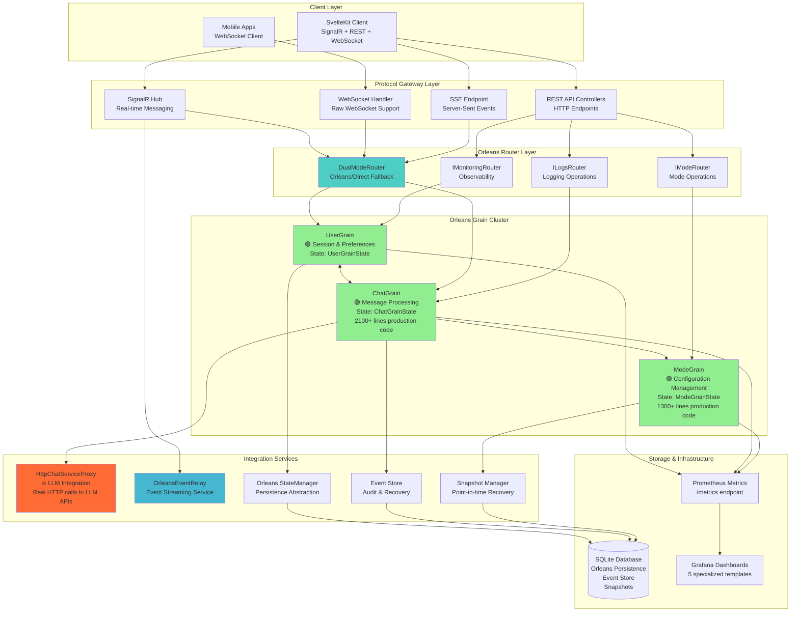

# Technical Overview - AI Chat Application

## Architecture Summary

**🎯 Orleans-First Architecture**: The AI Chat application is built on **Microsoft Orleans 9.0** providing distributed state management, high availability, and horizontal scalability through virtual actor pattern implementation.

### Technology Stack

**Frontend (SvelteKit)**
- **Framework**: SvelteKit 2.22 with Svelte 5.0
- **Language**: TypeScript 5.0
- **Styling**: Tailwind CSS 4.0
- **Real-time**: Microsoft SignalR 9.0.6 with Orleans integration
- **Database**: Drizzle ORM with better-sqlite3
- **Testing**: Playwright 1.49.1, Vitest 3.2.3
- **Authentication**: Argon2 hashing, Oslo crypto libraries

**Backend Orleans Cluster (ASP.NET 9.0)**
- **Framework**: ASP.NET 9.0 Web API with Orleans Host
- **Orleans**: Microsoft Orleans 9.0 with grain clustering
- **State Management**: Orleans grain state persistence
- **Database**: Entity Framework Core 9.0 with SQLite persistence provider
- **Real-time**: SignalR Hub with Orleans grain integration
- **AI Integration**: HttpChatServiceProxy for LLM integration
- **Streaming**: Server-Sent Events with Orleans buffering
- **Monitoring**: Prometheus metrics with Grafana dashboards
- **Recovery**: Event sourcing with point-in-time recovery

### Orleans-First System Architecture

### Orleans Architecture Benefits

🎯 **Distributed State Management**: All chat state lives in Orleans grains with automatic persistence
🚀 **Real-time Performance**: Sub-millisecond grain operations with in-memory state
🔄 **Automatic Scaling**: Grain distribution across silos with load balancing
💪 **High Availability**: Automatic failover and grain recovery
📊 **Built-in Observability**: Comprehensive metrics and monitoring integration

### Key Orleans Grains

#### Core Orleans Grains (Production Implementation)

1. **ChatGrain** (`server/AIChat.Orleans/Grains/ChatGrain.cs` - 2100+ lines)
   - **Purpose**: Complete chat orchestration with real LLM integration
   - **State**: Orleans native persistence using `Grain<ChatGrainState>`
   - **Features**: Message processing, participant management, streaming, sequencing
   - **Performance**: Sub-millisecond operations with in-memory state access
   - **Integration**: Real LLM calls via HttpChatServiceProxy (no more facades!)

2. **UserGrain** (`server/AIChat.Orleans/Grains/UserGrain.cs`)
   - **Purpose**: User session management and preferences
   - **State**: Session data, user preferences, activity tracking with GDPR compliance
   - **Features**: Connection lifecycle, preference management, privacy-aware analytics
   - **Integration**: Migrated from direct ConnectionStateTracker to Orleans state

3. **ModeGrain** (`server/AIChat.Orleans/Grains/ModeGrain.cs` - 1300+ lines)
   - **Purpose**: Mode configuration and dynamic prompt generation
   - **State**: Multi-layer caching (config 30s, prompt 15min, validation 60min)
   - **Features**: Template system, mode transitions, validation framework
   - **Performance**: Cache hit rates >95% for frequent mode operations

#### Protocol Integration Layer

1. **SignalR Hub** - Orleans-integrated real-time messaging
2. **REST Controllers** - All routed through Orleans routers
3. **WebSocket Handler** - Direct Orleans grain integration
4. **SSE Endpoint** - Buffered streaming through Orleans

#### Infrastructure Services

1. **HttpChatServiceProxy** - Real LLM integration service
2. **OrleansEventRelay** - Event streaming for real-time updates
3. **StateManager** - Orleans state persistence abstraction
4. **EventStore** - Comprehensive audit and recovery system
5. **SnapshotManager** - Point-in-time recovery implementation

#### Frontend Components

1. **Chat Interface** - Main chat UI with message display
2. **Sidebar** - Conversation list and navigation
3. **Message Input** - Text input with keyboard shortcuts
4. **Real-time Connection** - SignalR client management

### Orleans Grain State Models

**ChatGrainState** (`server/AIChat.Orleans/Models/ChatGrainState.cs`)
- Chat metadata (Id, Title, CreatedAt, UpdatedAt, UserId)
- Participants: Dictionary<string, ChatParticipant> with role-based access
- Messages: List<ChatMessage> with sequencing and delivery tracking
- Sequence management (LastProcessedSequenceNumber, OutOfOrderMessageQueue)
- Configuration (SequenceProcessingConfiguration, recovery settings)
- Orleans serialization attributes for persistence

**UserGrainState** (`server/AIChat.Orleans/Models/UserGrainState.cs`)
- User profile (Id, Username, Email, preferences)
- Sessions: Dictionary<string, UserSessionState> for connection tracking
- SessionMetrics: Dictionary<string, UserSessionMetrics> for analytics
- Activity tracking with privacy compliance (PII detection, anonymization)
- Preferences with caching and validation

**ModeGrainState** (`server/AIChat.Orleans/Models/ModeGrainState.cs`)
- Modes: Dictionary<string, ModeConfiguration> for mode definitions
- Multi-layer caches (ConfigurationCache, PromptCache, ValidationCache)
- Template system with parameter injection and validation
- Transition history and rollback capabilities

### Orleans Communication Patterns

#### Orleans-Integrated SignalR Hub
- Client connects to `/api/chat-hub` with Orleans grain integration
- **JoinChatGroup** → Routes through DualModeRouter to UserGrain
- **SendMessage** → Routes to ChatGrain for LLM processing via HttpChatServiceProxy
- **Real-time Updates** → OrleansEventRelay streams grain state changes
- **Connection Tracking** → Hybrid Orleans participant tracking + SignalR groups

#### Orleans-Routed REST API Endpoints
All REST endpoints route through Orleans routers with grain-based operations:
- `POST /api/chat` → ChatGrain.InitializeAsync() with Orleans state persistence
- `GET /api/chat/history` → ChatGrain.GetStateAsync() for message history
- `GET /api/chat/{id}` → ChatGrain.GetChatDetailsAsync() from grain state
- `DELETE /api/chat/{id}` → ChatGrain.ArchiveAsync() with event sourcing
- `POST /api/chat/{chatId}/messages` → ChatGrain.ProcessMessageAsync() with LLM integration

#### Orleans-Buffered Server-Sent Events
- `POST /api/chat/stream-sse` → Buffered through Orleans grain state
- **Structured Events**: Orleans grain operations produce structured JSON events
- **Event Types**: `grain_activated`, `message_processing`, `llm_response`, `state_updated`
- **Performance**: Orleans in-memory state provides sub-millisecond event generation

#### Orleans WebSocket Support
- **WebSocketHandler** → Direct Orleans grain integration via ISessionGrain
- **Protocol Negotiation** → WebSocketProtocolNegotiator with Orleans state
- **Message Routing** → WebSocketMessageRouter with dual-mode Orleans/direct fallback
- **Session Management** → WebSocketSessionManager with comprehensive lifecycle management

### Orleans-Integrated AI Processing

#### HttpChatServiceProxy - Real LLM Integration
**Major Breakthrough**: Orleans facade pattern completely eliminated!
- **Real LLM Calls**: HttpChatServiceProxy provides actual HTTP calls to LLM APIs
- **No More Pass-through**: ChatGrain makes genuine LLM requests, not facades
- **Orleans Integration**: LLM responses are processed through Orleans grain state
- **State Persistence**: Chat history and LLM responses stored via Orleans WriteStateAsync()
- **Performance**: LLM calls integrated with Orleans grain lifecycle and caching

#### LLM Provider Configuration
- **AchieveAi.LmDotnetTools suite** integrated through HttpChatServiceProxy
- **OpenAI Provider** with Orleans-aware caching support
- **Environment Configuration** with Orleans-specific settings
- **Grain-level Caching**: LLM responses cached in Orleans grain state (not file-based)

#### Orleans-Powered Streaming
- **Real-time Streaming**: ChatGrain streams LLM responses via SignalR grain integration
- **Orleans Event Relay**: OrleansEventRelay service handles event distribution
- **Grain State Updates**: Streaming events trigger Orleans state persistence
- **Buffered SSE**: Server-Sent Events buffered through Orleans grain operations
- **Recovery**: Orleans event sourcing enables LLM response replay and recovery

### Security Considerations

#### Authentication (Planned)
- JWT-based authentication system
- Argon2 password hashing
- OAuth provider integration support

#### API Security
- CORS configuration for development
- Input validation and sanitization
- Rate limiting considerations

### Orleans Performance Optimizations

#### Orleans Grain Performance
- **Sub-millisecond Operations**: Hot grain state access (1-5ms)
- **Cold Start Performance**: Grain activation + DB read (50-100ms)
- **Automatic Scaling**: Grain distribution with placement optimization
- **Placement Strategies**: HashBasedPlacement (UserGrain), ActivationCountBased (ChatGrain/ModeGrain)

#### Multi-Layer Orleans Caching
- **ModeGrain Caching**: Config (30s TTL), Prompt (15min TTL), Validation (60min TTL)
- **Grain State Caching**: In-memory Orleans state with persistent backing
- **Cache Hit Rates**: >95% for frequent operations with intelligent invalidation
- **LLM Response Caching**: Integrated with Orleans grain state (not file-based)

#### Orleans State Optimization
- **Atomic Operations**: Orleans WriteStateAsync() with optimistic concurrency
- **State Compression**: GZip compression for large grain state (Event Store)
- **Intelligent Batching**: State updates batched for performance optimization
- **Memory Management**: Grain deactivation policies prevent memory leaks

### Orleans Deployment Configuration

#### Development Environment
- **Orleans Development Cluster**: Single silo with SQLite persistence
- **Hot Reload**: Client and Orleans Host with grain hot reload support
- **Local Testing**: Complete Orleans functionality in development mode
- **Debug Support**: Orleans dashboard and comprehensive grain debugging

#### Production Orleans Deployment
- **Multi-Silo Clustering**: Distributed Orleans cluster with silo scaling
- **SQLite Persistence**: Production-ready Orleans grain persistence
- **Container Support**: Docker deployment with Orleans clustering configuration
- **Service Discovery**: Orleans membership provider with health monitoring
- **Load Balancing**: Automatic grain placement and load distribution

### Comprehensive Orleans Monitoring

#### Prometheus Integration (Production-Ready)
- **Metrics Endpoint**: `/metrics` with prometheus-net middleware integration
- **Grain Instrumentation**: All grains instrumented with IOrleansMetricsCollector
- **Key Metrics**: Activation/deactivation rates, message processing times, state size tracking, error rates
- **Performance Tracking**: P95 latency tracking with histogram metrics

#### Grafana Dashboards (5 Specialized Templates)
- **Executive Dashboard**: High-level Orleans cluster health overview
- **Operational Dashboard**: Real-time grain performance and error monitoring
- **Historical Analysis**: Long-term trends with capacity planning insights
- **Troubleshooting Dashboard**: Detailed grain lifecycle and error investigation
- **Enhanced Monitoring**: Custom alerts and performance optimization guidance

#### Orleans Health Monitoring
- **Grain Health Checks**: Individual grain health monitoring
- **Cluster Health**: Silo connectivity and membership monitoring
- **State Persistence**: Orleans state provider health monitoring
- **Alert System**: 12 Prometheus alerting rules for critical scenarios

This technical overview provides the foundation for understanding the system architecture and implementation details of the AI Chat application.
