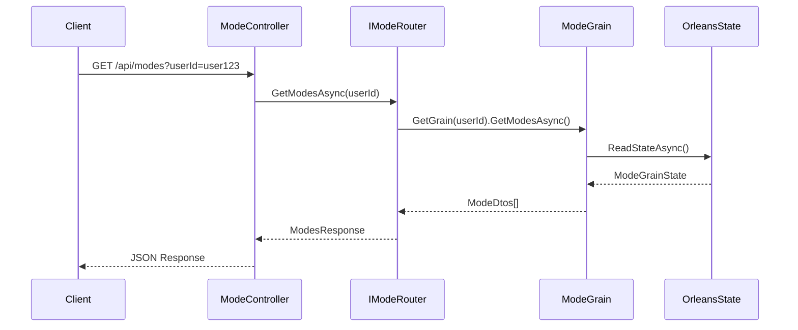

# Modes API Documentation

## Overview

The Modes API provides endpoints for managing chat modes, including retrieving system modes, creating custom modes, and performing CRUD operations on user-specific modes. **All operations are powered by Orleans ModeGrain** for distributed state management, caching, and real-time performance.

## Orleans Architecture

### ModeGrain Integration

All Mode API endpoints route through **Orleans ModeGrain** (`server/AIChat.Orleans/Grains/ModeGrain.cs`), providing:

- **Distributed State Management**: Mode configurations persisted using Orleans grain state
- **Multi-layer Caching**: Configuration cache (30s), prompt cache (15min), validation cache (60min)
- **Dynamic Prompt Generation**: Template-based system with parameter injection and validation
- **Real-time Performance**: Orleans grain activations provide sub-millisecond response times
- **Automatic Scaling**: Grain distribution across Orleans silos for horizontal scalability

### Orleans State Benefits

- **Consistency**: Single-writer principle ensures data consistency across distributed operations
- **Performance**: In-memory grain state with persistent backing storage eliminates database round trips
- **Resilience**: Automatic grain recovery and state reconstruction through Orleans infrastructure
- **Monitoring**: Built-in metrics collection and health monitoring through Orleans telemetry

## Base URL

```
/api/modes
```

## Authentication

All endpoints require a valid user session. The `userId` parameter is required for user context and authorization.

## Orleans Request Flow

### How API Requests Route Through Orleans



### Orleans Performance Characteristics

- **First Request (Cold Start)**: ~50-100ms (grain activation + DB read)
- **Subsequent Requests (Hot Grain)**: ~1-5ms (in-memory state access)
- **Configuration Updates**: Atomic operations with optimistic concurrency
- **Cache Invalidation**: Intelligent pattern-based cache clearing across grain network

### Orleans Error Handling

The API leverages Orleans grain error handling patterns:

```csharp
// Orleans-aware error responses
{
  "error": "Mode validation failed in grain user123-modes",
  "grainId": "user123-modes",
  "correlationId": "abc-123-def",
  "retryable": true,
  "grainStatus": "active"
}
```

## Endpoints

### 1. List All Modes

Retrieve all available modes for a user, including both system modes and user's custom modes.

#### Request

```http
GET /api/modes?userId={userId}
```

#### Parameters

| Parameter | Type | Required | Description |
|-----------|------|----------|-------------|
| userId | string | Yes | User identifier for retrieving user-specific modes |

#### Response

##### Success (200 OK)

```json
{
  "modes": [
    {
      "id": "general",
      "name": "General Assistant",
      "description": "Default mode with all available tools",
      "category": "task",
      "prompt": "You are a helpful AI assistant...",
      "tools": ["*"],
      "defaultModel": null,
      "isSystem": true,
      "userId": null,
      "createdAt": "2024-01-01T00:00:00Z",
      "updatedAt": "2024-01-01T00:00:00Z"
    },
    {
      "id": "custom-123",
      "name": "My Custom Mode",
      "description": "Personal writing assistant",
      "category": "custom",
      "prompt": "You are my personal writing assistant...",
      "tools": ["web-search", "webpage-fetch"],
      "defaultModel": "openai/gpt-4",
      "isSystem": false,
      "userId": "user-123",
      "createdAt": "2024-01-15T10:30:00Z",
      "updatedAt": "2024-01-15T10:30:00Z"
    }
  ],
  "count": 2
}
```

##### Error Responses

- **400 Bad Request**: Missing or invalid userId
- **500 Internal Server Error**: Server-side error retrieving modes

```json
{
  "error": "Error message describing the issue"
}
```

### 2. Get Specific Mode

Retrieve details for a specific mode by its ID.

#### Request

```http
GET /api/modes/{id}?userId={userId}
```

#### Parameters

| Parameter | Type | Required | Description |
|-----------|------|----------|-------------|
| id | string | Yes | Mode identifier (path parameter) |
| userId | string | Yes | User identifier for permission checking |

#### Response

##### Success (200 OK)

```json
{
  "id": "coding",
  "name": "Coding Assistant",
  "description": "Optimized for programming tasks",
  "category": "task",
  "prompt": "You are an expert programming assistant...",
  "tools": ["web-search", "webpage-fetch", "TaskManager"],
  "defaultModel": "openai/gpt-4",
  "isSystem": true,
  "userId": null,
  "createdAt": "2024-01-01T00:00:00Z",
  "updatedAt": "2024-01-01T00:00:00Z"
}
```

##### Error Responses

- **400 Bad Request**: Missing userId
- **404 Not Found**: Mode not found or user lacks permission
- **500 Internal Server Error**: Server-side error

### 3. Create Custom Mode

Create a new custom mode for a user.

#### Request

```http
POST /api/modes
Content-Type: application/json
```

#### Request Body

```json
{
  "userId": "user-123",
  "name": "Technical Writer",
  "description": "Mode for creating technical documentation",
  "category": "role",
  "prompt": "You are a technical documentation specialist...",
  "tools": ["web-search"],
  "defaultModel": "openai/gpt-4"
}
```

#### Field Validation

| Field | Type | Required | Constraints |
|-------|------|----------|-------------|
| userId | string | Yes | Non-empty |
| name | string | Yes | 1-100 chars, no HTML special chars (<, >, &) |
| description | string | Yes | 1-500 chars |
| category | string | No | One of: task, role, custom (default: custom) |
| prompt | string | Yes | 1-2000 chars |
| tools | array | Yes | Array of tool IDs or ["*"] for all tools |
| defaultModel | string | No | Valid model identifier or null |

#### Response

##### Success (201 Created)

```json
{
  "id": "custom-generated-id",
  "name": "Technical Writer",
  "description": "Mode for creating technical documentation",
  "category": "role",
  "prompt": "You are a technical documentation specialist...",
  "tools": ["web-search"],
  "defaultModel": "openai/gpt-4",
  "isSystem": false,
  "userId": "user-123",
  "createdAt": "2024-01-20T14:30:00Z",
  "updatedAt": "2024-01-20T14:30:00Z"
}
```

##### Error Responses

- **400 Bad Request**: Validation error or missing required fields
- **409 Conflict**: Mode with same name already exists for user
- **500 Internal Server Error**: Server-side error

### 4. Update Custom Mode

Update an existing custom mode. Only the mode owner can update their modes.

#### Request

```http
PUT /api/modes/{id}
Content-Type: application/json
```

#### Parameters

| Parameter | Type | Required | Description |
|-----------|------|----------|-------------|
| id | string | Yes | Mode identifier to update (path parameter) |

#### Request Body

```json
{
  "userId": "user-123",
  "name": "Updated Technical Writer",
  "description": "Enhanced mode for technical documentation",
  "category": "role",
  "prompt": "You are an expert technical documentation specialist...",
  "tools": ["web-search", "TaskManager"],
  "defaultModel": "openai/gpt-4-turbo"
}
```

#### Field Validation

Same as Create Custom Mode endpoint.

#### Response

##### Success (200 OK)

```json
{
  "id": "custom-mode-id",
  "name": "Updated Technical Writer",
  "description": "Enhanced mode for technical documentation",
  "category": "role",
  "prompt": "You are an expert technical documentation specialist...",
  "tools": ["web-search", "TaskManager"],
  "defaultModel": "openai/gpt-4-turbo",
  "isSystem": false,
  "userId": "user-123",
  "createdAt": "2024-01-20T14:30:00Z",
  "updatedAt": "2024-01-20T15:45:00Z"
}
```

##### Error Responses

- **400 Bad Request**: Validation error or attempting to update system mode
- **404 Not Found**: Mode not found or user lacks permission
- **500 Internal Server Error**: Server-side error

### 5. Delete Custom Mode

Delete a custom mode. Only the mode owner can delete their modes. System modes cannot be deleted.

#### Request

```http
DELETE /api/modes/{id}?userId={userId}
```

#### Parameters

| Parameter | Type | Required | Description |
|-----------|------|----------|-------------|
| id | string | Yes | Mode identifier to delete (path parameter) |
| userId | string | Yes | User identifier for ownership verification |

#### Response

##### Success (204 No Content)

No response body.

##### Error Responses

- **400 Bad Request**: Missing userId or attempting to delete system mode
- **404 Not Found**: Mode not found or user lacks permission
- **500 Internal Server Error**: Server-side error

## Integration with Chat API

### Creating a Chat with Mode

When creating a new chat, you can specify a mode:

```http
POST /api/chat
Content-Type: application/json

{
  "userId": "user-123",
  "message": "Help me write a function",
  "modeId": "coding"
}
```

### Continuing a Chat with Mode Change

When continuing a chat, you can switch modes:

```http
POST /api/chat/{chatId}/continue
Content-Type: application/json

{
  "message": "Now help me document this function",
  "modeId": "writing"
}
```

## Orleans Integration Examples

### ModeGrain State Management

The Orleans ModeGrain maintains state through Orleans persistence:

```csharp
// Example: How ModeGrain handles configuration updates
public async Task<ModeConfigurationResult> UpdateModeConfigurationAsync(
    string modeId,
    ModeConfigurationUpdate update,
    CancellationToken cancellationToken = default)
{
    using var activity = OrleansActivitySource.StartActivity("ModeGrain.UpdateConfiguration");
    activity?.SetTag("modeId", modeId);
    activity?.SetTag("grainId", this.GetPrimaryKeyString());

    try
    {
        // Orleans grain state access (in-memory, sub-millisecond)
        var existingMode = State.Modes.GetValueOrDefault(modeId);
        if (existingMode == null)
        {
            return ModeConfigurationResult.NotFound(modeId);
        }

        // Apply update with validation
        var updatedMode = await ApplyConfigurationUpdateAsync(existingMode, update, cancellationToken);

        // Atomic state persistence through Orleans
        State.Modes[modeId] = updatedMode;
        State.LastUpdated = DateTimeOffset.UtcNow;
        await WriteStateAsync(); // Orleans handles durability

        // Invalidate related caches
        await InvalidateConfigurationCacheAsync(modeId);

        return ModeConfigurationResult.Success(updatedMode);
    }
    catch (Exception ex)
    {
        _logger.LogError(ex, "Failed to update mode configuration for {ModeId}", modeId);
        return ModeConfigurationResult.Error($"Update failed: {ex.Message}");
    }
}
```

### Performance Through Orleans Caching

```csharp
// Orleans multi-layer caching implementation
public async Task<ModePromptResult> GeneratePromptAsync(string modeId, Dictionary<string, object> parameters)
{
    // Layer 1: Configuration Cache (30s TTL)
    var config = await GetCachedConfigurationAsync(modeId);

    // Layer 2: Prompt Cache (15min TTL)
    var cacheKey = ComputePromptCacheKey(modeId, parameters);
    if (State.PromptCache.TryGetValue(cacheKey, out var cached) && !cached.IsExpired)
    {
        return ModePromptResult.FromCache(cached.Prompt);
    }

    // Layer 3: Template generation with Orleans state
    var prompt = await GeneratePromptFromTemplate(config.PromptTemplate, parameters);

    // Cache the result
    State.PromptCache[cacheKey] = new CachedPrompt
    {
        Prompt = prompt,
        ExpiresAt = DateTimeOffset.UtcNow.AddMinutes(15)
    };

    return ModePromptResult.Generated(prompt);
}
```

### Orleans Grain Lifecycle

```csharp
// ModeGrain activation and deactivation
public override async Task OnActivateAsync(CancellationToken cancellationToken)
{
    // Orleans calls this when grain is activated
    await ReadStateAsync(); // Load persisted state

    _metricsCollector.RecordGrainActivation(this.GetType().Name, this.GetPrimaryKeyString());

    // Initialize caches
    await InitializeCacheAsync();

    await base.OnActivateAsync(cancellationToken);
}

public override async Task OnDeactivateAsync(DeactivationReason reason, CancellationToken cancellationToken)
{
    // Ensure state is persisted before deactivation
    await WriteStateAsync();

    _metricsCollector.RecordGrainDeactivation(this.GetType().Name, reason.ToString());

    await base.OnDeactivateAsync(reason, cancellationToken);
}
```

## Data Models

### ModeDto

```typescript
interface ModeDto {
  id: string;                    // Unique identifier
  name: string;                  // Display name
  description: string;           // Mode description
  category: string;              // Category (task, role, custom)
  prompt: string;                // System prompt
  tools: string[];               // Tool IDs or ["*"]
  defaultModel?: string | null;  // Preferred AI model
  isSystem: boolean;             // System mode flag
  userId?: string | null;        // Owner for custom modes
  createdAt: string;             // ISO 8601 timestamp
  updatedAt: string;             // ISO 8601 timestamp
}
```

### ModesResponse

```typescript
interface ModesResponse {
  modes: ModeDto[];              // Array of modes
  count: number;                 // Total count
}
```

### CreateModeApiRequest

```typescript
interface CreateModeApiRequest {
  userId: string;                // Required user ID
  name: string;                  // Mode name
  description: string;           // Mode description
  category?: string;             // Optional category
  prompt: string;                // System prompt
  tools: string[];               // Tool list
  defaultModel?: string | null;  // Optional model preference
}
```

### UpdateModeApiRequest

```typescript
interface UpdateModeApiRequest {
  userId: string;                // Required user ID
  name: string;                  // Updated name
  description: string;           // Updated description
  category?: string;             // Updated category
  prompt: string;                // Updated prompt
  tools: string[];               // Updated tool list
  defaultModel?: string | null;  // Updated model preference
}
```

## Error Handling

All error responses follow a consistent format:

```json
{
  "error": "Human-readable error message"
}
```

### Common Error Scenarios

1. **Missing UserId**: All endpoints require a userId for context
2. **Invalid Mode ID**: Attempting to access non-existent modes
3. **Permission Denied**: Trying to modify modes owned by other users
4. **System Mode Modification**: Attempting to update or delete system modes
5. **Validation Failures**: Invalid field values or constraints

## Rate Limiting

The API follows the application's standard rate limiting policies:

- Requests are limited per user session
- Burst limits apply to prevent abuse
- 429 Too Many Requests returned when limits exceeded

## Caching

- System modes are cached in memory on server startup
- Cache is refreshed when the server restarts
- Custom modes are fetched from the database on each request
- Client-side caching is recommended for mode lists

## Best Practices

### Client Implementation

1. **Cache Mode Lists**: Store the mode list locally and refresh periodically
2. **Handle Missing Tools**: Gracefully handle modes with unavailable tools
3. **Validate Before Submit**: Perform client-side validation before API calls
4. **Show Loading States**: Display appropriate UI feedback during API operations
5. **Error Recovery**: Implement retry logic for transient failures

### Mode Design

1. **Descriptive Names**: Use clear, concise names for custom modes
2. **Specific Prompts**: Write focused prompts for better results
3. **Minimal Tools**: Include only necessary tools for performance
4. **Test Modes**: Verify mode behavior before production use
5. **Version Control**: Consider exporting important custom modes

## Migration and Compatibility

### Backward Compatibility

- Chats created without modes default to "general" mode
- Existing chats continue to function with mode support
- API maintains compatibility with clients not using modes

### Future Considerations

- Mode versioning for tracking changes
- Mode sharing between users
- Mode templates and marketplace
- Advanced tool configuration options
- Performance metrics per mode

## Examples

### Example: Create a Custom Research Mode

```bash
curl -X POST https://your-domain/api/modes \
  -H "Content-Type: application/json" \
  -d '{
    "userId": "user-123",
    "name": "Academic Research",
    "description": "Mode for academic research and paper writing",
    "category": "task",
    "prompt": "You are an academic research assistant. Help with literature reviews, citations, and scholarly writing. Always cite sources and maintain academic rigor.",
    "tools": ["web-search", "webpage-fetch"],
    "defaultModel": "openai/gpt-4"
  }'
```

### Example: List User's Modes

```javascript
async function getUserModes(userId) {
  const response = await fetch(`/api/modes?userId=${userId}`);
  if (!response.ok) {
    throw new Error(`Failed to fetch modes: ${response.statusText}`);
  }
  const data = await response.json();
  return data.modes;
}
```

### Example: Update a Custom Mode

```javascript
async function updateMode(modeId, updates, userId) {
  const response = await fetch(`/api/modes/${modeId}`, {
    method: 'PUT',
    headers: {
      'Content-Type': 'application/json',
    },
    body: JSON.stringify({
      userId,
      ...updates
    })
  });
  
  if (!response.ok) {
    const error = await response.json();
    throw new Error(error.error || 'Failed to update mode');
  }
  
  return response.json();
}
```